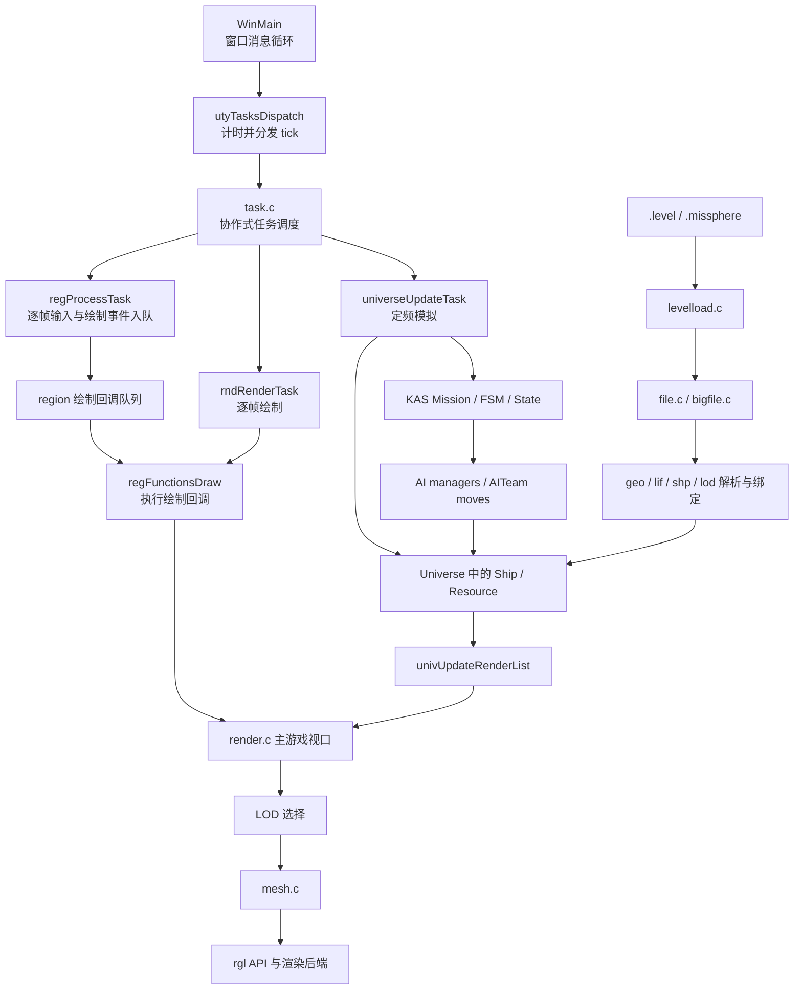

# Homeworld 1 源码学习路线

这份路线帮助你从程序入口一路追到游戏行为和画面。Homeworld 1 的实现以 C 为主，许多系统通过全局状态和回调协作；阅读时先认清“谁创建、谁更新、谁释放”，再钻进单个函数会轻松很多。

## 先建立整体图景

图中是便于学习的主干，不代表每个调用都发生在同一函数或同一个 tick。实际入口可从 [`src/Win32/main.c`](../src/Win32/main.c) 的 `WinMain`、[`src/Win32/utility.c`](../src/Win32/utility.c) 的 `utyTasksDispatch` 和系统初始化函数开始核对。

## 分阶段阅读

### 1. 启动和每帧调度

先读 `WinMain`，区分启动阶段与消息循环。启动阶段调用 `utyGameSystemsPreInit`、创建窗口、再调用 `utyGameSystemsInit`；消息循环在没有待处理 Windows 消息时调用 `utyTasksDispatch`。后者测量计时器 tick，再交给 `taskExecuteAllPending`。

接着读 [`src/Game/task.c`](../src/Game/task.c) 与 [`src/Game/task.h`](../src/Game/task.h)：查看 `taskStart` 怎样登记任务、`taskExecuteAllPending` 怎样累计时间和判断是否到期、任务怎样通过 `taskYield` 让出执行权。重点留意它是协作式调度：函数必须主动让出，调度器不会抢占正在运行的任务。

对应深读：[任务调度模块](modules/task_scheduler_overview.md)。

### 2. 世界状态和对象生命周期

先从 [`src/Game/spaceobj.h`](../src/Game/spaceobj.h) 对照两组结构：静态信息（如 `ShipStaticInfo`）和运行实例（如 `Ship`）。然后在 [`src/Game/universe.c`](../src/Game/universe.c) 找初始化、对象创建与静态信息加载入口，再在 [`src/Game/univupdate.c`](../src/Game/univupdate.c) 跟踪逐 tick 更新、渲染列表和死亡对象清理。

建议用一个具体对象做笔记：它由谁分配、静态信息何时准备、每个 tick 改哪些字段、删除时哪些关联也要清理。这个问题能帮助理解跨模块的所有权。

对应深读：[项目级空间对象模型总览](modules/spaceobj_overview.md)。

### 3. 关卡和资源如何进入内存

从 [`src/Game/levelload.c`](../src/Game/levelload.c) 找 `levelInit`，看看 `.level` 与 `.missphere` 如何描述场景和初始对象。遇到文件读取时转到 [`src/Game/file.c`](../src/Game/file.c) 的 `fileOpen`、`fileLoadAlloc`，再看 [`src/Game/bigfile.c`](../src/Game/bigfile.c) 如何定位归档条目。

随后沿资产解析走：`mesh.c` 处理几何，`bmp.c` 处理图像，`statscript.c` 把文本字段写进静态结构，`LOD.c` 读取细节层级配置。阅读时区分三个阶段：取得字节、解析格式、绑定到运行时对象。

对应深读：[资源加载](modules/resource_loading_overview.md)、[statscript](modules/statscript_overview.md) 和 [LOD](modules/lod_overview.md)。格式权威材料见 `documents/FormatsReleasedToPublic/`。

### 4. 任务脚本怎样驱动 AI

打开 [`src/SinglePlayer/Mission01.kas`](../src/SinglePlayer/Mission01.kas)，选一段状态逻辑，找出它发出的命令或状态跳转。再读 [`src/Game/KAS.c`](../src/Game/KAS.c) 的 `kasExecute`，理解 Mission、FSM、State 的推进方式；脚本中的宿主函数在 `KASFunc.c`，FSM 如何成为团队行为则继续追到 `AITeam.c`。

最后读 `AIFeatures.h`、`AIPlayer.c`、`AIFleetMan.c` 和 `AITeam.c`：区分“选择做什么”的管理器与“执行一串团队 move”的团队对象。观察脚本团队与常规 AI 团队共享哪些执行路径。

对应深读：[KAS 脚本系统总览](modules/kas_script_overview.md)、[KAS Host API 清单](modules/kas_host_api_reference.md) 和 [AI 决策与团队执行](modules/ai_features_overview.md)。`.kas` 编译器源码位于 `tools/win32/KAS/`。API 清单按业务分组列出当前启用的脚本接口；遇到具体函数时，从公开脚本名追到 `functions[]` 注册项，再追到 `KASFunc.c` 的 `kasf*` 实现。

### 5. 从对象状态走到画面

从 `univUpdateRenderList` 找对象进入渲染列表的条件；再看 [`src/Win32/render.c`](../src/Win32/render.c) 怎样遍历主游戏视口对象、[`src/Game/LOD.c`](../src/Game/LOD.c) 怎样按距离选择层级、`mesh.c` 怎样提交网格，最后看 [`src/rgl/`](../src/rgl/) 中的公共接口和后端。`sensors.c` 可作为 Sensors Manager 的另一条视图路径来对照。

对照静态和实例状态：LOD 表跟随静态类型数据，对象实例记录当前选中的 LOD。继续观察 `rgl` 如何让游戏侧不直接依赖某个光栅后端，以及这个抽象边界实际覆盖到哪里。

对应深读：[LOD 系统](modules/lod_overview.md) 和 [渲染管线](modules/render_pipeline_overview.md)。

### 6. 看一个完整的交互子系统

UI 适合用来观察另一种分层：`region` 负责区域树与事件分发，`FeFlow` 负责 `.fib` 屏幕实例化，`UIcontrols` 提供控件行为，业务模块注册回调。可以从 `utility.c` 的前端初始化顺序开始，再追一个按钮从 `.fib` 名称到 C 回调的绑定过程。

对应深读：[UI 系统](modules/ui_system_overview.md)。

## 值得学习的设计

| 设计 | 源码中的体现 | 带来的好处 | 需要同时看到的代价 |
| :-- | :-- | :-- | :-- |
| 统一的逻辑时钟 | `task.c` 管理每帧任务和定频任务；Universe 更新以固定周期推进 | 更新频率集中管理，模拟逻辑不必与显示帧率完全绑定 | 协作式任务需要主动让出；寄存器与栈切换实现高度依赖旧平台 |
| 静态定义与运行实例分离 | `spaceobj.h` 中的 `StaticInfo` 与 `Ship` 等实例 | 同型舰船共享模型、武器和参数，减少重复并便于按需加载 | C 前缀布局、多处全局表和裸指针使边界隐式，改结构时必须检查大量调用者 |
| 数据和行为各有入口 | `.level`、`.shp`、`.lod`、`.kas`，对应加载器、绑定器和脚本运行时 | 关卡设计与参数调整可在数据层完成，减少把内容硬编码进通用逻辑 | 格式、字段名和生成链路需要工具与运行时代码严格一致，诊断能力受限 |
| 高层意图与执行细节分开 | KAS 发出目标；AI managers 组织 `AITeam` 与 move 队列 | 脚本可以描述任务节奏，通用 AI 负责舰船编组和具体执行 | 控制权交接、全局上下文和脚本回调之间存在隐式约定 |
| 以性能为中心的分级 | LOD、多频率更新、对象分类更新与多种 rgl 后端 | 在硬件能力差异较大的年代，系统能控制模拟与绘制成本 | 部分优化路径带有平台假设；代码中也有未接线或过时的机制，需按实际调用验证 |
| 工具驱动的界面布局 | FEMan `.fib`、运行时 `FeFlow`、可复用 UI controls | 界面布局与 C 业务行为有清晰的编辑和运行环节 | 绝对坐标和名称回调降低了类型安全与布局弹性 |

这些优点来自真实约束下的系统组织方式，不代表实现没有历史包袱。好的学习方式是同时记下“解决了什么问题”和“为此付出了什么复杂度”。

## 两条练习链

**从任务脚本追到舰船命令**：在 `Mission01.kas` 选一个状态，记录其 watch 条件和发出的 KAS 命令；追到 `KASFunc.c` 的宿主函数、`AITeam` 的 move 入队，再找到对应 move 的处理函数。沿途标出每一步修改的对象状态。

**从关卡描述追到可渲染对象**：选一个 `.missphere` 中的舰船，追踪 `levelload.c` 创建实例的过程；列出所需静态文件、读入接口、绑定后的静态结构，再追踪该实例进入渲染列表并选中 LOD 的条件。

## 阅读时的核对习惯

- 先从头文件确认数据结构和函数声明，再从 `.c` 找实现和调用方。
- 用 `rg -n '函数名|字段名' src/Game src/Win32` 找写入点和调用点，别只看定义。
- 每读一个系统都回答：状态放在哪里、谁拥有它、何时更新、失败或删除时怎样收尾？
- 源码能直接证明的写作“事实”；根据结构猜测设计意图的写作“推断”。注释可能过期，调用点和实际分支优先。
- 这份仓库是旧版 Windows C 项目快照。某功能存在头文件或枚举，不足以证明它在当前版本完整启用；继续核对实现与调用点。
