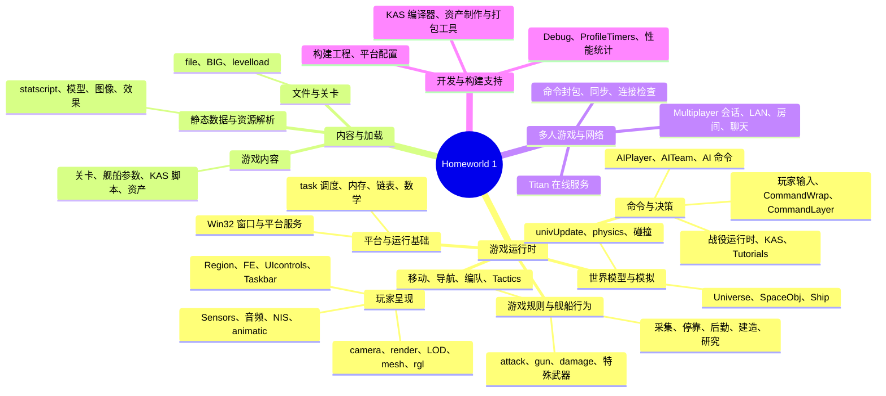
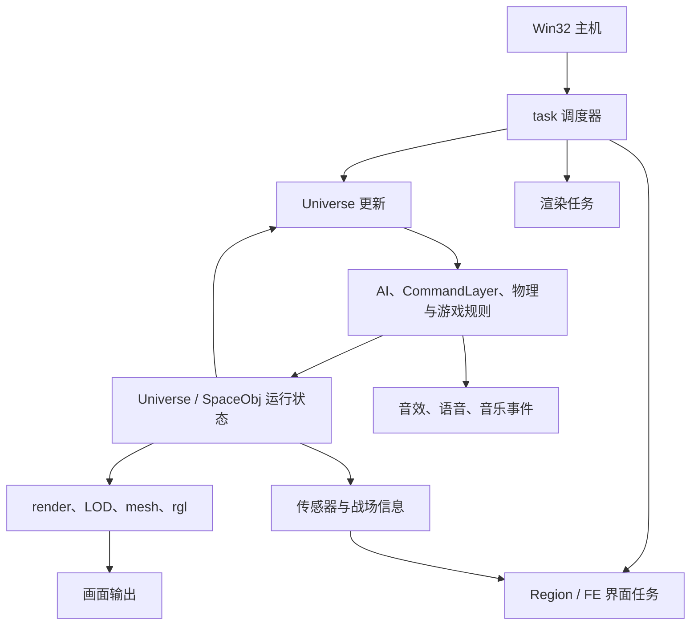
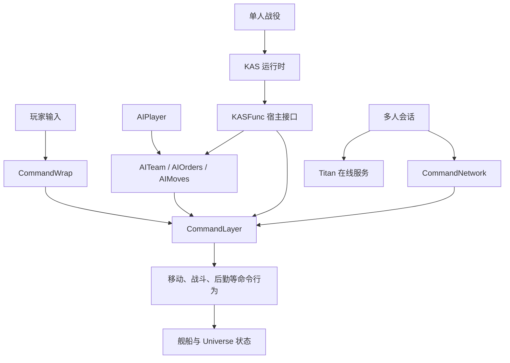
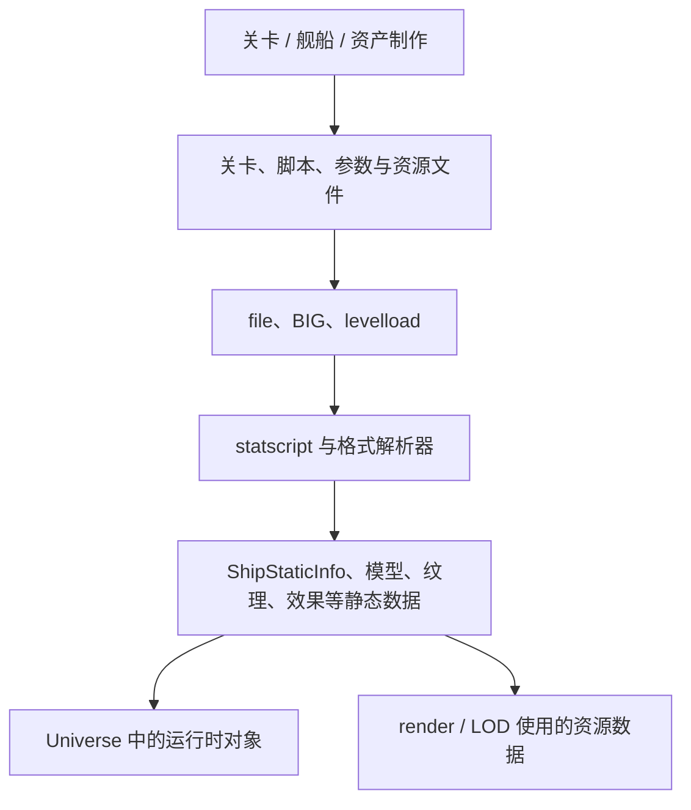

# Homeworld 1 项目模块分类与依赖关系

这张地图从**职责**分类，而不是照搬源码目录。它用于回答两件事：项目有哪些主要模块；它们怎样把输入、模拟、内容和画面连接起来。

## 项目模块分类

**分类边界**

- `Tactics` 是游戏规则的一部分；它不是 AI 决策器。姿态数值中的伤害、射程和弹速倍率只为 Fighter / Corvette 配置。
- 玩家、AI、KAS 是**命令或任务的来源**；`CommandLayer` 负责维护和推进运行中的舰船命令。
- 多人游戏模式管理会话与联网；`CommandNetwork` 同步命令；命令到达后仍进入游戏命令执行层。
- 状态机、存档、音频事件等横跨多个职责，按它服务的系统归类，不单独当作一套同级模块。
- `src/Game/`、`src/Win32/` 等目录包含多个职责；目录边界不等于模块边界。

## 运行时依赖

### 模拟、世界状态与玩家呈现

- `task` 驱动更新、界面和渲染等工作。
- 游戏规则修改运行时对象状态；渲染、传感器界面和音频系统读取状态或事件。
- 图中的反馈边表示持续运行中的状态读取，不表示固定的单帧调用顺序。

### 谁产生舰船命令

- `CommandLayer` 既保存活动命令，也在后续更新中推进命令。
- AI 团队和 KAS 可以编排行为；最终的舰船命令仍由游戏运行时执行。
- 多人玩家命令经网络同步后进入同一执行层。

### 关卡与资产怎样进入运行时

- 文件访问负责找到和读取资源；解析器把内容转为静态数据；关卡运行时再据此创建对象。
- `kas2c` 把 KAS 脚本编译成 C 函数；KAS 运行时通过宿主接口调用游戏功能。

## 模块文档索引

- **运行基础与世界模型**：[任务调度](modules/task_scheduler_overview.md)、[SpaceObj 对象模型](modules/spaceobj_overview.md)
- **游戏规则与舰船行为**：[玩家命令执行](modules/player_command_execution_overview.md)、[移动与编队](modules/movement_formation_overview.md)、[舰船战术](modules/ship_tactics_overview.md)、[特殊武器](modules/special_weapons_overview.md)、[特殊能力与战场感知](modules/special_abilities_battlefield_awareness_overview.md)、[资源与舰船后勤](modules/resource_ship_logistics_overview.md)、[建造与研究](modules/construction_research_overview.md)
- **决策与单人任务**：[AI 决策与团队执行](modules/ai_features_overview.md)、[KAS 脚本系统](modules/kas_script_overview.md)、[KAS Host API](modules/kas_host_api_reference.md)、[战役运行时](modules/campaign_runtime_overview.md)
- **玩家呈现与反馈**：[UI 系统](modules/ui_system_overview.md)、[渲染管线](modules/render_pipeline_overview.md)、[LOD 系统](modules/lod_overview.md)、[声音系统](modules/audio_system_overview.md)
- **内容与横切机制**：[资源加载](modules/resource_loading_overview.md)、[statscript 数据绑定](modules/statscript_overview.md)、[状态机实现](modules/state_machine_implementations_overview.md)

多人网络和开发工具目前没有同等范围的独立 overview，可从分类图中的源码模块继续阅读。
