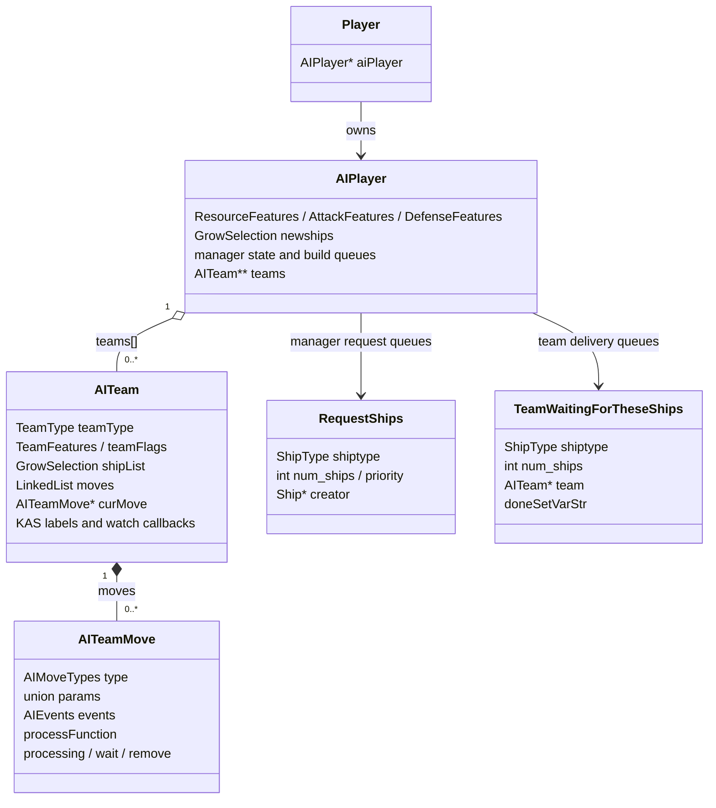
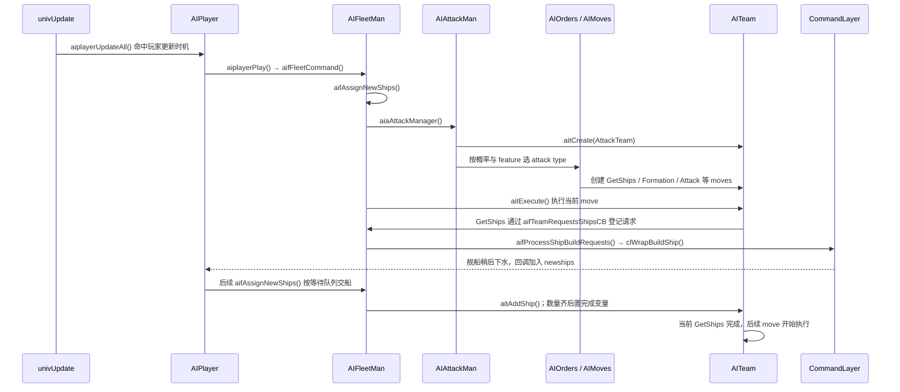
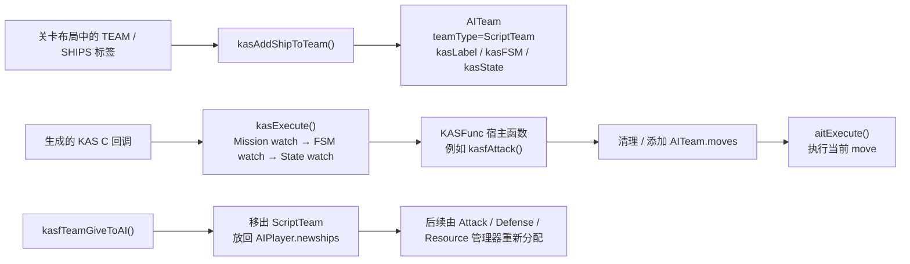

# AI 模块：从玩家决策到舰队动作

> 本文按运行时流程介绍 `src/Game/` 中的电脑玩家 AI、共享的团队命令执行器，以及战役脚本 KAS 怎样接入团队。重点是“谁做决定、状态放在哪里、命令怎样变成舰船行为”。
>
> 阅读时可以把 AI 想成两层：**管理器决定团队要做什么；`AITeam` 按队列逐步执行命令。** KAS 也能向同一团队下命令，但它负责战役脚本，不等同于电脑玩家 AI。

## 1. 先看整体：AI 在一帧里做什么

`univUpdate()` 调用 `aiplayerUpdateAll()` 推进 KAS 和电脑玩家 AI，随后处理主 `CommandLayer`。AI 不是每个模拟帧都完整重算：`aiplayerUpdateAll()` 会按玩家难度和玩家编号错开电脑玩家的更新时机。

```mermaid
flowchart TD
    U["univUpdate()"] --> AU["aiplayerUpdateAll()"]
    AU --> K{ "单人战役的 KAS 更新时机?" }
    K -->|是| KS["kasExecute()\nMission / ScriptTeam 的 FSM 与 State watch"]
    K -->|否| CPU{ "电脑玩家本帧到更新时机?" }
    KS --> CPU
    CPU -->|否| CL["clProcess(mainCommandLayer)"]
    CPU -->|是| AP["aiplayerPlay(AIPlayer)"]
    AP --> FC["aifFleetCommand()"]
    FC --> M["Attack / Defense / Resource 管理器"]
    M --> T["AITeam.moves：创建或更新团队命令"]
    T --> EX["aitExecute()：推进每个团队的当前 move"]
    EX --> R["造船请求 / CommandLayer 命令"]
    R --> CL
    CL --> NEXT["命令继续影响舰船；新下水舰回到 AIPlayer.newships"]
```

### 一次常规电脑玩家更新的顺序

在标准种族的 `aifFleetCommand()` 中，源码顺序是：

1. 更新敌方舰船知识、准备本轮管理器使用的 blob 数据，并清理防御告警。
2. `aifAssignNewShips()` 把新舰交给已有的脚本、进攻或防御等待队列；资源舰等特定类型交给资源管理器；其余舰船暂留 `newships` 储备。
3. 首次更新时运行 `aiaProcessSpecialTeams()`；后续更新才依次运行 `aiaAttackManager()`、`aidDefenseManager()`、`airResourceManager()`。这些管理器会改团队命令，或登记建舰请求。
4. `aitExecute()` 推进当前玩家的团队。
5. `aifProcessShipBuildRequests()` 汇总造船/科技需求并向 `CommandLayer` 发出建造命令。
6. 清理本轮临时 blob 数据。

**两个重要分支**：`aifFleetCommand()` 对 P2 海盗种族会改走 `aifP2FleetCommand()` 后返回；单人游戏关闭电脑舰队控制时，三个常规管理器会被跳过，但团队执行和请求处理仍在该函数尾部。见 [`AIPlayer.c`](../../src/Game/AIPlayer.c#L832)、[`AIFleetMan.c`](../../src/Game/AIFleetMan.c#L1278) 和 [`univupdate.c`](../../src/Game/univupdate.c#L7650)。

## 2. 模块分工：不同管理器改同一份团队状态

| 部分 | 负责的问题 | 关键入口 / 文件 | 主要读写状态 |
| :-- | :-- | :-- | :-- |
| 玩家 AI 外壳 | 何时更新某个电脑玩家；建立当前玩家上下文；启动、结束与存档 | `aiplayerUpdateAll()`、`aiplayerPlay()`，`AIPlayer.c` | `AIPlayer`、全局 `aiCurrentAIPlayer` |
| 舰队管理器 | 新舰归属、建舰请求、科技/资源和建造调度 | `aifFleetCommand()`、`aifAssignNewShips()`、`aifProcessShipBuildRequests()`，`AIFleetMan.c` | `newships`、`RequestShips` 队列、等待团队队列、建造计数 |
| 进攻管理器 | 侦察、骚扰、进攻团队构成与攻击类型 | `aiaAttackManager()`、`aiaGenerateNewAttackTeam()`，`AIAttackMan.c` | `attackTeam[]`、`reconTeam[]`、攻击概率和特征位 |
| 防御管理器 | 护卫、巡逻、母舰防守、入侵应对 | `aidDefenseManager()`，`AIDefenseMan.c` | `guardTeams[]`、防御目标、告警和特征位 |
| 资源管理器 | 采集舰、资源点、资源船与支援舰的调度 | `airResourceManager()`，`AIResourceMan.c` | `airResourceCollectors`、`airResourceReserves`、资源船数量 |
| 订单构造器 | 把“攻击/守卫/侦察”等高层意图展开成 move 队列 | `aioCreate*()`，`AIOrders.c` / `AIOrders2.c` | `AITeam.moves` |
| 团队执行器 | 逐步执行队列中的当前命令，推进、等待或销毁团队 | `aitExecute()`，`AITeam.c`；move 实现在 `AIMoves*.c` | `AITeam.curMove`、`AITeamMove` |
| 事件与辅助 | move 执行中的条件事件；飞行、目标选择、几何和通用 AI 帮助函数 | `AIEvents.c`、`AIHandler.c`、`AIShip.c`、`AIUtilities.c` | 当前团队、目标选择和 move 上的 `AIEvents` |
| 战役脚本桥接 | 运行 KAS 任务脚本，给 `ScriptTeam` 下发高层命令 | `KAS.c`、`KASFunc.c` | `AITeam.kas*` 字段和同一条 `AITeam.moves` 队列 |

管理器通常不是各自持有一套独立的团队对象；它们的许多状态直接放在所属玩家的 `AIPlayer` 里。`aiCurrentAIPlayer` 则是旧式接口使用的“当前正在处理哪位 AI 玩家”上下文，很多 feature 宏与管理器函数会隐式读取它。

## 3. 关键数据结构：玩家、团队、move 和造船请求



| 结构 | 放什么、归谁管理 | 读代码时要抓住的点 |
| :-- | :-- | :-- |
| `AIPlayer` | 一个电脑玩家的 AI 总状态；通过 `Player.aiPlayer` 关联。 | 三类玩家级特征位；敌情；`newships`；资源、攻击、防御状态；`teams[]`；造船队列和建造计数。它是“每个玩家一份”的主要状态容器。 |
| `AITeam` | 一组一起接受 AI 命令的舰船，由该 AIPlayer 的 `teams[]` 登记。 | `shipList` 是团队舰船集合；`moves` 是命令链表；`curMove` 指向当前命令；`teamType` 区分 Attack/Defense/Resource/Script 等用途。KAS 团队还复用其中的 `kasLabel`、FSM/State 名称和 watch 函数。 |
| `AITeamMove` | 一条团队命令，也是 `AITeam.moves` 的节点。 | `type` 决定 move 种类；`params` 联合体保存该种类参数；`processFunction` 每次推进它；`events` 可在执行期间改变控制流；`processing`、`wait`、`remove` 记录执行状态。 |
| `AIEvents` | move 正在监听的事件及处理器。 | 例如遭受攻击、附近有敌人、燃料低、团队人数/健康变化、成员死亡。事件不是新的团队命令队列，而是挂在当前 move 上的中断/响应条件。 |
| `RequestShips` | 管理器提出“建造某类型、若干艘”的需求。 | 攻击、防御、脚本需求进入各自的 `LinkedList`；资源管理器请求保存在一个单独槽位。`creator` 记住可负责建造的母舰/航母。 |
| `TeamWaitingForTheseShips` | 请求与接收团队之间的交付登记。 | 记录目标 `team`、剩余数量和完成变量。它与 `RequestShips` 是配套的两种状态：前者决定新船交给谁，后者决定船厂造什么。 |
| `ShipTypesBeingBuilt` | 每个管理器按舰船类型统计正在建造数量。 | 配合 `newships` 与等待队列，把已经安排建造的船和已下水、待分配的船区分开。 |
| `GrowSelection` / `SelectCommand` | 游戏中常用的舰船集合及其具体选择数据。 | AI 会在这些集合上筛选、计数和移除舰船；move 队列则是 `LinkedList`。阅读代码时不要把“集合成员”和“团队命令节点”混为一类。 |

### Feature 位与难度

- `AIPlayer.ResourceFeatures`、`AttackFeatures`、`DefenseFeatures` 是玩家级位掩码；`AITeam.TeamFeatures` 是团队级位掩码。相应的 `aiu*FeatureEnabled()` 宏让管理器按位判断能力是否打开。
- 例子：`AIA_HARASS` 打开骚扰团队逻辑，`AID_ACTIVE_GUARD` 影响主动防御，`AIR_SMART_COLLECTOR_REQUESTS` 影响资源船申请，`AIT_TACTICS` 控制 move 间战术设置。
- 难度不只改变 feature 位：默认更新掩码 `AIPLAYER_UPDATE_RATE={63,31,15}`、进攻类型概率、研究间隔和 `AIT_TEAM_MOVE_DELAY` 也会随难度影响行为。团队难度在 `aitCreate()` 初始化，并决定团队特征和 move 间延迟。
- **源码注意点**：[`AIUtilities.h`](../../src/Game/AIUtilities.h#L62) 中名为 `aiuDisableTeamFeature` 的宏实际调用 `bitSet`，不是 `bitClear`。读到“关闭团队特征”时需结合调用点核对；本文只记录其实现，不推断这是设计意图还是遗留错误。

## 4. Use case 一：电脑玩家凑出一支进攻队

这条路径串起“新舰 → 管理器判断 → move 命令 → 缺船申请 → 船加入团队”。以下是标准种族电脑玩家的典型路径；P2 海盗使用独立分支。



1. **更新时机与上下文**：`univUpdate()` 调 `aiplayerUpdateAll()`。默认 `AIPLAYER_UPDATE_RATE` 是 `{63,31,15}`；判断式为 `(univUpdateCounter & rate) == (playerIndex & rate)`。因此不同难度会隔若干模拟帧更新一次，并按玩家下标错开。命中后 `aiplayerPlay()` 设置 `aiCurrentAIPlayer`，再进入 `aifFleetCommand()`。
2. **新舰先经过分派**：`aifAssignNewShips()` 优先检查脚本、攻击、防御团队的待交付队列；匹配成功就把船加入对应 `AITeam.shipList` 并从 `newships` 移除。资源舰、非战斗舰等交给资源管理器；没有匹配的战斗舰留在 `newships` 储备。
3. **进攻管理器不是直接控制每艘船**：`aiaAttackManager()` 清理旧团队、尝试把可用新舰组织成团队，并在适当条件下创建新攻击团队。`aiaGenerateNewAttackTeam()` 从 `AttackType` 中抽选，结合 `aiaAttackProbability[]` 和已开启的 feature，再由 `aiaGenerateAttackType()` 调用 `aioCreate*()`。
4. **`AIOrders` 把战略变成 move 列表**：例如一项攻击订单可以按顺序加入 `GetShips`、编队、攻击和结束 move。每个 move 的参数保存在对应的 `AITeamMove.params` 中；这里形成的是团队命令计划，不是已经执行完的舰船动作。
5. **`aitExecute()` 每次只推进当前 move**：它先运行 `aieExecute(team)`，因为事件处理器可以修改 `curMove`；再处理延迟；最后才调用当前 move 的 `processFunction`。返回完成后，才切到下一个 move，并按需应用新编队/战术。`MOVE_DONE` 代表这条命令序列结束。

### 缺舰时的交接细节

- `MOVE_GETSHIPS` 的处理函数首次运行时调用 `aifTeamRequestsShipsCB()`。它把“要造什么”写入管理器的 `RequestShips` 队列，同时创建 `TeamWaitingForTheseShips`，记住接收团队、舰船类型、待交数量和完成变量。
- `aifProcessShipBuildRequests()` 检查请求可否满足、研究和资源状态，再经 `BuildShip()` / `clWrapBuildShip()` 把建造交给命令层。船并不是在 AI 管理器内部直接创建。
- 舰船下水时 `aiplayerShipLaunchedCallback()` 通常把它加入所属 AI 的 `newships`。后续 `aifAssignNewShips()` 找到相符的等待项，`aitAddShip()` 把它放进目标团队；数量归零后完成变量置真。
- `MOVE_GETSHIPS` 读取完成变量后才返回完成。这样“船造好”“船已下水”“船已分给团队”是可区分的三个时点。

## 5. Use case 二：战役 KAS 脚本控制一支团队

单人战役中，KAS 驱动剧情和任务行为；它并不替换团队执行器，而是把命令写进同一个 `AITeam.moves`。



- KAS 运行时在 `KAS.c`：`kasExecute()` 调 mission watch，并遍历 `AIPlayer.teams[]`，对 `teamType == ScriptTeam` 的团队调用其 FSM 和 State watch。`CurrentTeamP` 是许多 `kasf*` 宿主函数隐式读取的当前团队。
- `kasFSMCreate()` 把已有团队标成 `ScriptTeam`，在 `AITeam` 上保存 FSM 名和 watch 函数并执行 init；这里并没有另建一个独立的 FSM 团队对象。
- 例如 `kasfAttack()` 会清掉当前团队已有 moves，再调用 `aimCreateAdvancedAttack()` 加入新命令。之后仍由 `aitExecute()` 调用 move 的处理函数推进。
- `kasfTeamGiveToAI()` 会把脚本团队的船逐一移出团队、放回 `AIPlayer.newships`；后续普通管理器才重新认领这些船。这是脚本控制权交还 AI 的明确路径。
- `KAS` 是源码中的系统名：代码注释称它支持 KAS language；仓库源码没有给出这三个字母的正式展开。KAS 语言由 `kas2c` 工具转换成 C 回调后参与构建。

## 6. 读代码时的边界与推荐顺序

### AI 模块负责什么

- 按难度和特征决定敌情处理、团队构成、资源/舰船需求和高层命令。
- 用 `AITeam`、`AITeamMove` 与事件回调保存团队执行状态。
- 把建造意图交给 `CommandLayer`；把团队移动/攻击等意图交给 move 函数和命令包装器。

### AI 模块不负责什么

- 不拥有整个世界或舰船对象的生命周期；底层对象在 `universe` / `spaceobj`。
- 不负责完整的物理积分与碰撞计算；AI 只读取对象状态并生成命令。
- KAS 不等于所有 AI：它主要控制单人任务的脚本团队；常规电脑玩家还会由 Attack/Defense/Resource 管理器自主决策。

### 建议阅读路径

1. [`univupdate.c`](../../src/Game/univupdate.c#L7650)：确认 AI 在一帧更新中的位置。
2. [`AIPlayer.c`](../../src/Game/AIPlayer.c#L832)：看分帧调度与当前玩家上下文。
3. [`AIFleetMan.c`](../../src/Game/AIFleetMan.c#L1278)：看管理器的总调用顺序、新舰分配和建造队列。
4. [`AIAttackMan.c`](../../src/Game/AIAttackMan.c#L883) 与 [`AIOrders.c`](../../src/Game/AIOrders.c#L27)：看进攻决策如何生成团队命令。
5. [`AITeam.c`](../../src/Game/AITeam.c#L2112) 与 `AIMoves.c` / `AIMoves1.c` / `AIMoves2.c`：看当前 move 如何推进。
6. [`AIEvents.c`](../../src/Game/AIEvents.c#L1)、[`KAS.c`](../../src/Game/KAS.c#L180)、[`KASFunc.c`](../../src/Game/KASFunc.c#L290)：分别看事件处理与脚本接入。

## 7. 事实范围

本文描述的是当前仓库 `src/Game/` 的实现路径。管理器具体策略有种族、难度和 feature 条件分支；上述“进攻团队”用例用于串起通用的数据流，并不表示每个 AI 更新都会新建团队或造船。若要追踪某个关卡的实际行为，还要继续检查该任务的 KAS 回调、AI feature 设置和玩家种族。
