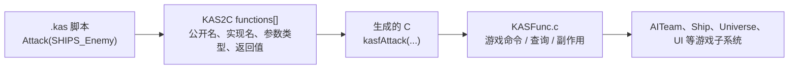

# KAS Host API 参考

> 范围：当前仓库 `tools/win32/KAS/KAS2C.c` 中启用的 `functions[]` 注册项。
> 总览与脚本类型：[KAS 脚本系统 overview](kas_script_overview.md)。
> 统计口径：301 个启用 API；`TeamGiveToPlayer` 虽有注册表源码，但包在 `#if 0` 中，不属于当前可调用接口。

---

## 1. Host API 在 KAS 中的位置

KAS 脚本不直接访问游戏引擎内部函数。脚本写公开名称（例如 `Attack(...)`），`kas2c` 在注册表中查找该名称，检查参数个数与大致类型，再生成调用 `KASFunc.c` 中 `kasf*` 函数的 C 代码。

接口名分两层：

- **脚本名**：本文清单中的 `Attack`、`ShipsCount`、`TutShowText` 等，大小写按注册表原样书写。
- **C 实现名**：如 `Attack` 映射到 `kasfAttack`。它是生成 C 时调用的实现符号，不是 `.kas` 中通常使用的名字。

注册表的返回标志为 `0` 或 `1`：`0` 生成 `void` 调用；`1` 生成可用于整数表达式的 `sdword` 结果。返回 `sdword` 的接口可能表示数量、距离、布尔条件或枚举值，具体含义要看所在类别及实现。接口参数类型包括整数、布尔、字符串、团队、舰船集合、路径、坐标和体积等；脚本表达式本身仍以整数为主，完整类型说明见 overview 的“基础数据类型”。

**校验边界**：编译器能报告未知函数、参数过多/不足，以及部分参数类别不匹配；注册表检查不等于完整的静态类型系统，也不替代运行期对象/标签有效性检查。

---

## 2. 按业务功能分组的接口清单

以下每个名称都来自启用的注册表。相邻接口通常共享相同的操作对象；功能说明先解释这一组的共同用途，再说明名称后缀所代表的差别。

### 2.1 脚本变量、计时器与团队消息

| 接口 | 功能 |
| :-- | :-- |
| `TimerCreate`、`TimerSet`、`TimerStart`、`TimerCreateSetStart`、`TimerStop`、`TimerRemaining`、`TimerExpired`、`TimerExpiredDestroy`、`TimerDestroy` | 创建和控制按名字引用的计时器；查询剩余时间或是否到期；`ExpiredDestroy` 在检查到期的同时清理计时器。计时器受当前 Mission/FSM/State 脚本作用域规则约束。 |
| `VarCreate`、`VarSet`、`VarCreateSet`、`VarInc`、`VarDec`、`VarGet`、`VarDestroy` | 创建、设值、增减、读取或销毁整数脚本变量；`CreateSet` 合并创建与初始化，`Get` 可用于条件表达式。 |
| `MsgSend`、`MsgSendAll`、`MsgReceived` | 向指定团队发送消息、向团队广播消息、检查当前团队是否收到某消息。用于不同团队 FSM 之间的轻量事件协作。 |

### 2.2 移动、攻击、护卫与编队

| 接口 | 功能 |
| :-- | :-- |
| `MoveTo`、`ShipsMoveTo` | 让当前脚本团队或显式舰船集合移动到指定坐标。 |
| `Attack`、`AttackSpecial`、`AttackFlank`、`MoveAttack`、`AttackHarass`、`AttackMothership`、`BulgeAttack`、`Intercept`、`SetSwarmTargets`、`SwarmMoveTo`、`ShipsAttack`、`TargetDrop` | 创建不同类型的攻击/拦截/蜂群命令，设置蜂群目标，或让显式舰船集合攻击目标；`TargetDrop` 清除当前攻击目标。差异在战术意图、目标/攻击者集合和目标筛选方式。 |
| `FormationDelta`、`FormationBroad`、`FormationDelta3D`、`FormationClaw`、`FormationWall`、`FormationSphere`、`FormationCustom` | 设置团队或指定舰船集合的编队形状。 |
| `Guard`、`GuardMothership` | 让当前团队护卫指定舰船集合或母舰。 |
| `TacticsAggressive`、`TacticsNeutral`、`TacticsEvasive` | 切换当前团队的攻击、中立或规避战术。 |
| `Kamikaze`、`KamikazeEveryone` | 让当前团队，或当前玩家所有有舰船的团队，对指定目标执行自杀式攻击命令。 |
| `SpecialToggle`、`ShipsDamage`、`ShipsOrder`、`ShipsOrderAttributes` | 为当前团队切换特殊能力；对指定舰船集合直接施加伤害；读取集合中第一艘舰船当前命令的 order / attributes（无舰船或无命令时返回 `0`）。 |

### 2.3 路径、空间查询与舰船集合

| 接口 | 功能 |
| :-- | :-- |
| `Patrol`、`PatrolPath`、`PathNextPoint`、`PointInside` | 设置主动巡逻或沿路径巡逻；取得路径后续点；检测坐标是否处于体积内。 |
| `ShipsClear`、`ShipsCount`、`ShipsCountType`、`ShipsAdd`、`ShipsRemove`、`ShipsDisabled` | 清空/查询/修改脚本舰船集合；按舰船类型计数；`ShipsDisabled` 返回集合中失能舰船的数量。 |
| `ShipsSelectEnemy`、`ShipsSelectFriendly`、`ShipsSelectClass`、`ShipsSelectType`、`ShipsSelectDamaged`、`ShipsSelectMoving`、`ShipsSelectCapital`、`ShipsSelectNonCapital`、`ShipsSelectNotDocked`、`ShipsSelectIndex`、`ShipsSelectNearby`、`ShipsSelectSpecial` | 按敌我关系、类别/类型、受损/移动状态、大小舰属性、停靠状态、索引、附近范围或特殊能力，从游戏对象中筛选舰船写入集合。 |
| `FindShipsInside`、`FindEnemiesInside`、`FindEnemiesNearby`、`FindEnemiesNearTeam`、`FindEnemyShipsOfType`、`FindFriendlyShipsOfType`、`FindEnemyShipsOfClass`、`FindFriendlyShipsOfClass`、`FindShipsNearPoint` | 搜索并填充符合空间位置、队伍敌我关系、舰船类型或类别条件的舰船集合；返回值可供脚本判断找到的数量/结果。 |

### 2.4 团队与舰船状态查询、行为参数

| 接口 | 功能 |
| :-- | :-- |
| `TeamHealthAverage`、`TeamHealthLowest`、`TeamFuelAverage`、`TeamFuelLowest`、`TeamCount`、`TeamCountOriginal`、`NewShipsAdded`、`ThisTeamIs` | 查询当前团队生命值/燃料统计、现存或初始舰船数、新加入舰船数，或判断当前团队是否为指定团队。 |
| `TeamSkillSet`、`TeamSkillGet`、`TeamMakeCrazy` | 设置/查询团队技能参数，或启用该团队的特殊激进/失控行为标志。 |
| `TeamAttributesBitSet`、`TeamAttributesBitClear`、`TeamAttributesSet`、`TeamVelocityMaxSet`、`TeamVelocityMaxClear`、`TeamHealthSet`、`TeamFuelSet` | 设置/清除团队属性位，调整速度上限，并设置团队生命值或燃料。 |
| `ShipsAttributesBitSet`、`ShipsAttributesBitClear`、`ShipsAttributesSet`、`ShipsVelocityMaxSet`、`ShipsVelocityMaxClear`、`ShipsDamageModifierSet`、`ShipsDamageModifierClear`、`ShipsSetNonRetaliation`、`ShipsSetRetaliation` | 批量修改指定舰船集合的属性位、速度上限和伤害倍率，或切换是否自动还击。 |

### 2.5 超空间、跳跃门、增援与 AI 控制

| 接口 | 功能 |
| :-- | :-- |
| `DisablePlayerHyperspace`、`HoldHyperspaceWindow`、`TeamHyperspaceOut`、`TeamHyperspaceIn`、`TeamHyperspaceInNear` | 控制玩家超空间能力/窗口，并让团队跳出、跳入或在目标附近跳入。 |
| `GateDestroy`、`GateShipsOut`、`GateShipsIn`、`GateMoveToNearest`、`GateShipsOutNearest` | 控制跳跃门及舰船通过跳跃门进出、移动到最近跳跃门或从最近门跳出。 |
| `MissionSkillSet`、`MissionSkillGet` | 设置/读取任务层面的 AI 技能参数。 |
| `RequestShips`、`RequestShipsOriginal`、`Reinforce`、`ReinforceTeamWithShips` | 请求舰船或增援；可使用当前/原始配置，也可把指定舰船补入目标团队。 |
| `ForceCombatStatus` | 对舰船集合强制设定战斗状态。 |
| `TeamGiveToAI` | 把脚本团队的舰船控制权交回常规 AI 调度。 |
| `DisableAIFeature`、`EnableAIFeature`、`DisableAllAIFeatures`、`EnableAllAIFeatures` | 对当前玩家 AI 的指定功能或所有功能进行开关控制。 |
| `TeamSwitchPlayerOwner`、`ShipsSwitchPlayerOwner` | 切换当前团队或指定舰船集合的玩家归属。 |

### 2.6 距离、威胁、停靠与采集

| 接口 | 功能 |
| :-- | :-- |
| `Random` | 取得脚本随机数，用于分支、延迟或行为变化。 |
| `Nearby`、`FindDistance` | 查询坐标间的距离关系或距离值。 |
| `UnderAttack`、`UnderAttackElsewhere` | 判断当前团队或指定的其它团队是否遭受攻击，并把攻击者写入舰船集合。 |
| `Dock`、`DockSupport`、`DockSupportWith`、`ShipsDockSupportWith`、`DockStay`、`ShipsDockStay`、`DockInstant`、`DockStayMothership`、`Launch`、`TeamDocking`、`TeamDockedReadyForLaunch`、`TeamFinishedLaunching` | 控制当前团队或显式舰船集合进行停靠、支援停靠、保持停靠、立即停靠、母舰停靠与起飞；也可查询团队停靠/起飞进度。 |
| `Harvest` | 启动当前团队的资源采集行为。 |
| `RUsEnemyCollected` | 查询敌方已采集资源量，供任务触发条件使用。 |

### 2.7 任务目标、阶段结束与存档

| 接口 | 功能 |
| :-- | :-- |
| `ObjectiveCreate`、`ObjectiveCreateSecondary`、`ObjectiveSet`、`ObjectiveGet`、`ObjectivesGetAll`、`ObjectiveDestroy`、`ObjectivesDestroyAll` | 创建/更新/查询/销毁主要或次要任务目标，并读取或清理目标集合。 |
| `MissionCompleted`、`MissionFailed`、`Stop` | 完成/判负任务，或清空当前团队的 move 并向其舰船提交 Halt 命令。 |
| `GameEnd` | 在 CGW / Downloadable / OEM 等特定构建中退出到 plug screens；其它构建下该实现不执行退出操作。 |
| `SaveLevel` | 请求保存当前关卡状态。 |

### 2.8 玩家界面、建造与脚本调试消息

| 接口 | 功能 |
| :-- | :-- |
| `BuildControl` | 开关单人任务中电脑舰队 AI 的舰队控制权限（写入 `giveComputerFleetControl`）；它不是建造界面开关。 |
| `BuilderRestrictShipTypes`、`BuilderUnrestrictShipTypes`、`BuilderRestrictAll`、`BuilderRestrictNone`、`BuilderCloseIfOpen`、`ForceBuildShipType` | 限制/恢复可建造舰船类型，关闭建造界面或强制建造指定舰船。 |
| `BuildingTeam`、`BuildManagerShipTypeInBatchQueue`、`BuildManagerShipTypeInBuildQueue`、`BuildManagerShipTypeSelected` | 查询负责建造的团队，以及当前建造管理器中的队列或所选舰船类型。 |
| `CameraGetAngleDeg`、`CameraGetDeclinationDeg`、`CameraGetDistance` | 读取当前相机方位角、俯仰角和距离。 |
| `SelectNumSelected`、`SelectIsSelectionShipType`、`SelectContainsShipTypes`、`SelectedShipsInFormation`、`ShipsInFormation`、`FindSelectedShips` | 查询玩家当前选择的舰船数量、类型、编队关系，或将选择结果写入脚本舰船集合。 |
| `Print`、`Log`、`LogInteger`、`Popup`、`PopupInteger` | 向命令消息区、日志或弹窗输出字符串/整数，用于任务说明、调试和玩家提示。 |
| `ForceTaskbar` | 强制显示或启用任务栏相关界面。 |
| `RaceOfHuman`、`NISRunning` | 查询人类玩家种族或 NIS（非交互场景/过场）运行状态。 |
| `FadeToWhite`、`ClearScreen`、`wideScreenIn`、`wideScreenOut`、`SubtitleSimulate`、`LocationCard` | 执行画面淡白/清屏、宽银幕遮幅、模拟字幕或地点卡片等任务演出效果。 |

### 2.9 教程系统接口（Tut 前缀）

这些接口主要给教程脚本控制指针、文字、按钮、教学步骤和玩家可用操作。

| 接口 | 功能 |
| :-- | :-- |
| `TutSetPointerTargetXY`、`TutSetPointerTargetXYRight`、`TutSetPointerTargetXYBottomRight`、`TutSetPointerTargetXYTaskbar`、`TutSetPointerTargetXYFE`、`TutSetPointerTargetShip`、`TutSetPointerTargetShipSelection`、`TutSetPointerTargetShipHealth`、`TutSetPointerTargetShipGroup`、`TutSetPointerTargetFERegion`、`TutSetPointerTargetRect`、`TutSetPointerTargetAIVolume`、`TutRemovePointer`、`TutRemoveAllPointers` | 在屏幕坐标、前端区域、舰船/舰船栏、矩形区域或 AI 体积上设置教程指针，并移除单个或全部指针。 |
| `TutSetTextDisplayBoxGame`、`TutSetTextDisplayBoxToSubtitleRegion`、`TutSetTextDisplayBoxFE`、`TutShowText`、`TutHideText` | 选择游戏内、字幕区或前端文字框，并显示/隐藏教程文字。 |
| `TutShowNextButton`、`TutHideNextButton`、`TutNextButtonClicked`、`TutShowBackButton`、`TutHideBackButton`、`TutShowPrevButton`、`TutSaveLesson` | 显示/隐藏教程导航按钮，检测“下一步”点击、切换上一步/返回按钮，并保存教程进度。 |
| `TutShowImages`、`TutHideImages` | 显示或隐藏教程配图。 |
| `TutEnableEverything`、`TutDisableEverything`、`TutEnableFlags`、`TutDisableFlags`、`TutForceUnpaused` | 解锁/限制教程中的操作，按标志开关操作项，或强制解除暂停。 |
| `TutGameSentMessage`、`TutResetGameMessageQueue` | 检查/清空教程使用的游戏消息队列。 |
| `TutContextMenuDisplayedForShipType`、`TutResetContextMenuShipTypeTest` | 检查指定舰船类型的上下文菜单是否显示，并重置该检查状态。 |
| `TutRedrawEverything` | 请求重绘教程相关界面。 |
| `TutCameraFocus`、`TutCameraFocusDerelictType`、`TutCameraFocusFar`、`TutCameraFocusCancel`、`TutCameraFocusedOnShipType` | 让教程相机聚焦舰船或残骸类型、使用远景/取消聚焦，并查询相机是否聚焦指定舰船类型。 |
| `DisablePlayer`、`TutShipsInView`、`TutShipsTactics`、`TutPieDistance`、`TutPieHeight` | 按教程步骤限制玩家输入，检查舰船是否在视野内/战术是否符合条件，并读取教程菜单相关距离或高度。 |

### 2.10 传感器、研究、交易与资源

| 接口 | 功能 |
| :-- | :-- |
| `ForceFISensors`、`OpenSensors`、`CloseSensors`、`SensorsIsOpen`、`SensorsWeirdness`、`SensorsStaticOn`、`SensorsStaticOff` | 控制或查询传感器界面状态，设置教程/任务所需的传感器静态干扰效果。 |
| `TechSetResearch`、`TechSetPurchase`、`TechSet`、`TechGetResearch`、`TechGetPurchase`、`TechGet`、`TechSetCost`、`TechGetCost`、`TechIsResearching` | 设置、查询或修改科技研究/购买状态、成本，并检测研究是否进行中。 |
| `TraderGUIDisplay`、`TraderGUIIsDisplayed`、`TraderGUIDialogSet`、`TraderGUIPriceScaleSet`、`TraderGUIPriceScaleGet`、`TraderGUIDisable` | 控制交易者界面的显示、对话和价格倍率，或查询/禁用界面。 |
| `RUsGet`、`RUsSet`、`GetWorldResources` | 查询/设置玩家 RUs（资源单位）或世界资源量。 |

### 2.11 音频、演员、可见性与特效

| 接口 | 功能 |
| :-- | :-- |
| `SoundEvent`、`SoundEventShips`、`SpeechEvent`、`SpeechEventShips` | 在任务脚本中触发音效/语音事件，可绑定舰船集合上下文。 |
| `ToggleActor`、`MusicPlay`、`MusicStop`、`HyperspaceDelay` | 切换任务演出中的演员状态、播放/停止音乐，或控制超空间演出的延迟。 |
| `RenderedShips` | 查询指定舰船集合是否曾以指定 LOD 或更低细节绘制；适合脚本等待镜头中的舰船实际出现。 |
| `RenderedDerelictType` | 查询指定残骸类型是否以给定 LOD 绘制。 |
| `ResetShipRenderFlags`、`ResetDerelictRenderFlags` | 清除已绘制 LOD 标记，供下一次绘制检测重新计数；注意当前 `ResetDerelictRenderFlags` 实现遇到第一个匹配残骸就 `break`，因此只重置一个对象（`KASFunc.c:3804-3821`）。 |
| `HideShips`、`UnhideShips`、`DeleteShips`、`RotateDerelictType` | 隐藏/恢复/删除舰船，或旋转指定残骸类型。 |
| `SpawnEffect` | 对指定舰船集合创建具名效果，并传入一个数值参数（实现会将其转成浮点效果参数）。 |
| `PingAddSingleShip`、`PingAddShips`、`PingAddPoint`、`PingRemove` | 在传感器/战术界面添加单舰、舰船集合或点位提示标记，并移除标记。 |

### 2.12 世界暂停与其它任务钩子

| 接口 | 功能 |
| :-- | :-- |
| `PauseUniverse`、`UnpauseUniverse`、`PauseShipBuilding`、`UnpauseShipBuilding` | 暂停/恢复宇宙模拟或舰船建造。 |
| `PauseOtherKAS`、`UnpauseOtherKAS` | 暂停/恢复其它 KAS 团队脚本，常用于演出或任务事件期间冻结其它团队行为。 |
| `IntelEventEnded`、`IntelEventNotEnded`、`ForceIntelEventEnded` | 查询或强制设置 Intel/情报事件完成状态。 |

---

## 3. 不在清单中的名字与易混淆点

- **`TeamGiveToPlayer` 当前不可调用**：它在 `functions[]` 中，但处于 `#if 0` 禁用段；不能因为 `KASFunc.c` 里有同名实现，就认定脚本可用。
- **`TimerStop` 有名称与实现不符的疑点**：`kasfTimerStop()`（`KASFunc.c:235-239`）当前调用的是 `timTimerStart()`，而不是 `Timer.c` 中提供的 `timTimerStop()`。按当前源码执行时它会启动/重置计时器，而非停止计时器；发行脚本中没有搜到 `TimerStop` 的用法。使用前应按实现核查，不要只依赖 API 名称。
- **`ResetDerelictRenderFlags` 只重置一个匹配对象**：如上表所述，循环找到同类型残骸后立即退出；这与复数命名可能表达的“清空全部”不一致。这里记录源码行为，不推断作者意图。
- **`kasf*` 不是脚本 API 名**：它们是 C 端实现。脚本用表中的公开名，例如写 `TeamGiveToAI;`，生成代码再调用 `kasfTeamGiveToAI()`。
- **表头声明类型不等于 KAS 有完整类型系统**：函数表用参数元数据做代码生成和编译期提示。坐标、团队、舰船集合、路径和体积通常由脚本标签解析成指针参数；变量和算术表达式不是任意对象引用容器。
- **接口可能影响全局游戏状态**：这批函数不仅下发 AITeam move，也直接改 Universe、Ship、科技、资源、传感器、相机、教程 UI、音频与演出状态。读具体脚本时，要继续查对应 `kasf*` 实现及其调用的子系统。

---

## 4. 源码索引

| 要查的问题 | 入口 |
| :-- | :-- |
| 当前 `.kas` 能调用哪些名字、参数类别和返回值 | `tools/win32/KAS/KAS2C.c` 的 `functions[]` 与 `kasFunction()` |
| 注册参数类型怎样变成生成代码原型 | `tools/win32/KAS/KAS2C.c` 的 `kasParamTypeToString()`、`kasParamTypeToC()`、`kasHeaders()` |
| 脚本参数如何解析成团队/舰船集合/位置/路径/体积指针 | `tools/win32/KAS/KAS2C.y` 的 `param` / `paramteam` 规则 |
| 实际游戏副作用和查询结果 | `src/Game/KASFunc.c`；各 `kasf*` 调用的模块实现 |
| Mission/FSM/State 的运行时调度 | `src/Game/KAS.c` 的 `kasMissionStart()`、`kasExecute()`、`kasFSMCreate()`、`kasJump()`
