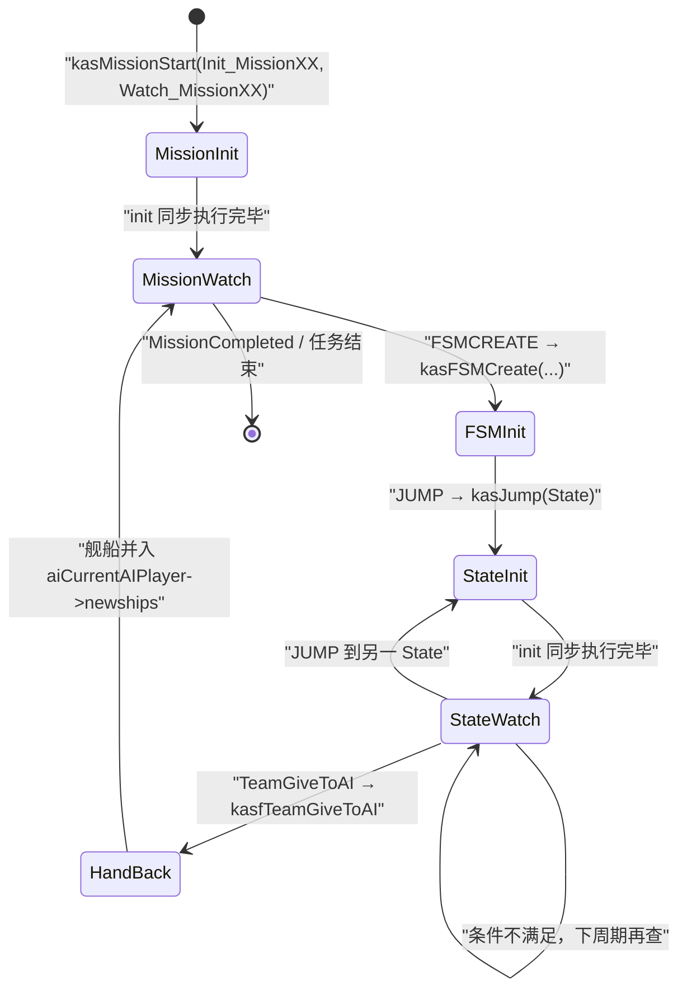
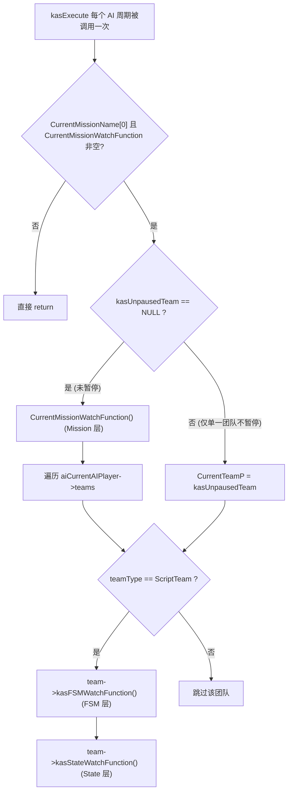
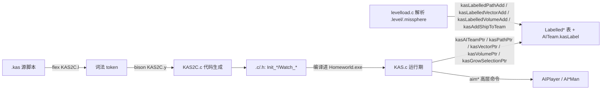

# KAS 脚本系统 模块 overview

> 模块：`KAS`（Mission scripting language runtime + `kas2c` 编译器）
> 源码：`src/Game/KAS.c`、`src/Game/KAS.h`、`src/Game/KASFunc.c`、`src/Game/KASFunc.h`、`tools/win32/KAS/`
> 路径均相对仓库根目录；「事实」可由源码核验，「推断」是由代码结构推出的解释，「设计观察」总结实现收益与代价。

---

## 1. 模块定位

**一句话职责（事实）**：KAS 定义并控制三级层级对象——`Mission` → `FSM`（有限状态机）→ `State`，由 `kas2c` 把 `.kas` 源脚本编译为 C 的 `Init_*` / `Watch_*` 函数，运行期 `KAS.c` 在每次 AI 周期推进这三层的 watch 段，驱动单人任务的团队（`AITeam`）行为。

**在整体架构中的位置（引用总览，事实）**：本模块属于游戏逻辑层的「脚本推进 AI」环节。`docs/analysis.md` 第 4.2 节将其归类为「脚本系统 KAS」，第 3 节架构图中 `KAS.c` 位于 `universe.c`（宇宙更新）与 `AIPlayer.c + AI*Man`（AI 管理器）之间：`universe.c`/`AIPlayer.c` 周期调用 `kasExecute`，`kasExecute` 推进 Mission/FSM/State 的 watch 段，通过 `kasFSMCreate`/`kasJump` 或宿主函数把团队控制权交给 FSM、或交回常规游戏 AI。第 5.1 节数据流图中 `KAS` 是「宇宙更新 → AI」链上的关键节点：`kasExecute → kasFSMCreate/特征位开关 → AIPlayer → 下发高层命令`。

**职责边界（事实）**：

管什么：

- 三层对象（Mission/FSM/State）的运行期作用域与推进调度（`kasMissionStart` / `kasExecute` / `kasJump` / `kasFSMCreate`，`src/Game/KAS.c`）。
- 脚本引用布局实体的标签解析：`TEAM`/`SHIPS`/`TEAMSHIPS`/`PATH`/`POINT`/`VOLUME`/`*POINT` 等标签 → 运行时指针（`kasAITeamPtr`/`kasPathPtr`/`kasVectorPtr`/`kasVolumePtr`/`kasGrowSelectionPtr` 等，`src/Game/KAS.c`）。
- 脚本可调用的宿主函数集（当前 `tools/win32/KAS/KAS2C.c` 的 `functions[]` 注册表有 301 个启用 API），包括攻击/移动/停靠/采集/超空间/目标/字幕、教程 UI 和世界状态操作；实现主要在 `src/Game/KASFunc.c`。
- 变量/定时器的「作用域名」解析（`kasfScopeName`，`src/Game/KASFunc.c:133`）。
- 脚本状态存档（`kasSave`/`kasLoad` + 函数指针↔偏移转换，`src/Game/KAS.c`）。
- 语言编译：flex（`KAS2C.l`）+ bison（`KAS2C.y`）+ 代码生成（`KAS2C.c`）把 `.kas` 翻译为 `.c`/`.h`。

不管什么：

- 不执行具体移动/攻击/采集的逐帧积分——这些交给 AI 管理器（`aim*` 系列 `AITeamMove`）与 `univUpdate`；脚本只发命令、设标志、读状态。
- 不拥有 `AITeam`/`Ship`/`Selection` 的生命周期——团队由 `aitCreate`/`aitDestroy` 管理，舰船由 `universe` 持有，KAS 只在 `AITeam` 结构体上挂 `kas*` 字段（事实，`src/Game/AITeam.h:400-409`）。
- 不做渲染/输入/音频/网络；不含 SDL/bgfx/miniaudio/Wasmtime 相关类型（KAS 只 `#include` 游戏逻辑头，如 `AITeam.h`/`Volume.h`/`Timer.h`/`Objectives.h`）。
- 不直接解析二进制资源（`.big` 由 `file.c` 屏蔽）。

---

## 2. 设计与关键数据结构

### 2.1 关键数据结构 / 接口（事实，字段名源自 `src/Game/KAS.h` 与 `src/Game/AITeam.h`）

| 名称 | 类型 / 签名 | 字段 / 要点 | 作用与所有权 |
| :-- | :-- | :-- | :-- |
| 作用域枚举 | `enum` | `KAS_SCOPE_MISSION` / `KAS_SCOPE_FSM` / `KAS_SCOPE_STATE` | 变量/定时器运行期作用域三级（`src/Game/KAS.h:11-14`） |
| `KASInitFunction` / `KASWatchFunction` | `typedef void (*)(void)` | 无参无返回 | init（进一次）/ watch（每周期）回调统一类型（`src/Game/KAS.h:16-17`） |
| `KasSelection` | `struct` | `label[48]` + `GrowSelection shipList` | 用户 `SHIPS` 变量的存储；由 `kasGrowSelectionPtr` 懒创建，全局 `Selections` 数组持有（`src/Game/KAS.h:27-30`） |
| `LabelledPath` | `struct` | `label[48]` + `Path *path` | 布局标签路径；全局 `LabelledPaths` 数组持有（`src/Game/KAS.h:38-41`） |
| `LabelledVector` | `struct` | `label[48]` + `hvector *hvector` | 布局标签点；全局 `LabelledVectors` 数组持有（`src/Game/KAS.h:42-45`） |
| `LabelledVolume` | `struct` | `label[48]` + `Volume *volume` | 布局标签体积；全局 `LabelledVolumes` 数组持有（`src/Game/KAS.h:46-49`） |
| 名称/标签上限 | 宏 | `KAS_MISSION/FSM/STATE_NAME_MAX_LENGTH = 47`、`KAS_MAX_LABEL_LENGTH = 47`、`KAS_TEAM_NAME_MAX_LENGTH = 47` | 各层级名称与标签的最大长度（`src/Game/KAS.h:20-22,35,93`） |
| `AITeam.kasLabel` / `kasFSMName` / `kasStateName` | `char[...]` | 脚本团队标签 / 当前 FSM 名 / 当前 State 名 | 团队标签直接存于 `AITeam`（`src/Game/AITeam.h:401-403`） |
| `AITeam.kasFSMWatchFunction` / `kasStateWatchFunction` | `KASWatchFunction` | FSM 层 / State 层 watch 回调 | 由 `kasFSMCreate`/`kasJump` 写入，`kasExecute` 读取（`src/Game/AITeam.h:404-405`） |
| `AITeam.kasOrigShipsType` / `kasOrigShipsCount` / `kasTactics` / `kasFormation` | `ShipType`/`sdword`/`TacticsType`/`TypeOfFormation` | 布局中的原始舰型/数量 + 当前战术/编队 | 脚本元数据，供增援/命令传递（`src/Game/AITeam.h:406-409`） |
| `TeamType.ScriptTeam` | `enum` | `AttackTeam/DefenseTeam/ResourceTeam/ScriptTeam/AnyTeam` | 团队类型；`ScriptTeam` 标记被脚本控制的团队（`src/Game/AITeam.h:371-378`） |

**运行期全局状态（事实，`src/Game/KAS.c:49-89`）**：`CurrentMissionScope` / `CurrentMissionScopeName` / `CurrentMissionName` / `CurrentMissionWatchFunction` / `CurrentTeamP`（`#define kasThisTeamPtr CurrentTeamP`）/ `kasUnpausedTeam` / `CurrentMissionSkillLevel`；以及四张动态表 `Selections`、`LabelledPaths`、`LabelledVectors`、`LabelledVolumes`（各自带 `Used`/`Allocated` 计数）。**注意**：`CurrentTeamP` 是模块级全局「当前团队」指针，`kasJump`/`kasFSMCreate` 以及所有无 team 参数的 `kasf*` 函数（如 `kasfAttack`/`kasfMoveTo`）都隐式依赖它——这是该模块最核心的隐式状态所有权约定（事实，`KASFunc.c:72` `extern AITeam *CurrentTeamP;`）。

### 2.2 关键接口（事实，函数名源自 `src/Game/KAS.h` / `src/Game/KASFunc.c` / `tools/win32/KAS/KAS2C.c`）

| 类别 | 函数 | 文件 | 作用 |
| :-- | :-- | :-- | :-- |
| 运行期入口 | `kasMissionStart(name, init, watch)` | `src/Game/KAS.c:228` | 记录 `CurrentMissionName` + `CurrentMissionWatchFunction`，`hsStaticInit`，同步调用 `init` |
| 运行期入口 | `kasExecute()` | `src/Game/KAS.c:180` | 每个 AI 周期推进 Mission→各 FSM→当前 State 的 watch 段（含暂停分支） |
| 状态转移 | `kasJump(stateName, init, watch)` | `src/Game/KAS.c:118` | 设 `kasStateName` + `kasStateWatchFunction`，立即执行 `init` |
| FSM 实例化 | `kasFSMCreate(fsmName, init, watch, team)` | `src/Game/KAS.c:138` | 把团队 `teamType` 置 `ScriptTeam`、写入 FSM 名与 watch 函数，执行 `init` |
| 标签解析 | `kasAITeamPtr`/`kasAITeamShipsPtr`/`kasShipsVectorPtr`/`kasTeamsVectorPtr`/`kasVolumeVectorPtr`/`kasThisTeamsVectorPtr`/`kasPathPtr`/`kasPathPtrNoErrorChecking`/`kasVolumePtr`/`kasVectorPtr`/`kasVectorPtrIfExists`/`kasGetGrowSelectionPtrIfExists`/`kasGrowSelectionPtr` | `src/Game/KAS.c` | 按标签字符串查表返回指针（团队/舰船列表/路径/点/体积） |
| 标签表维护 | `kasLabelsInit` / `kasLabelledPathAdd` / `kasLabelledVectorAdd` / `kasLabelledVolumeAdd` / `kasLabelledEntitiesDestroy` / `kasAddShipToTeam` / `kasShipDied` | `src/Game/KAS.c` | 关卡加载期填充/清空标签表、建团队、剔除阵亡舰船 |
| 存档 | `kasSave` / `kasLoad` / `kasConvertFuncPtrToOffset` / `kasConvertOffsetToFuncPtr` | `src/Game/KAS.c` | 序列化脚本全局状态；函数指针↔偏移互转 |
| 宿主函数 | 301 个启用的脚本 API，例如 `Attack`、`MoveTo`、`Dock`、`Harvest`、`TeamHyperspaceIn`、`ObjectiveCreate`、`VarSet`、`TimerCreate`、`MsgSend` | 编译器注册表 `tools/win32/KAS/KAS2C.c`；C 实现 `src/Game/KASFunc.c` | 脚本可调用的游戏命令、查询与副作用函数；按类别详见[Host API 参考](kas_host_api_reference.md) |
| 编译器代码生成 | `kasFSMAdd`/`kasFSMStart`/`kasFSMEnd`/`kasFSMCreateStart`/`kasStateStart`/`kasStateEnd`/`kasInitializeStart`/`kasWatchStart`/`kasJump`/`kasFunctionStart`/`kasScopeSet`/`kasHeaders` | `tools/win32/KAS/KAS2C.c` | `.kas` → C 代码生成的支撑函数 |

### 2.3 KAS 脚本的基础数据类型

KAS 看起来像有团队、舰船列表、坐标和体积等类型；但它不是一门带完整类型声明与局部变量的通用语言。应把**表达式里的值**与**传给 Host API 的游戏对象引用**分开理解：

| 脚本里的值 / 引用 | 源码对应 | 含义与限制 |
| :-- | :-- | :-- |
| 整数表达式 | `KAS2C.y` 的 `expression` | 表达式统一生成 C 整数运算；支持十进制/十六进制数字、`+ - * /`、比较、`and/or/not`。脚本没有浮点字面量或变量声明语法。 |
| 布尔条件 | `true` / `false`、比较与逻辑运算 | 不是独立存储类型：编译器把 `true` / `false` 输出为 `1` / `0`，条件最终作为整数表达式判断。 |
| 字符串 | `"..."`，以及 `LSTRING_<标签>` | 字符串是传给 Host API 的常量指针；没有脚本内可变字符串变量。`LSTRING_` 由 `LOCALIZATION` 块提供多语言文本。 |
| 脚本变量 | `VarCreate` / `VarSet` / `VarGet` | 由 AIVar 保存有符号整数（`sdword`）。变量有 Mission、FSM、State 作用域；`G_` 前缀表示显式全局变量。 |
| 计时器 | `TimerCreate` / `TimerSet` 等 | 用名字标识的游戏计时器；按当前脚本作用域隔离。常用于延迟、超时与阶段控制。 |
| 团队引用 | `TEAM_<label>`、`THISTEAM` | 编译成 `AITeam *` 查找；`THISTEAM` 指当前执行 FSM 的团队。 |
| 舰船集合引用 | `SHIPS_<label>`、`TEAMSHIPS_<label>`、`THISTEAMSHIPS` | 编译成 `GrowSelection *`。`SHIPS_` 是脚本命名的可变选择集；`TEAMSHIPS_` 和 `THISTEAMSHIPS` 分别取指定团队或当前团队的成员集合。 |
| 空间/路径引用 | `PATH_<label>`、`POINT_<label>`、`VOLUME_<label>` | 分别解析成 `Path *`、`hvector *` 和 `Volume *`，由关卡布局标签表在运行时提供。 |
| 集合中心点引用 | `SHIPSPOINT_`、`TEAMSPOINT_`、`VOLUMEPOINT_`、`THISTEAMSPOINT` | 解析成 `hvector *`，表示对应舰船集、团队或体积的中心位置，供移动/距离等 API 使用。 |

Host API 注册表还记录每个参数的 C 类型和是否有数值返回值。当前启用接口实际用到 `sdword`、`bool`、`char *`、`AITeam *`、`GrowSelection *`、`Path *`、`hvector *` 和 `Volume *`；编译器源码能描述更多原生参数类型，但不代表这些类型都可在 KAS 表达式中声明或保存。调用器也会检查函数名、参数个数，并对不匹配的参数类型给出警告。完整接口清单与功能分类见[Host API 参考](kas_host_api_reference.md)。

**编译期函数命名契约（事实，`tools/win32/KAS/KAS2C.c:1494-1642`）**：`kasInitializeStart`/`kasWatchStart` 按当前 `parseLevel`（`LEVEL_LEVEL`/`LEVEL_FSM`/`LEVEL_STATE`）生成函数名——`Init_<level>`/`Watch_<level>`（Mission 层）、`Init_<level>_<fsm>`/`Watch_<level>_<fsm>`（FSM 层）、`Init_<level>_<fsm>_<state>`/`Watch_<level>_<fsm>_<state>`（State 层），其中 `<level>` 取自源文件名（去扩展名，如 `Mission03`）。运行期 `kasMissionStart` 收到的 `Init_MissionXX`/`Watch_MissionXX` 正是这套命名产物（事实，`src/Game/SinglePlayer.c:2934-2952`、`src/Game/Tutor.c:523`）。

---

## 3. 关键业务逻辑

### 3.1 Mission → FSM → State 三层生命周期（状态机，事实）

**关键步骤解释（事实）**：

1. `kasMissionStart` 只在任务开始时被 `SinglePlayer.c`/`Tutor.c` 按任务号调用一次，记录任务名与 watch 函数后立即执行 `Init_MissionXX`（`src/Game/KAS.c:228-238`）。
2. Mission 层 watch（`CurrentMissionWatchFunction`）每周期被 `kasExecute` 调用，通常负责关卡级条件与 `FSMCREATE` 派出团队。
3. `kasFSMCreate` 把某个 `AITeam` 标记为 `ScriptTeam`，写入 `kasFSMName`/`kasFSMWatchFunction`，随后立即执行 `Init_<level>_<fsm>`；`Init_<level>_<fsm>` 里通常立即 `JUMP` 到初始 State（`src/Game/KAS.c:138-173`）。
4. `kasJump` 把团队当前 State 名换为 `stateName`、登记 `kasStateWatchFunction`，并立即执行 `Init_<level>_<fsm>_<state>`；之后每个周期只跑 `kasStateWatchFunction`（`src/Game/KAS.c:118-131`）。
5. 交还控制权靠脚本关键字 `TeamGiveToAI` → `kasfTeamGiveToAI`，它把团队舰船从团队移除并并入 `aiCurrentAIPlayer->newships`（`src/Game/KASFunc.c:1431-1450`）。

### 3.2 kasExecute 每周期推进（控制流，事实）

**关键步骤解释（事实，`src/Game/KAS.c:180-223`）**：

1. 入口守卫：`CurrentMissionName[0]` 为空或 `CurrentMissionWatchFunction` 为空即返回——保证无任务时不跑脚本。
2. 未暂停分支：先 `CurrentMissionWatchFunction()`（Mission 层），再遍历 `aiCurrentAIPlayer->teams`，对每个 `teamType == ScriptTeam` 的团队依次跑 `kasFSMWatchFunction()`（FSM 层）与 `kasStateWatchFunction()`（State 层）。
3. 暂停分支：当 `kasfOtherKASPause` 把 `kasUnpausedTeam` 置为某团队后，`kasExecute` 只推进这一支团队（该机制让「字幕/情报事件」播放期间其它团队冻结，`kasfOtherKASUnpause` 恢复，`src/Game/KASFunc.c:4237-4250`）。
4. `kasExecute` 的注释明确「must be called once per AI cycle」；实际调用点有 `src/Game/AIPlayer.c:853,879` 与 `src/Game/universe.c:4005`。

**关于 watch 的执行粒度（事实 + 推断）**：脚本没有字节码解释器或抢占式时间片。init 段（`INITIALIZE/ENDI`）生成的 `Init_*` 在进入时**同步执行一次**；watch 段（`WATCH/ENDW`）生成的 `Watch_*` 在**每个 AI 周期执行一次**。每个 watch 函数是短促的「条件判断 + 副作用」：`kasJump` 生成的代码在跳转后立即 `return`（`tools/win32/KAS/KAS2C.y:125` 的 `JUMP` 规则输出 `";\n\treturn;\n\t"`），从而把脚本推进切成与 AI 周期对齐的一小块；没有额外的抢占式时间片切分代码。

### 3.3 编译链路与标签实体解析（数据流，事实）

**关键步骤解释（事实）**：

1. `kas2c` 命令行契约：`KAS2C mission.kas mission.c mission.h` 产出一份 `.c` 与一份 `.h`（`tools/win32/KAS/KAS2C.y:292` 用法提示）；`.h` 内含 FSM 原型与 `#include`（`AITeam.h`/`AIMoves.h`/`Timer.h`/`Volume.h`/`Objectives.h` 等，`KAS2C.c:387-400`）。
2. 语法自上而下为 `level → localization? fsms initialize_block watch_block`，`fsm → FSM id state_list initialize_block watch_block states ENDF`，`state → STATE id initialize_block watch_block ENDS`（`tools/win32/KAS/KAS2C.y:41-238`）。`STATES` 先行声明本 FSM 的全部状态名，供 `kasJump` 编译期校验状态存在。
3. `kasScopeSet` 在每个生成的 init/watch 函数体首部写入作用域设定：Mission 层 `CurrentMissionScope = KAS_SCOPE_MISSION` + `CurrentMissionScopeName = "<level>"`；FSM/State 层 `CurrentMissionScope = KAS_SCOPE_FSM/STATE` + `CurrentMissionScopeName = kasThisTeamPtr->kasLabel`（`tools/win32/KAS/KAS2C.c:1471-1492`）。因此**同一 FSM 定义被两个不同团队实例化时，变量/定时器按团队标签隔离**。
4. `kasfScopeName` 在运行期把变量/定时器名作用域化：显式 `G_` 前缀=全局；非 Mission 作用域时拼 `"<CurrentMissionScopeName>.<name>"`；Mission 作用域时原样（`src/Game/KASFunc.c:133-146`）。
5. 标签解析分两类：团队标签直接存 `AITeam.kasLabel`（`kasAITeamPtr` 遍历 `aiCurrentAIPlayer->teams` 用 `strnicmp` 匹配，特殊标签 `MsgSender` 指向 `CurrentTeamP->msgSender`，`src/Game/KAS.c:243-263`）；路径/点/体积存三张 `Labelled*` 表（`levelload.c:1398` 调 `kasLabelledPathAdd` 填充），由 `kasPathPtr`/`kasVectorPtr`/`kasVolumePtr` 用 `strnicmp` 匹配。用户 `SHIPS` 变量是第四类，`kasGrowSelectionPtr` 首次引用时懒创建（`src/Game/KAS.c:498-527`）。

**关键字 → 运行时函数映射（事实，`tools/win32/KAS/KAS2C.y:188-224`）**：

| 脚本关键字/标签 | 生成的运行时调用 | 返回类型 |
| :-- | :-- | :-- |
| `SHIPS_<id>` | `kasGrowSelectionPtr("<id>")` | `GrowSelection*`（懒创建） |
| `TEAM_<id>` | `kasAITeamPtr("<id>")` | `AITeam*` |
| `TEAMSHIPS_<id>` | `kasAITeamShipsPtr("<id>")` | `GrowSelection*` |
| `SHIPSPOINT_<id>` / `TEAMSPOINT_<id>` / `VOLUMEPOINT_<id>` | `kasShipsVectorPtr` / `kasTeamsVectorPtr` / `kasVolumeVectorPtr` | `hvector*`（中心点） |
| `PATH_<id>` / `POINT_<id>` / `VOLUME_<id>` | `kasPathPtr` / `kasVectorPtr` / `kasVolumePtr` | `Path*` / `hvector*` / `Volume*` |
| `THISTEAM` / `THISTEAMSHIPS` / `THISTEAMSPOINT` | `kasThisTeamPtr` / `(&kasThisTeamPtr->shipList)` / `kasThisTeamsVectorPtr()` | 当前团队自引用 |

`JUMP <id>` 生成 `kasJump("<id>", Init_<level>_<fsm>_<id>, Watch_<level>_<fsm>_<id>); return;`（`KAS2C.c:1880-1909` + `KAS2C.y:125`）；`FSMCREATE(<id>, <team>)` 生成 `kasFSMCreate("<id>", Init_<level>_<id>, Watch_<level>_<id>, <team>);`（`KAS2C.c:1339-1366`）。`functions[]` 表把脚本函数名映射到 `kasf*` 实现名并声明参数类型；完整启用清单见[Host API 参考](kas_host_api_reference.md)（注册表定义于 `KAS2C.c:48-1259`）。

### 3.4 存档的函数指针偏移（事实）

`kasSave` 把 `CurrentMissionWatchFunction` 存为索引（`WatchFunctionToIndex`）、`CurrentTeamP` 存为团队索引（`AITeamToTeamIndex`），四张标签表与变量/定时器逐项序列化（`src/Game/KAS.c:1191-1256`）。`WatchFunctionToIndex`/`IndexToWatchFunction` 基于 `WatchFunctionAddress(i)` 的一张 `switch` 表（`src/Game/SinglePlayer.c:2868-2922`）。`kasConvertFuncPtrToOffset` 以 `IndexToWatchFunction(currentMission-1)` 的地址为基，把任意函数指针转成「相对当前任务 watch 函数的字节偏移」，存档写偏移而非绝对地址，读档时反向还原——这是脚本编译进可执行文件后仍能存读脚本状态的机制（`src/Game/KAS.c:1360-1383`）。

---

## 4. 与其它模块的交互

### 4.1 输入 / 依赖（事实）

| 依赖 | 用到的符号 | 核验 |
| :-- | :-- | :-- |
| 团队与 AI | `AITeam`（`kas*` 字段）、`aitCreate`/`aitAddShip`/`aitRemoveShip`/`aitDeleteAllTeamMoves`/`aitMsgSend`/`aitMsgReceived`、`aiCurrentAIPlayer->teams` | `src/Game/AITeam.h`、`src/Game/AIPlayer.c` |
| AI 移动/命令 | `aimCreateAttack`/`aimCreateAdvancedAttack`/`aimCreateMoveTeam`/`aimCreateDock`/`aimCreateLaunch`/`aimCreateReinforce`/`aimCreatePatrolMove`/`aiuWrapMove`/`aiuWrapAttack` … | `src/Game/AIMoves.c`/`.h`、`src/Game/AIUtilities.h` |
| 对象/选择 | `Ship`、`GrowSelection`、`SelectCommand`、`selSelected`、`SOF_*`/`SPECIAL_*` 标志 | `src/Game/spaceobj.h`、`src/Game/shipselect.h` |
| 几何 | `Path`（`aiuCreatePathStruct`）、`Volume`（`volPointInside`/`volFindCenter`）、`hvector`/`vector` | `src/Game/volume.h`、`src/Game/vector.h`、`src/Game/AIUtilities.h` |
| 变量/定时器 | `AIVar`（`aivarCreate`/`aivarValueSet`/`aivarFind`）、`Timer`（`timTimerCreate`/`timTimerRemaining`…） | `src/Game/AIVar.h`/`.c`、`src/Game/Timer.h`/`.c` |
| 关卡加载 | `kasLabelledPathAdd`/`kasLabelledVectorAdd`/`kasLabelledVolumeAdd` 由 `levelload.c` 调用填充标签表 | `src/Game/levelload.c:1398` |
| 单人流程 | `kasMissionStart` 由 `SinglePlayer.c`/`Tutor.c` 调用；`WatchFunctionAddress` 表 | `src/Game/SinglePlayer.c:2868-2952`、`src/Game/Tutor.c:523` |
| 其它 | `Objectives`、`hs`（超空间）、`soundevent`/`speechevent`、`subtitle`、`ping`、`tutor`、`consmgr`（建造）、`TradeMgr`、`SaveGame` | `src/Game/KASFunc.c` 顶部 `#include` 列表 |

### 4.2 输出 / 被谁调用（事实）

| 方向 | 内容 | 核验 |
| :-- | :-- | :-- |
| 周期推进 | `kasExecute` 由 `AIPlayer.c:853,879` 与 `universe.c:4005` 调用 | `src/Game/AIPlayer.c`、`src/Game/universe.c` |
| 高层命令 | 脚本经 `kasf*` 下发攻击/移动/停靠/采集/超空间等，落到 `aim*` 团队移动与 `clWrap*`/`spHyperspace*` | `src/Game/KASFunc.c` |
| 团队控制权 | `kasFSMCreate` 置 `ScriptTeam` 夺取控制；`kasfTeamGiveToAI` 交还 `aiCurrentAIPlayer->newships` | `src/Game/KAS.c`、`src/Game/KASFunc.c` |
| 状态查询 | 脚本读舰船血量/燃料/位置/命令/阵型等，返回给 watch 条件判断 | `kasfTeamHealthAverage`/`kasfShipsOrder`/`kasfNearby` 等 |

---

## 5. 设计特点与实现代价

### 5.1 设计收益

- **任务语义分层**：Mission 控制全局阶段，FSM 管理某个团队的行为，State 表达团队当前步骤。
- **状态可复用**：同一 FSM 定义可以为不同团队创建实例，各自保留变量、定时器和当前 State。
- **脚本表达意图，AI 执行动作**：KAS 的宿主函数创建团队命令，AI move 负责等待、响应事件和完成条件。
- **命令表约束脚本能力**：`functions[]` 将脚本可调用名称映射到 C 函数和参数类型，形成清楚的宿主接口层。
- **运行状态可保存**：脚本状态以 Mission/FSM/State 与变量、定时器等数据为中心，并处理函数索引与存档的对应关系。

### 5.2 读代码时要留意

- `.kas`、`kas2c` 生成代码和 `KAS.c` 运行时共同定义真实语义；只看语法文件或运行时都不完整。
- `CurrentTeamP` 等隐式上下文让宿主函数方便调用，却使行为依赖当前执行团队。
- 脚本函数直接修改 Universe、Ship、音效等系统状态，因此 KAS 的实际边界比一个独立状态机更宽。
- 存档需重建回调与函数索引关系；序列化状态时要区分运行数据和代码地址。

### 5.3 推荐阅读顺序

从 `Mission01.kas` 选一个 FSM 与 State，追到生成的 init/watch 函数；接着看 `kasExecute` 推进顺序、`kasf*` 宿主命令和 `AITeam` 的 move 执行，最后读同一状态的 `kasSave` / `kasLoad` 路径。

---

## 6. 事实 / 推断边界

**事实（可在仓库核验）**：

- 全部函数名、结构体名、字段名、宏名、枚举名均来自 `src/Game/KAS.h`/`KAS.c`/`KASFunc.c`/`kasfunc.h`/`AITeam.h` 与 `tools/win32/KAS/KAS2C.{l,y,c,h}`，例如 `kasMissionStart`/`kasExecute`/`kasJump`/`kasFSMCreate`、`KAS_SCOPE_*`、`KASInitFunction`/`KASWatchFunction`、`KasSelection`/`LabelledPath`/`LabelledVector`/`LabelledVolume`、`AITeam.kasLabel`/`kasFSMName`/`kasStateName`/`kasFSMWatchFunction`/`kasStateWatchFunction`、`ScriptTeam`、`CurrentTeamP`/`kasUnpausedTeam`。
- 三层结构与编译期命名契约（`Init_<level>[_<fsm>[_<state>]]`、`Watch_*`）由 `KAS2C.c` 的 `kasInitializeStart`/`kasWatchStart` 与 `SinglePlayer.c:2934-2952` 的 `kasMissionStart` 调用点直接核验。
- `kasJump`/`kasFSMCreate` 的控制流（保存/恢复 `CurrentTeamP` 与作用域、`kasStateWatchFunction = NULL`、`kasTactics = Neutral`、`kasFormation = NO_FORMATION`）均为 `src/Game/KAS.c:118-173` 源码明示。
- 标签解析的关键字映射表（`SHIPS_/TEAM_/TEAMSHIPS_/PATH_/POINT_/VOLUME_/THISTEAM` 等）来自 `tools/win32/KAS/KAS2C.y:188-224`。
- `kasfScopeName` 的 `G_`/局部/全局作用域规则、`kasfTeamGiveToAI` 交还控制权、存档的函数指针偏移机制，均已在对应源码定位。

**推断（合理但无显式文档）**：

- 「同一 FSM 定义被多个团队实例化时变量按团队标签隔离」由 `kasScopeSet` 把 `CurrentMissionScopeName` 设为 `kasThisTeamPtr->kasLabel` 推出（`KAS2C.c:1478-1483`），源码无文字直述此意图。
- 「watch 每周期短促执行 + `JUMP` 立即 `return`」构成与 AI 周期对齐的协作式脚本推进；这描述的是周期性调用，不是抢占式时间片。
- `kas2c` 把 `.kas` 编译进可执行文件（非运行期解释），由「`.kas` 位于 `src/SinglePlayer/`、`KAS2C` 产出 `.c`/`.h`、存档用函数指针偏移」综合推出。

**设计观察边界**：

- 第 5 节是基于当前实现的设计观察，不代表源码作者的原始设计意图。
- 本分析只阅读源码与 `docs/analysis.md`，不搬运、不解析、不修改 `exe/`、`tools/bin/`、`EB Levels/`、`sound/` 下的二进制大文件；`.mdb`（任务资源二进制）未解析。
