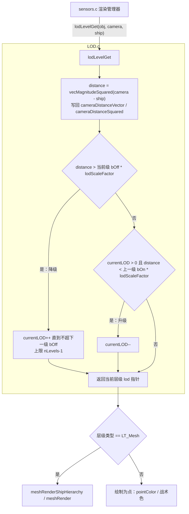
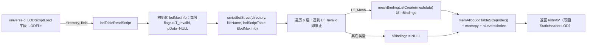
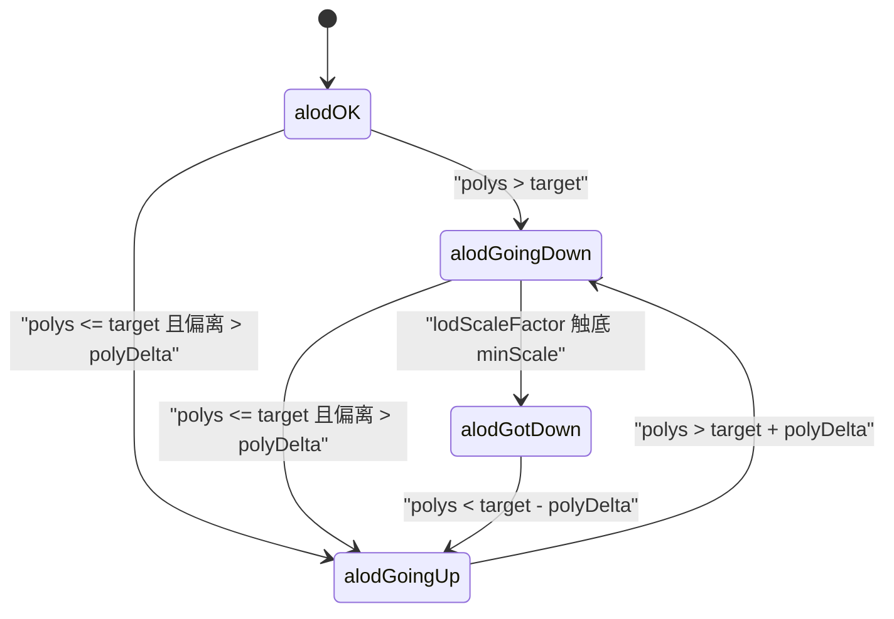

# LOD 系统 模块 overview

> 模块源码范围：`src/Game/LOD.c`、`src/Game/LOD.h`、`src/Game/autolod.c`、`src/Game/autolod.h`
> 本文档是聚焦单模块的深读记录，所有函数名 / 结构体名 / 字段名 / 宏名均可在上述文件及
> `src/Game/spaceobj.h`、`src/Game/sensors.c`、`src/Game/universe.c`、`src/Game/mesh.h`
> 中核验（相对路径给出）。未出现在源码中的结论会显式标注为「推断」或「设计观察」。

## 1. 模块定位

**一句话职责**：为每个空间对象维护最多 6 级细节层次（LOD），按「相机与对象的距离」在
网格（Mesh）、小精灵（TinySprite）、亚像素（SubPixel）、自定义函数（Function）、空绘制
（NULL）之间选择渲染方式，远端对象退化为一个色点；`autolod.c` 试图用一个全局缩放因子
`lodScaleFactor` 依据屏幕多边形预算平滑帧率。

**在整体架构中的位置**（总览结论引自 `docs/analysis.md` 第 3、4.5 节）：LOD 属于「对象
静态信息 → 渲染提交」链路中靠近渲染的一环——LOD 表随 `StaticInfo` 静态存在，对象实例
只持有 `currentLOD`/`renderedLODs` 两个运行时状态。渲染管理器 `sensors.c` 逐对象调用
`lodLevelGet` 选出当前层级，再据此决定走 `meshRenderShipHierarchy`/`meshRender`（网格）或
「绘点」（非网格层级）。`analysis.md` 的模块汇总表将本模块概括为「6 级细节层次按距切换，
`lodinfo`/`lod`、`lodLevelGet`、`LT_Mesh…LT_NULL`」。

**职责边界**：

- **管**：`.lod` 文本脚本的解析与 LOD 表分配（`lodTableReadScript`）；距离→层级的判定与
  实例状态 `currentLOD` 的维护（`lodLevelGet`）；LOD 表的释放 / 网格重着色 / 层级大小
  统计（`lodFree`/`lodAllMeshesRecolorize`/`lodHierarchySizeCompute`）；自动保存调参结果
  （`lodAutoSave`）；自动 LOD 缩放因子的维护逻辑（`autolod.c`）。
- **不管**：网格的加载与几何渲染（归 `mesh.c`）；相机与对象的剔除 / 可见性（归 `sensors.c`，
  LOD 只被其调用）；`.lod` 文件的字段→结构体偏移绑定框架本身（归 `statscript.c`，LOD 只
  提供绑定表 `lodScriptTable`）；距离计算之外的音频衰减等其它距离用途（只顺带写
  `cameraDistanceSquared` 供复用，见 `spaceobj.h` 注释「distance to camera (for sound, level
  of detail)」）。

## 2. 设计与关键数据结构

### 2.1 核心数据结构（表 1）

| 名称 | 来源文件 | 关键字段 | 说明 |
| --- | --- | --- | --- |
| `LOD_NumberLevels` | `src/Game/LOD.h` | 宏值 `6` | 每对象 LOD 层级上限 |
| `LT_Invalid` / `LT_Mesh` / `LT_TinySprite` / `LT_SubPixel` / `LT_Function` / `LT_NULL` | `src/Game/LOD.h` | 宏值 `0x0000`~`0x0005` | 层级类型位；`LT_NULL` 表示「不绘制」 |
| `LM_LODType` | `src/Game/LOD.h` | 宏值 `0x0007` | 类型掩码，`flags` 取低 3 位即层级类型 |
| `LOD_ScaleFactor` | `src/Game/LOD.h` | 宏值 `0.6f` | `lodScaleFactor` 的默认值（全局缩放） |
| `lod` | `src/Game/LOD.h` | `flags`；`mOn,bOn`；`mOff,bOff`；`pData`；`nMatrices`；`hBindings`（另 `baseScalar,stripeScalar` 仅当 `LOD_AUTO_SAVE`） | 单层 LOD：`bOn/bOff` 为开关距离阈值，`mOn/mOff` 为斜率参数（本快照未用于选级，见 3.1）；`pData` 依类型存 `meshdata*` 等；`hBindings` 为网格层级绑定表 |
| `lodinfo` | `src/Game/LOD.h` | `nLevels`；`pointColor`；`level[1]`（柔性数组；`fileName` 仅当 `LOD_AUTO_SAVE`） | 挂在 `StaticHeader.LOD` 上的完整 LOD 表；`level` 实际长度由 `nLevels` 决定 |
| `lodmaxinfo` | `src/Game/LOD.h` | 同上，但 `level[LOD_NumberLevels]` 定长 | 解析脚本时的临时缓冲区（`lodTableReadScript` 内部静态 `lodMaxInfo`） |
| `lodTableSize(n)` | `src/Game/LOD.h` | 宏 `sizeof(lodinfo)+(n-1)*sizeof(lod)` | 按实际层级数计算分配字节数 |
| `lodScaleFactor` | `src/Game/LOD.c` | `real32`（初始 `LOD_ScaleFactor`） | 全局距离缩放因子；`lodLevelGet` 用它缩放阈值；`autolod.c` 试图动态调整它 |
| `lodScriptTable` | `src/Game/LOD.c` | `scriptStructEntry[]` | `.lod` 文件字段 → 回写回调的绑定表（见 2.3） |

> `nMatrices`（`src/Game/LOD.h` 中 `lod` 的 `sdword nMatrices` 字段）在本快照中没有任何
> 读写处，`hmatrix **startMatrix` 已整段注释掉——两者均为遗留设计（事实）。

### 2.2 对外接口（表 2）

| 函数 | 来源 | 签名要点 | 作用 |
| --- | --- | --- | --- |
| `lodTableReadScript` | `src/Game/LOD.c` / `LOD.h` | `lodinfo *(char *directory, char *fileName)` | 解析 `.lod` 脚本并分配 LOD 表 |
| `lodLevelGet` | `src/Game/LOD.c` / `LOD.h` | `lod *(void *spaceObj, vector *camera, vector *ship)` | 计算距离并更新 `currentLOD`，返回当前 `lod*` |
| `lodPanicLevelGet` | `src/Game/LOD.c` / `LOD.h` | `lod *(void *, vector *, vector *)` | 同 `lodLevelGet` 后对 `currentLOD==3` 特判（见 3.3） |
| `lodAllMeshesRecolorize` | `src/Game/LOD.c` / `LOD.h` | `void (lodinfo *)` | 遍历各层 `LT_Mesh` 调用 `meshRecolorize`（队伍配色变更后刷新） |
| `lodHierarchySizeCompute` | `src/Game/LOD.c` / `LOD.h` | `sdword (lodinfo *)` | 累加各层网格 `nPolygonObjects`，供 `StaticHeader.hierarchySize` 使用 |
| `lodFree` | `src/Game/LOD.c` / `LOD.h` | `void (lodinfo *)` | 释放各层 `meshFree`/`meshBindingListDelete` 后 `memFree` 整表 |
| `lodAutoSave` | `src/Game/LOD.c` / `LOD.h` | `sdword (lodinfo *)`（`#if LOD_AUTO_SAVE`） | 把调好的 LOD 参数写回 `.lod` 文件 |
| `alodStartup`/`alodReset`/`alodShutdown`/`alodAdjustScaleFactor`/`alodSetMinMax`/`alodSetTargetPolys`/`alodIncPolys` 等 | `src/Game/autolod.c` / `autolod.h` | 见 3.4 | 自动 LOD 缩放因子维护（本快照仅部分接线，见 3.4） |

### 2.3 `.lod` 脚本绑定表与解析回调

`lodScriptTable`（`src/Game/LOD.c` 第 33~81 行）把 `.lod` 文本字段映射到 `lodinfo` 各字段：

- `pointColor` → `scriptSetRGBCB`（写 `pointColor` 字段）；
- `type0`~`type5` → `lodTypeRead`（写 `level[N].flags` 的类型位）；
- `mOn0~5`/`mOff0~5`/`bOn0~5`/`bOff0~5` → `scriptSetReal32CB`（写各层开关参数）；
- `pMeshFile0~5` → `lodMeshFileLoad`（写 `level[N].pData` 为 `meshdata*`）；
- `pSpriteFile0~5` → `lodSpriteFileRead`（写 `level[N].pData`，当前实现直接 `dbgFatal`，未支持）；
- `baseScalar`/`stripeScalar` → `lodColorScalarRead`（写全局 `trBaseColorScalar`/`trStripeColorScalar`，
  声明于 `src/Win32/texreg.h`，用于队伍色 tint 标量，仅在 `LOD_AUTO_SAVE` 下持久化到层级）。

> `scriptStructEntry` 的 `offset1/offset2` 记录的是字段相对结构体基址的字节偏移：
> `lodScriptTable` 各条目以静态占位结构 `static lodinfo lodStaticInfo`（`src/Game/LOD.c` 第 32 行）
> 取 `&lodStaticInfo.<field>` 与 `&lodStaticInfo` 的地址差，`statscript.c` 的 `scriptSetStruct`
> 再以 `structureToFillIn + (offset1 - offset2)` 把该偏移应用到真实目标 `&lodMaxInfo`
> （`src/Game/statscript.c` 第 770 行起）。`lodStaticInfo` 仅作偏移锚点，本身不承载数据（事实）。

回调实现（`src/Game/LOD.c`）：

- `lodTypeRead`：先把 `field` 大写（`_strupr`），再 `strstr` 匹配 `"INVALID"`/`"MESH"`/
  `"TINYSPRITE"`/`"SUBPIXEL"`/`"FUNCTION"`/`"NULL"`，用 `(flags & ~LM_LODType) | LT_*` 只改
  类型位、保留其余位；未知类型在 `LOD_ERROR_CHECKING` 下 `dbgFatalf`。
- `lodMeshFileLoad`：`directory`+`field` 拼出文件名，`fileExists` 或 `meshPagedVersionExists`
  成立则 `meshLoad`，否则回退 `defaultmesh`（`LOD.c` 顶部 `extern meshdata *defaultmesh`）。
- `lodColorScalarRead`：`sscanf("%f")`，`0.0` 视为「不变」取 `1.0`，按 `dataToFillIn` 是否
  等于 `&lodMaxInfo` 区分 base/stripe。

### 2.4 状态所有权

- **静态（谁拥有）**：LOD 表（`lodinfo*`）由 `StaticHeader.LOD`（`src/Game/spaceobj.h` 第 401
  行 `lodinfo *LOD`）持有，随静态信息表加载、`lodFree` 释放；缺省表 `defaultlod`
  （`src/Game/universe.c` 第 194 行）在 `lodTableReadScript("DefaultShip\\","DefaultShip.lod")`
  建立、退出时释放。
- **实例（谁拥有）**：`SpaceObj`（及其派生 `Ship`/`Derelict`/`Missile`/`Asteroid`/`Cloud`/
  `Nebula` 等）各持 `ubyte currentLOD`、`ubyte renderedLODs`、`real32 cameraDistanceSquared`、
  `vector cameraDistanceVector`（`src/Game/spaceobj.h` 第 974~980 行等多处）。`currentLOD` 由
  `lodLevelGet` 写入并在多次调用间作为「上一帧层级」参与滞回；新建对象在 `src/Game/univupdate.c`
  中置 `currentLOD = 0`（第 616、710、845、969、1027、1078 行）。
- **全局（谁拥有）**：`lodScaleFactor`（`src/Game/LOD.c` 第 84 行）与 `autolod.c` 的
  `alodNumPolys`/`alodState`/`alodTargetPolys` 等 `static` 状态为模块级全局，进程内共享。

## 3. 关键业务逻辑

### 3.1 距离选级：`lodLevelGet` 控制流

关键步骤解释（对应 `src/Game/LOD.c` 第 262~321 行）：

1. 取 `obj->staticinfo->staticheader.LOD`，`dbgAssert(info != NULL)`。
2. `vecSub(obj->cameraDistanceVector, *camera, *ship)` 后 `vecMagnitudeSquared` 得到
   **距离平方** `distance`，并存回对象供声音/LOD 复用。
3. 降级判定用 `bOff`：若 `distance > level[currentLOD].bOff * lodScaleFactor`，则 `do/while`
   逐级 `currentLOD++`，直到不再超过该级 `bOff` 或达到 `nLevels-1` 封顶。
4. 升级判定用 `bOn`：否则 `while (currentLOD>0 && distance < level[currentLOD-1].bOn *
   lodScaleFactor)` 逐级 `currentLOD--`。
5. 断言 `0 <= currentLOD < nLevels` 后 `return &level[currentLOD]`。

**关键事实（阈值语义）**：`bOn`/`bOff` 是**距离平方**阈值，且在实际选级中只用到 `bOn`/`bOff`；
`mOn`/`mOff` 虽被脚本读取、被 `lodAutoSave` 写回（`%.1f`），但 `lodLevelGet` 从不读取它们，
属于「已配置未参与选级」的斜率参数。阈值还统一乘全局 `lodScaleFactor`（默认 `0.6f`），因此
放大 `lodScaleFactor` 即整体拉远各层级切换距离（事实）。`src/Win32/mainrgn.c` 第 2153~2163 行的
调试界面直接改 `bOn`/`bOff`（`bOn = bOff * 0.9f`），印证「升级阈值比降级阈值略小」以形成滞回、
避免层级抖动（事实）。

### 3.2 脚本加载：`lodTableReadScript` 数据流

关键步骤解释（对应 `src/Game/LOD.c` 第 102~147 行与 `src/Game/universe.c` 第 1354~1364 行）：

1. `universe.c` 的 `LODScriptLoad` 回调接到 `"LODFile"` 字段：值为 `"DefaultShip"` 时复用
   `defaultlod`，否则 `lodTableReadScript(directory, field)`（`src/Game/universe.c` 第 1354~1364 行）。
2. `lodTableReadScript` 先把内部静态 `lodMaxInfo` 各层清为 `LT_Invalid`、`pData=NULL`，重置
   `trBaseColorScalar/trStripeColorScalar`，再 `scriptSetStruct` 填表。
3. 从 `level[0]` 起扫描，遇 `LT_Invalid` 即 `break`；`LT_Mesh` 层调用 `meshBindingListCreate`
   建立层级绑定表 `hBindings`，其余类型置 `NULL`。
4. 按 `lodTableSize(index)` 分配精确大小，`memcpy` 复制，写 `nLevels=index`；`LOD_AUTO_SAVE`
   下用 `filePathPrepend` + `memStringDupe` 保存完整路径到 `fileName` 以便 `lodAutoSave`。

### 3.3 非网格层级与「恐慌」特判

- 渲染侧只显式处理 `LT_Mesh`（`src/Game/sensors.c` 第 899、1097 行 `(level->flags & LM_LODType)
  == LT_Mesh`）；非网格层级统一走 `justRenderAsDot`（第 944、950 行 `goto justRenderAsDot`），
  即 `LT_TinySprite`/`LT_SubPixel`/`LT_Function`/`LT_NULL` 在本快照都被降级为「绘点」，点的颜色
  取战术色或 `lodinfo.pointColor`（后者在 `sensors.c` 第 1046、1084、1135、1559、2011 行等处用于
  小行星/星云/尘埃等）。
- `lodPanicLevelGet`（`src/Game/LOD.c` 第 331~351 行）先 `lodLevelGet`，再当 `currentLOD==3` 时
  `currentLOD++` 试探更低层级，若该层不是 `LT_Mesh` 则回退 `currentLOD--`——即「跳到一帧可用的
  网格层」。该函数在本快照**无任何调用点**（事实，仅声明+定义）。

### 3.4 自动 LOD：`autolod.c` 的多边形预算状态机

`autolod.c` 维护一个全局缩放因子的「预算控制器」：用 `alodIncPolys` 累计本帧已提交的多边形数，
`alodAdjustScaleFactor` 比较目标多边形数并升降 `lodScaleFactor`，`alodGetPanic`/`alodSetPanic`
 标记「缩放因子调整已不够用」的恐慌态。其内部状态机 `alodState` 枚举为
`alodOK/alodGoingDown/alodGoingUp/alodGotDown`（`src/Game/autolod.c` 第 40~48 行）：

状态机解释（对应 `src/Game/autolod.c` 第 281~381 行 `alodAdjustScaleFactor`）：

1. 非活动判定：`alodTargetPolys==0 || alodPolyDelta==0 || opNoLODVal`（选项关闭）时直接
   `alodSetPanic(FALSE)`、`lodScaleFactor=alodMaxScaleFactor` 后返回。
2. `delta = |target - alodNumPolys|`。若 `alodNumPolys > alodTargetPolys`（多边形超预算）：
   先做滞回保护——若处于 `alodGoingUp` 且 `alodNumPolys < target + polyDelta` 则直接 `return`
   （不立即反转）；否则置 `alodState=alodGoingDown`，按 `delta` 偏离程度以 `1x/2x/4x`
   `alodScaleFactorDelta` 递减 `lodScaleFactor`；触底 `alodMinScaleFactor` 时置 `alodGotDown`，
   仍超预算则 `alodSetPanic(TRUE)`。
3. 否则（多边形低于预算）：仅在 `delta > polyDelta` 且（`polys < target - delta` 或当前非
   `alodGotDown`）时置 `alodGoingUp`，按偏离以 `1x/2x/4x` 递增、封顶 `alodMaxScaleFactor`。
4. 代码内 `FIXME: this ALWAYS overshoots`（第 343 行）为原作者对升级方向过冲的已知问题标注。

**关键事实（接线状态，需区分）**：`autolod.c` 的**计数侧已接线**——`alodIncPolys` 被
`src/Game/mesh.c`（第 1464、1727、1890、2079、2248、2458 行）、`src/Game/clouds.c`（第 321 行）、
`src/Game/nebulae.c`（第 1348、1499 行）调用累计多边形数；`alodEnable` 被 `src/Game/particle.c`
（第 1820、1823 行）在粒子渲染期间临时禁用；`alodGetTargetPolys`/`alodSetTargetPolys` 被
`src/Game/options.c`（第 562、566、1468、1871 行）用于「细节阈值」选项读写。但**调整/反馈侧
未接线**——`alodStartup`/`alodReset`/`alodShutdown`（生命周期）、`alodAdjustScaleFactor`（真正
调整缩放因子的函数）、`alodSetMinMax`/`alodGetMin`/`alodGetMax`、`alodGetPanic`/`alodSetPanic`
在本快照的 `src/` 内均**无任何调用点**（事实，仅声明+定义）。因此当前快照里 `lodScaleFactor`
不会随帧率自动变化，自动 LOD 闭环在本快照是**半成品/遗留**状态。

## 4. 与其它模块的交互

| 方向 | 交互对象 | 具体内容 | 证据 |
| --- | --- | --- | --- |
| 输入（谁驱动本模块） | `statscript.c` | `scriptSetStruct` 以 `lodScriptTable` 填 `lodinfo` | `src/Game/LOD.c` 第 115 行 |
| 输入 | `universe.c` | `LODScriptLoad` 处理 `"LODFile"` 字段、`defaultlod` 建立/释放、队伍配色变更后 `lodAllMeshesRecolorize`、`lodHierarchySizeCompute` 填 `hierarchySize` | `src/Game/universe.c` 第 1354~1364、1014、2322、3032、3078、3272、3714 行 |
| 输入 | `mesh.c` | `lodMeshFileLoad` 调 `meshLoad` 得到 `meshdata*`；`meshBindingListCreate`/`meshBindingListDelete` 建立/释放层级绑定表；`lodFree` 调 `meshFree` | `src/Game/LOD.c` 第 127、233、373、376 行 |
| 输入 | `sensors.c` | 渲染时逐对象调 `lodLevelGet`（第 898、1096 行）取 `lod*`，据 `LT_Mesh` 分支 `meshRenderShipHierarchy`/`meshRender` 或绘点 | `src/Game/sensors.c` 第 898~930、1096~1119 行 |
| 输入 | `mesh.c`/`clouds.c`/`nebulae.c`/`particle.c`/`options.c` | `alodIncPolys`/`alodEnable`/`alodGetTargetPolys`/`alodSetTargetPolys` 喂入多边形计数与目标值 | 见 3.4 |
| 输入 | `texreg.c`（`src/Win32/`） | `trBaseColorScalar`/`trStripeColorScalar` 全局被 `lodColorScalarRead` 写入 | `src/Game/LOD.c` 第 165、169 行；声明于 `src/Win32/texreg.h` 第 295~296 行 |
| 输出 | 实例状态 | `lodLevelGet` 写 `obj->currentLOD`/`cameraDistanceSquared`/`cameraDistanceVector`，返回 `lod*` 供渲染 | `src/Game/LOD.c` 第 270~271、283、296、320 行 |
| 输出 | 渲染 | `level->pData`（`meshdata*`）+ `obj->currentLOD` 传入 `meshRenderShipHierarchy` | `src/Game/sensors.c` 第 923~925 行 |
| 输出 | 选择/脚本 | `renderedLODs` 位掩码被 `select.c`/`KASFunc.c`/`AITeam.c` 读取（`mouseCursorOverLODs`、`kasfRenderedShips`/`kasfRenderedDerelicts`、`bitTest(...,0x7)`） | `src/Game/select.c` 第 766 行；`src/Game/KASFunc.c` 第 3765、3797 行；`src/Game/AITeam.c` 第 544 行 |

> `renderedLODs` 在本快照只被读（`bitTest`）、被清零（`=0`/`bitClear`），**没有任何 `bitSet`
> 写位点**（事实）。因此「记录本帧实际绘制了哪些层级」的生产者代码在本快照缺失，`renderedLODs`
> 恒为 0，KAS/选择的「是否在某层级渲染」查询在该快照语义上不可用（推断）。

## 5. 设计特点与实现代价

### 5.1 设计收益

- **滞回减少切换抖动**：进入和离开某层级使用不同阈值，观察距离的小幅变化不会反复切换。
- **一个选级结果支持多种表示**：网格、微型精灵、子像素、函数或空层级，让远处对象逐步降低绘制成本。
- **配置数据与实例状态分开**：LOD 表附着于静态信息，对象实例只记录当前选择等运行期信息。
- **存在多边形预算反馈的设计痕迹**：`autolod.c` 保存目标和计数状态，可用来学习画质调节闭环怎样组织。

### 5.2 读代码时要留意

- 选级不只是“距离越远级别越低”：`bOn`/`bOff`、全局缩放和特殊类型分支共同决定结果。
- `.lod` 数据通过 statscript 风格的字段表写入结构；字段绑定和静态 LOD 结构必须一起理解。
- `LT_Function`、精灵读入和自动调整等路径在当前快照中有未实现或未接线的迹象；定义、注释和真实调用点要分开核查。
- 全局缓冲、默认 mesh/LOD 和渲染列表状态会影响加载与选择，追单个 `lodLevelGet` 函数不足以解释完整生命周期。

### 5.3 推荐阅读顺序

先读 `lodLevelGet` 和 `lod` / `lodinfo` 结构，手算一个相机距离经过阈值与滞回后的级别；再看 `lodTableReadScript` 怎样生成配置，最后追踪调用者如何把选级结果变成网格或远景表示。

## 6. 事实 / 推断边界

- **事实（可核验）**：本文所有函数名/结构体名/字段名/宏名/常量（`lod`、`lodinfo`、`lodmaxinfo`、
  `lodTableSize`、`LT_*`、`LM_LODType`、`LOD_NumberLevels`、`LOD_ScaleFactor`、`lodLevelGet`、
  `lodTableReadScript`、`lodPanicLevelGet`、`lodAllMeshesRecolorize`、`lodHierarchySizeCompute`、
  `lodFree`、`lodAutoSave`、`alod*` 系列、`currentLOD`/`renderedLODs`/`cameraDistanceSquared`/
  `cameraDistanceVector`、`StaticHeader.LOD`、`trBaseColorScalar`/`trStripeColorScalar` 等）均来自
  `src/Game/LOD.c/h`、`autolod.c/h`、`spaceobj.h`、`sensors.c`、`universe.c`、`mesh.h`、`texreg.h`
  的直接阅读，行号已标注。选级只使用 `bOn/bOff`、`autolod` 计数侧已接线而调整侧无调用点、
  `renderedLODs` 无写位点、`nMatrices` 无读写——均为逐文件 `grep` 验证的结果。
- **推断**：`mOn/mOff` 本意是「过渡斜率/线性参数」但未参与选级（由字段命名与 `lodAutoSave` 的
  `%.1f` 输出推断其原意）；`bOn = bOff*0.9f` 的滞回设计意图（由 `mainrgn.c` 调试代码推断）；
  `autolod` 本意是「帧率自适应闭环」但本快照未完整接线（由函数存在且计数侧已接线、调整侧无调用点
  推断）；`LT_Function`/`LT_TinySprite`/`LT_SubPixel` 为「设计预留、实现未完成」（由枚举存在 +
  `lodSpriteFileRead` 内 `dbgFatal` + `sensors.c` 无对应分支推断）。
- **设计观察**：第 5 节总结的是当前快照中可观察到的收益与限制，不代表所有路径都在运行时启用。
