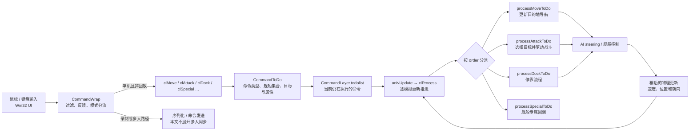
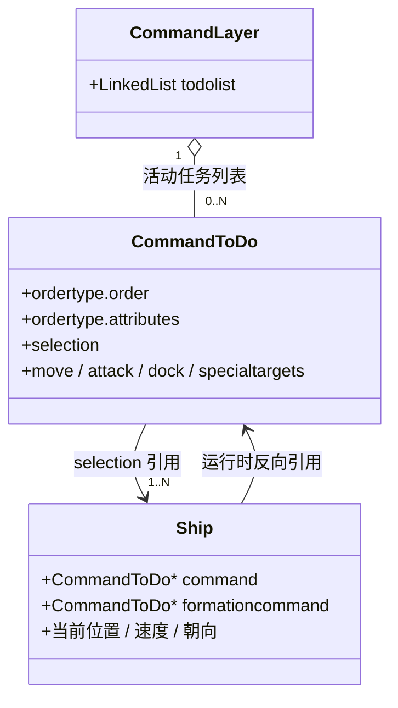
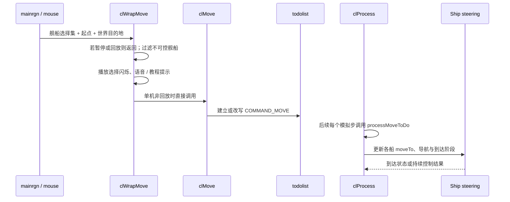

# 玩家命令执行：从鼠标输入到舰船持续行动

这份文档解释单机游戏中，玩家输入怎样变成舰船命令，并在后续模拟更新中持续推进。理解重点是区分三层：**输入包装器、命令状态、舰船控制行为**。

## 整体路径

在 `univUpdate()` 中，单机 AI 更新先于 `clProcess()`；`clProcess()` 为本次模拟步推进命令，物理更新随后消费舰船的控制结果。玩家和 AI/脚本最终可以汇入相同的命令执行层，但本图从玩家输入开始。

## 三层职责

| 层 | 主要职责 | 代表源码 |
| --- | --- | --- |
| 输入与包装 | 接收界面动作；检查暂停、回放及舰船可控性；给玩家提示并处理教程反馈 | [`mainrgn.c`](../../src/Win32/mainrgn.c)、[`mouse.c`](../../src/Win32/mouse.c)、[`CommandWrap.c`](../../src/Game/CommandWrap.c) |
| 命令状态 | 建立、替换或更新 `CommandToDo`；维护活动命令列表和每艘船的命令引用 | [`CommandLayer.h`](../../src/Game/CommandLayer.h)、[`CommandLayer.c`](../../src/Game/CommandLayer.c) |
| 行为与模拟 | 按命令类型计算移动、战斗、停靠等行为，再由物理系统推进对象状态 | [`CommandLayer.c`](../../src/Game/CommandLayer.c)、[`AIShip.c`](../../src/Game/AIShip.c)、[`physics.c`](../../src/Game/physics.c) |

`CommandWrap` 的 “Wrap” 可以理解为命令的外层处理：它统一处理输入有效性、反馈以及单机直接调用/其他模式转发。它本身通常不负责每帧把舰船飞到目的地。

## 核心数据：一个仍在运行的命令

`CommandToDo` 不只是“刚收到的输入记录”。只要舰船还需要继续移动、攻击、采集或停靠，它就留在 `todolist` 中，由 `clProcess()` 在后续模拟步重复处理。命令完成后，处理分支释放命令内容并从链表移除；一些属性（如队形或被保护状态）可使相关状态继续存在。

一次选择也不必永远对应一个 `CommandToDo`：CommandLayer 可以为多艘船建立一个命令组，也可以按业务规则拆成多条；例如采集资源命令会为每艘采集船建立独立命令，便于分别选择矿点和处理舱位。

## 用例：右键给舰队下达移动命令

移动命令的包装器 `clWrapMove()` 在单机路径中直接调用 `clMove()`；`clMove()` 再准备或改写 CommandLayer 中的命令对象。后续 `clProcess()` 才根据命令状态调用 `processMoveToDo()`，由舰船 steering 计算推力与转向。详细的编队与物理路径见[移动与编队 overview](movement_formation_overview.md)。

## 命令覆盖与并存

- 新命令通常会移除舰船原先执行中的部分命令，再把舰船放入新命令；这是“命令覆盖”的常见路径。
- 已有命令也可能被原地改写，例如 `ChangeOrderToMove()` 或 `ChangeOrderToAttack()` 保留命令对象并替换其内部数据。
- 命令属性可与主命令组合。例如编队、保护和被动攻击可影响某些命令的后续处理。
- 每种命令拥有自己的处理函数和完成条件。`clProcess()` 是分发与推进框架，不是所有命令共享同一个行为算法。
- 停靠、采集、建造和研究有各自的数据及周期逻辑；见[资源与舰船后勤](resource_ship_logistics_overview.md)和[建造与研究](construction_research_overview.md)。

### 命令重派

“重派”是文档里对**把舰船当前执行的命令改成另一种命令**的简称，不是源码中的 API 名称。

- **原地改写**：`ChangeOrderToAttack()` 会释放旧命令内容、把 `CommandToDo` 的类型改为 `COMMAND_ATTACK`，并装入新的目标数据；命令对象本身可以保留。
- **替换或拆分命令组**：`clAttack()` 会检查舰船当前在哪些命令组里，再改写原命令或为剩余舰船建立新命令。
- **被动还击不是重派成攻击命令**：`ChangeOrderToPassiveAttack()` 给允许的现有命令加上 `COMMAND_IS_PASSIVEATTACKING` 属性；它是否能做取决于当前命令类型、舰船类别等条件。

因此，在 Tactics 文档中，“Aggressive 时把命令重派为攻击”应理解为：自动还击逻辑判断允许打断或替换当前行为后，调用 CommandLayer 把该船当前命令改成 `COMMAND_ATTACK`。分组路径遇到正在移动 / 停靠等忙碌命令时，不会改成完整攻击；它只会尝试被动还击，而且还要通过 `canChangeOrderToPassiveAttack()` 的检查。

## 建议顺着源码读

1. [`src/Win32/mainrgn.c`](../../src/Win32/mainrgn.c)：右键地图、空白位置或舰船时分别会调用什么包装器。
2. [`src/Game/CommandWrap.c`](../../src/Game/CommandWrap.c)：`clWrapMove()`、`clWrapAttack()`、`clWrapDock()`、`clWrapSpecial()`。
3. [`src/Game/CommandLayer.h`](../../src/Game/CommandLayer.h)：`CommandToDo`、命令 union、`CommandLayer`。
4. [`src/Game/CommandLayer.c`](../../src/Game/CommandLayer.c)：`clMove()`、`ChangeOrderToMove()`、`clProcess()`。
5. [`src/Game/univupdate.c`](../../src/Game/univupdate.c)：`univUpdate()` 中 AI、命令处理和物理更新的先后关系。
