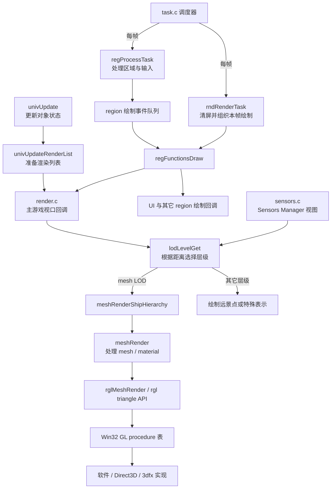

# 渲染管线模块 overview

> 模块：世界对象渲染、mesh 提交与 rgl 后端
> 关键源码：`src/Game/univupdate.c`、`src/Game/sensors.c`、`src/Game/mesh.c`、`src/rgl/rglext.c`、`src/Win32/glcaps.c`、`src/Win32/render.c`
> 路径均相对仓库根目录；「事实」可由源码核验，「推断」是由代码结构推出的解释，「设计观察」总结实现收益与代价。

## 1. 一句话概括

Homeworld 把对象更新、渲染列表准备、视口内对象绘制、mesh 几何提交和底层光栅后端分成连续几步。逻辑对象不直接调用软件光栅或 D3D 绘制细节，而是通过 mesh 与 rgl 的接口表达绘制请求。

## 2. 调用链地图

图中主游戏视口与 Sensors Manager 是两条对象视图路径；主游戏视口遍历和 LOD 选择位于 `render.c`，Sensors Manager 在 `sensors.c` 中也会调用 `lodLevelGet`。`univUpdateRenderList` 只准备对象列表，不直接绘制。`regProcessTask` 处理区域并排队绘制事件，`rndRenderTask` 再通过 `regFunctionsDraw` 执行回调。

## 3. 各阶段职责

### 3.1 对象状态与渲染列表

`univUpdate` 推进对象逻辑状态；`univUpdateRenderList` 和 `univUpdateMinorRenderList` 按 Universe 中的对象维护渲染侧列表。Universe 更新任务会按刷新节奏更新这些列表，减少每次绘制都从所有对象重新组织数据的工作。

查看 `src/Game/universe.c` 中的 `universeUpdateTask` 与 `src/Game/univupdate.c` 中的列表更新函数。注意对象类别和列表刷新频率会影响对象何时进入绘制路径。

### 3.2 视口、可见对象与 LOD

`render.c` 的主游戏视口遍历 `universe.RenderList`，调用 `lodLevelGet` 计算相机距离并选择当前 LOD。`LT_Mesh` 进入网格绘制；本仓库快照中其它层级有路径会退化为点表示，不能单凭 `LT_*` 枚举认定每种表示都有完整实现。`sensors.c` 为 Sensors Manager 提供另一条视图路径，也会使用 LOD。

LOD 的阈值、滞回和未接线分支见 [LOD 模块](lod_overview.md)。视口还会处理遮挡、选择、传感器状态和战术颜色等规则，因此它不是单纯的 mesh 遍历器。

### 3.3 Mesh 加载和绘制

`meshLoad` 通过统一文件接口读取 `.geo` 数据，校验文件头和版本，修复文件内偏移指针，并根据材质中的纹理名注册纹理。加载后的 `meshdata` 保存 polygon object 与材质数据，供多个对象或 LOD 使用。

绘制时，`meshRenderShipHierarchy` 依据舰船的层级绑定应用部件变换，再调用 `meshRender`。`meshRender` 按材质、颜色方案和 polygon mode 准备当前 mesh；`rglMeshRender` 遍历 polygon object，通过回调切换材质并将几何送入三角形 API。

阅读顺序：`meshLoad` → `meshRenderShipHierarchy` → `meshRender` → `rglMeshRender`。相应实现分别位于 `src/Game/mesh.c` 和 `src/rgl/rglext.c`。

### 3.4 rgl 接口与后端

`rglext.h` 扩展了 GL 风格 API，包含 `rglMeshRender`、`rglTexturedTriangle` 等游戏侧调用。Win32 层通过 `glcaps.c` / `gldll.c` 获取并绑定 GL 函数指针；rgl 的构建文件列出软件、D3D 与 3dfx 驱动实现。

这层接口让 mesh 绘制代码不必针对每个光栅实现各写一套，但 GL 状态语义、扩展函数和平台窗口仍需要后端匹配。应把它理解为有限的渲染调用边界，不是完整的跨平台图形抽象。

## 4. 设计特点与实现代价

### 4.1 设计收益

- **逐层压缩绘制工作**：对象先经过列表组织和视口规则，再按 LOD 决定细节，最后才提交几何。
- **加载与绘制分离**：`.geo` 解析和纹理注册集中在 mesh 加载阶段，绘制阶段复用已准备好的 `meshdata`。
- **共享网格表达舰船层级**：mesh bindings 描述部件层级，使同一基础几何可以按对象状态应用不同变换。
- **后端可替换一部分**：软件、Direct3D 与 3dfx 后端实现同一类 GL 风格入口，游戏侧可以复用大量调用。

### 4.2 读代码时要留意

- 渲染列表是模拟更新和视口绘制之间的数据接口；绘制 bug 可能来自列表刷新时机，而不只来自 mesh 函数。
- mesh 加载会修复二进制布局中的指针，需区别文件偏移和进程内地址。
- 材质回调会改变当前绘制状态，`meshRender` 与 `rglMeshRender` 的调用顺序会影响后续 polygon。
- rgl 通过 GL 风格函数减少后端差异，但后端能力、状态和窗口管理仍然可见。
- `sensors.c` 同时包含可见性、游戏规则和绘制决策，说明渲染边界并非完全独立于游戏逻辑。

### 4.3 建议的源码练习

1. 在 `univUpdateRenderList` 找一种对象加入哪个列表，再找 `render.c` 消费 `universe.RenderList` 的位置。
2. 对该对象追踪 `currentLOD` 的读取与更新，比较 mesh LOD 和点表示的绘制分支。
3. 对一个 polygon object 追到 `rglMeshRender`，记下 material callback 何时触发、何时提交三角形。
4. 对照 `src/rgl/makefile` 中的软件和 D3D 驱动目标，找出共享 API 与后端私有代码的边界。

## 5. 事实 / 推断边界

**设计观察**：本篇总结的是当前源码快照实际接线的分层和收益，不意味着每个枚举能力都完整支持，也不代表作者的原始设计意图。
