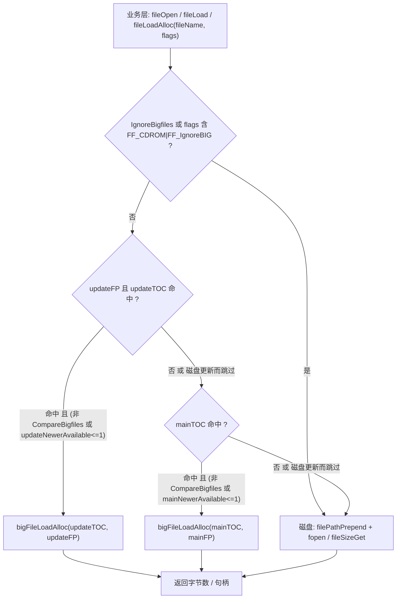
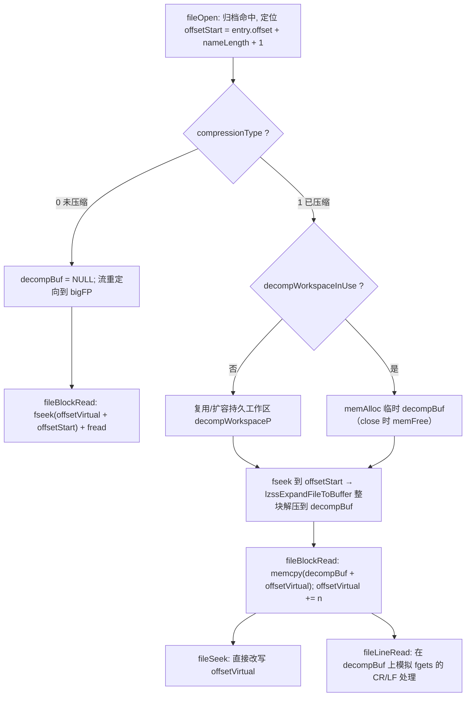

# 资源透明加载（file.c + bigfile.c） 模块 overview

> 模块：资源透明加载（`file.c` + `bigfile.c` + `crc32.c`）
> 源码：`src/Game/file.c`、`src/Game/file.h`、`src/Game/bigfile.c`、`src/Game/bigfile.h`、`src/Game/crc32.c`、`src/Game/crc32.h`
> 路径均相对仓库根目录；「事实」可由源码核验，「推断」是由代码结构推出的解释，「设计观察」总结实现收益与代价。

---

## 1. 模块定位

**一句话职责（事实）**：向上层提供统一的文件「整块读」与「流式读」接口，屏蔽「磁盘散文件」与「`.big` 归档」两种物理存储的差异；`.big` 内文件以 2×32 位文件名 CRC 作为 64 位键索引，压缩文件在打开时整块解压到缓冲、再用虚拟偏移伪装成流式 IO。

**在整体架构中的位置（引用总览，事实）**：`docs/analysis.md` 第 4.1 节把本模块归类为「资源透明加载」，第 3 节整体架构图中把它放在「游戏逻辑层」（`FILE["file.c + bigfile.c 透明加载"]`），向下指向「资源管线」的 `.big` 归档（`FILE --> BIG`）与 `.geo/.lif/.etg` 格式（`FILE --> GEO`）。第 5.2 节数据流则把它定位为「`.level/.missphere` 布局 → 静态信息绑定」链上的取数步骤：`fileOpen`/`fileLoadAlloc` 透明地在 `.big` 与磁盘间选择，随后格式解析器（`mesh.c`/`bmp.c`/`statscript.c` 等）读出的数据再被绑定进运行时对象。

**职责边界（事实）**：

管什么：

- 统一三种取数形态：整块分配读 `fileLoadAlloc`、整块到指定地址 `fileLoad`、类 ANSI 流 `fileOpen`/`fileBlockRead`/`fileSeek`/`fileLineRead`/`fileCharRead`/`fileClose`。
- 归档目录表 `bigTOC` / `bigTOCFileEntry` 的读写、CRC64 键控定位、排序与二分/线性查找。
- 打开/加载时的「覆盖语义」：`update` 归档 → `main` 归档 → 磁盘文件系统的优先级，以及 `CompareBigfiles` 扫描出的「磁盘文件更新」跳过逻辑。
- LZSS 解压（经 `LZSS.h`/`BitIO.h`）与「解压缓冲伪装流」机制。
- 路径前置：`filePrependPathSet`/`fileCDROMPathSet`/`filePathPrepend` 统一拼全路径。

不管什么：

- 不解析具体资产格式（`.geo/.lif/.etg/.shp` 等由 `mesh.c`/`bmp.c`/`etg.c`/`statscript.c` 负责），只负责把字节交给它们。
- 不做写归档：`bigDelete`/`bigExtract` 是未实现的桩（`src/Game/bigfile.c:1800-1832`），`fileOpen` 对 bigfile 命中时用 `dbgAssert` 禁止 `FF_WriteMode`/`FF_AppendMode`（`src/Game/file.c:560-561`）。
- 不拥有上层对象生命周期：`fileLoadAlloc` 分配的缓冲由调用方负责（`memAllocAttempt` 分配、调用方 `memFree`）。

---

## 2. 设计与关键数据结构

### 2.1 关键数据结构 / 接口（事实，字段名源自 `src/Game/file.h`、`src/Game/bigfile.h`）

| 名称 | 类型 / 签名 | 字段 / 参数 | 作用与所有权 |
| :-- | :-- | :-- | :-- |
| `fileOpenInfo` | `struct` | `inUse`、`path`、`usingBigfile`、`fileP`、`bigFP`、`bigTOC`、`textMode`、`offsetStart`、`decompBuf`、`offsetVirtual`、`length` | 单个打开文件的句柄状态；`fileP`（磁盘流）与 `bigFP`/`bigTOC`（归档流/目录表）二选一，由 `usingBigfile` 区分（`src/Game/file.h:83-101`） |
| `filesOpen[]` | `fileOpenInfo[MAX_FILES_OPEN+1]` 全局数组 | 索引即 `filehandle` | 句柄表全局持有；下标 0 弃用（句柄 0 表示错误），故实际容量 `MAX_FILES_OPEN=32`（`src/Game/file.c:67`、`src/Game/file.h:76`） |
| `bigTOCFileEntry` | `struct` | `nameCRC1`、`nameCRC2`、`nameLength`、`storedLength`、`realLength`、`offset`、`timeStamp`、`compressionType` | 归档目录表条目；`nameCRC1/2` 是文件名前后两半的 CRC32，与 `nameLength` 构成 64 位近似唯一键（`src/Game/bigfile.h:82-96`） |
| `bigTOC` | `struct` | `numFiles`、`flags`、`fileEntries` | 归档目录表；`flags` 的 `BF_FLAG_TOC_SORTED` 位决定二分还是线性查找（`src/Game/bigfile.h:100-104`） |
| `mainTOC` / `updateTOC` | 全局 `bigTOC` | 主归档 / 补丁归档目录表 | `bigOpen` 时读入并全局持有，随游戏存续（`src/Game/bigfile.c:57-61`） |
| `mainFP` / `updateFP` | 全局 `FILE *` | 主归档 / 补丁归档流 | 同上；`updateFP==NULL` 表示无补丁（`src/Game/bigfile.c:60`） |
| `mainNewerAvailable[]` / `updateNewerAvailable[]` | 全局 `unsigned char *` | 每 TOC 条目：`2`=磁盘更新 / `1`=磁盘更旧 / `0`=磁盘无此文件 | `bigFilesystemCompare` 递归扫描磁盘后填充，供加载时跳过归档（`src/Game/bigfile.c:65-66`） |
| `decompWorkspaceP` / `decompWorkspaceSize` / `decompWorkspaceInUse` | 全局静态 | 持久解压工作区 | 打开压缩文件时复用，避免反复分配；忙时改走临时分配（`src/Game/file.c:70-72`） |
| `CompareBigfiles` / `IgnoreBigfiles` / `LogFileLoads` | 全局 `bool` | 是否比较磁盘新文件 / 是否完全跳过归档 / 是否记加载日志 | 运行期开关，控制覆盖语义与诊断（`src/Game/bigfile.c:45-53`） |
| `bigCRC64EQ` / `bigCRC64GT` / `bigCRC64LT` | 宏 | 对 `bigTOCFileEntry` 指针做 64 位 CRC 比较 | 排序与二分查找的基础比较（`src/Game/bigfile.h:112-114`） |

### 2.2 打开标志 `FF_*`（状态矩阵，事实，`src/Game/file.h:53-62`）

| 标志 | 值 | 语义 | 是否真正影响归档搜索路径 |
| :-- | :-- | :-- | :-- |
| `FF_TextMode` | 1 | 文本模式打开 | 否（只影响 `access[1]` 与 `textMode` 字段） |
| `FF_IgnoreDisk` | 2 | 「不搜磁盘，直奔 .BIG」 | **否——声明但未接线**（见 2.3） |
| `FF_WriteMode` | 16 | 写模式 | 否（bigfile 命中时被 `dbgAssert` 禁止） |
| `FF_AppendMode` | 32 | 追加模式 | 否（同上） |
| `FF_ReturnNULLOnFail` | 64 | 失败返回 NULL 而非致命错误 | 否 |
| `FF_CDROM` | 128 | 从 CD-ROM 打开 | **是**：`fileOpen`/`fileLoad`/`fileLoadAlloc`/`fileExists`/`fileSizeGet` 的 `bitTest(flags, FF_CDROM|FF_IgnoreBIG)` 命中即跳过归档，且 `filePathPrepend` 改用 `fileCDROMPath` |
| `FF_IgnoreBIG` | 256 | 不搜 .BIG，只读磁盘 | **是**：同上，跳过归档直接走磁盘 |
| `FF_IgnorePrepend` | 512 | 不加前置路径 | 否（只影响 `filePathPrepend` 拼路径） |

### 2.3 `FF_IgnoreDisk` 是「死标志」这一关键事实

任务重点点名的 `FF_IgnoreBIG` / `FF_IgnoreDisk` 覆盖语义，实际在源码里不对称（事实）：

- `FF_IgnoreBIG`（256）在 `file.c` 的 5 处归档搜索入口（`fileLoadAlloc`/`fileLoad`/`fileExists`/`fileSizeGet`/`fileOpen`）统一以 `bitTest(flags, FF_CDROM|FF_IgnoreBIG)` 判定，是**真正生效**的「只走磁盘」开关（`src/Game/file.c:107`、`229`、`394`、`452`、`552`）。
- `FF_IgnoreDisk`（2）只在 `src/Game/file.h:54` 定义，`grep -rn "FF_IgnoreDisk" src/` 除定义外**零处使用**。所谓「只读归档」在实现里不是靠这个标志，而是靠**查找顺序**天然达成：入口总是先查归档，只在归档未命中（或 `CompareBigfiles` 判定磁盘更新）时才落到磁盘。因此「只读归档」是隐式行为，不是显式开关（推断：作者保留了标志位但从未接线，或依赖调用方不传该标志即可达到同样效果）。
- 真正的「强制只走磁盘」全局开关是 `IgnoreBigfiles`（`bigfile.c:49`），所有入口先判 `!IgnoreBigfiles` 才进归档分支（事实）。

---

## 3. 关键业务逻辑

### 3.1 加载/打开时的查找顺序与覆盖语义（数据流，事实）

所有整块加载入口（`fileLoadAlloc`/`fileLoad`）与流打开入口（`fileOpen`）共享同一条「update 归档 → main 归档 → 磁盘」的查找顺序，仅末尾落点不同。

**关键步骤解释（事实，`src/Game/file.c`、`src/Game/bigfile.c`）**：

1. 前置开关：`!IgnoreBigfiles && !bitTest(flags, FF_CDROM|FF_IgnoreBIG)` 才进入归档分支；否则直接 `filePathPrepend` + `fopen` 走磁盘（`file.c:107`、`552`）。
2. 先查补丁归档：`existsInUpdateBigfile = updateFP && bigTOCFileExists(&updateTOC, _fileName, &updateFileNum)`；命中且「非（`CompareBigfiles` 且 `updateNewerAvailable[updateFileNum] > 1`）」才真正加载，否则视为被磁盘更新文件覆盖而跳过（`file.c:111-112`）。
3. 再查主归档：仅在补丁归档未命中时，才 `bigTOCFileExists(&mainTOC, ...)`，同样受 `mainNewerAvailable[mainFileNum] > 1` 跳过条件约束（`file.c:128-132`）。
4. 归档加载失败（`bigfileResult == -1`）会穿透继续走磁盘，不做致命错误——`fileLoadAlloc`/`fileLoad` 里 `if (bigfileResult != -1) return ...`（`file.c:115`）。
5. 兜底磁盘：`filePathPrepend` 拼全路径后 `fopen("rb")`/`fileSizeGet`；文件不存在则 `dbgFatalf`（除非 `FF_ReturnNULLOnFail`，仅 `fileOpen` 支持）。

「更新文件覆盖归档」的判定数据来自 `bigFilesystemCompare`：它递归扫描磁盘目录树，对每个磁盘文件查 `mainTOC`/`updateTOC` 的 `timeStamp`，较新则写 `2`、较旧写 `1`、不存在写 `0`（`src/Game/bigfile.c:2093-2176`）。`CompareBigfiles` 关闭时此覆盖语义整体失效（`file.c` 内所有 `CompareBigfiles && ...` 分支短路）。

### 3.2 压缩文件的「整块解压 + 流伪装」（控制流，事实）

`fileOpen` 对归档命中且 `compressionType != 0` 的文件，在打开时一次性解压到 `decompBuf`，之后 `fileBlockRead`/`fileSeek`/`fileLineRead`/`fileCharRead` 都在 `decompBuf` 上以 `offsetVirtual` 伪装成流；未压缩文件则直接把流重定向到 `bigFP` 内偏移。

**关键步骤解释（事实）**：

1. `offsetStart` 的定位：`(bigTOC->fileEntries + fileNum)->offset + (bigTOC->fileEntries + fileNum)->nameLength + 1`，即跳过内联存储的（加密）文件名 + 终止 `\0` 后才是数据区（`src/Game/file.c:567`）。
2. 压缩文件整块解压：`fseek(bigFP, offsetStart)` 后 `bitioFileInputStart` → `lzssExpandFileToBuffer(bitFile, decompBuf, length)` → `bitioFileInputStop`，并 `dbgAssert(expandedSize == length)`、`dbgAssert(storedSize == entry->storedLength)`（`file.c:693-698`）。
3. 工作区复用：`decompWorkspaceP` 若空闲则复用（不够就 `memRealloc` 扩容，多留 `decompWorkspaceIncrement`=65536 余量）；若正被另一个打开文件占用，则 `memAlloc` 新临时缓冲，`fileClose` 时 `memFree`（`file.c:597-666`、`811-818`）。
4. 流伪装：`fileBlockRead` 对 `decompBuf` 分支走 `memcpy(decompBuf + offsetVirtual, ...)`；`fileSeek` 只改写 `offsetVirtual`（`FS_Start`/`FS_Current`/`FS_End` 三分支）；`fileLineRead` 在缓冲上手工模拟 `fgets` 的 `13`(CR)/`10`(LF) 吞并与 `ungetc` 回退（`file.c:902-914`、`848-865`、`1008-1036`）。
5. 未压缩文件：`decompBuf = NULL`，`fileBlockRead` 退化为 `fseek(offsetVirtual + offsetStart)` + `fread(bigFP)`，无内存复制（`file.c:909-912`）。

### 3.3 CRC64 键控定位（算法，事实）

- 键的生成在 `bigTOCFileExists`（`src/Game/bigfile.c:387-414`）：先把文件名 `_strlwr` 转小写、`filenameSlashMassage` 把 `/` 归一到 `\` 并压平连续斜杠；然后 `nameCRC1 = crc32Compute(name, nameLength/2)`、`nameCRC2 = crc32Compute(name + nameLength/2, nameLength/2)`，前后两半各算一个 32 位 CRC，拼成 64 位近似唯一键。
- CRC32 本体是查表法（`CRCTable` 共 256 项）的 `crc32Compute`，初值 `0xffffffff`、逐字节异或查表、最后 `~crc`（`src/Game/crc32.c:96-108`）。
- 查找在 `bigTOCFileExistsByCRC`（`src/Game/bigfile.c:420-465`）：若 `toc->flags & BF_FLAG_TOC_SORTED` 则二分查找（`bigCRC64GT` 判序）；否则线性查找，但从「上次命中位置」`static int FileNum` 继续，以加速顺序访问。
- TOC 排序 `bigTOCSort` 是 shell sort（`src/Game/bigfile.c:546-653`，另有被 `#if 0` 关闭的冒泡/插入排序版本）。

---

## 4. 与其它模块的交互

### 4.1 输入 / 依赖（事实）

| 依赖 | 用到的符号 | 核验 |
| :-- | :-- | :-- |
| 基础类型与位测试 | `udword`/`sdword`/`bool`/`crc32`/`crc16`，`bitTest` 宏 | `src/Game/types.h:172`、`src/Game/crc32.h:13-14` |
| 内存分配 | `memAllocAttempt`/`memAlloc`/`memRealloc`/`memFree`，`NonVolatile`/`Pyrophoric`/`MBF_String`/`MEM_NameLength` | `src/Game/memory.h` |
| LZSS 解压/压缩 | `lzssExpandFileToBuffer`/`lzssCompressFile`/`lzssCompressBuffer`/`lzssExpandBuffer` | `src/Game/LZSS.h` |
| 位流 IO | `bitioFileInputStart`/`bitioFileInputStop`/`bitioFileAppendStart`/`bitioFileAppendStop`/`bitioFileOpenOutput`/`bitioFileCloseOutput` | `src/Game/BitIO.h` |
| 调试/日志 | `dbgAssert`/`dbgFatalf`/`dbgMessagef`，`DBG_Loc` | `src/Game/debug.h` |
| CRC32 | `crc32Compute`/`crc16Compute`，`CRCTable` | `src/Game/crc32.c` |
| 平台文件 API | `fopen`/`fread`/`fwrite`/`fseek`/`ftell`/`_findfirst`/`_finddata_t`/`_strlwr`/`_unlink`/`tmpnam` | `stdio.h`、`io.h`（Win32） |

### 4.2 输出 / 被谁调用（事实）

本模块向外的产出是「统一文件读取」能力，`file.h` 中声明的入口被游戏逻辑层广泛调用（`grep` 核验到 `fileOpen` 的调用方）：

| 调用方 | 用途 | 核验 |
| :-- | :-- | :-- |
| `statscript.c` | `fileOpen(..., FF_TextMode)` + `fileLineRead` 读 `.shp`/`.script` 文本 | `src/Game/statscript.c` |
| `mesh.c` / `bmp.c` / `etg.c` / `meshanim.c` / `btg.c` | 读 `.geo`/`.lif`/`.etg` 等二进制格式 | `src/Game/mesh.c`、`bmp.c`、`etg.c` |
| `levelload.c` / `universe.c` | 读 `.level`/`.missphere` 布局与静态信息 | `src/Game/levelload.c`、`universe.c` |
| `SaveGame.c` / `singleplayer.c` / `stats.c` / `scenpick.c` / `PlugScreen.c` / `nis.c` / `animatic.c` / `netcheck.c` / `HorseRace.c` | 存读档、存档、UI、过场等 | 各 `src/Game/*.c` |
| `src/Win32/sstream.c` / `src/Win32/texreg.c` | 平台层音频流/纹理注册读取 | `src/Win32/sstream.c`、`texreg.c` |

补充事实：运行时入口 `bigOpen`/`bigFilesystemCompare`/`bigCRC`/`bigClose` 仅在 `src/Game/bigfile.c` 内定义、声明，**本源码快照内无游戏侧调用点**（`grep` 全仓仅命中 `src/Game/bigfile.{c,h}` 与 `tools/win32/Biggie/` 的命令行工具副本）——即游戏启动时谁来 `bigOpen` 并驱动 `bigFilesystemCompare` 的接线代码不在快照中（见第 6 节推断）。

---

## 5. 设计特点与实现代价

### 5.1 设计收益

- **一个读取接口覆盖多种存储**：调用者用 `fileOpen` / `fileLoadAlloc`，不用在每个解析器里区分磁盘、主归档和补丁归档。
- **开发期覆盖方便**：散文件可以覆盖归档版本；补丁归档又优先于主归档，便于逐层更新内容。
- **流接口兼容归档内容**：`fileOpen` 为归档文件创建句柄，让文本解析器继续使用 `fileSeek`、`fileLineRead` 等接口。
- **索引考虑了旧式存储介质**：目录排序和查找路径试图减少定位成本，归档条目保存压缩前后长度与偏移。

### 5.2 读代码时要留意

- `filesOpen[]`、TOC 和解压工作区包含全局状态；句柄抽象简化调用方，同时限制了重入和并发能力。
- 压缩归档条目在打开时整块解压，随后用虚拟偏移模拟流读取；这降低了解压逻辑复杂度，但可能增加峰值内存。
- CRC 键在热路径中代替文件名比较，查找快但依赖键足够区分；核对 `bigTOCFileExistsByCRC` 的注释和调用者对碰撞的假设。
- `FF_IgnoreDisk` 在头文件中有定义但没有实际使用点；接口声明不一定代表功能已接通。
- 找不到文件通常会触发致命错误，错误恢复不是这套接口的主要目标。

### 5.3 推荐阅读顺序

从 `fileOpen` 开始，分别跟踪补丁归档命中、主归档命中和磁盘回退三条路径；再看压缩文件的 `decompBuf` 如何被 `fileBlockRead` 与 `fileSeek` 使用。最后对照 `fileLoadAlloc`，比较整块加载和类流式读取共享了哪些规则。

---

## 6. 事实 / 推断边界

**事实（可在仓库核验）**：

- 全部函数名、结构体名、字段名、宏名、标志值均来自 `src/Game/file.{c,h}`、`src/Game/bigfile.{c,h}`、`src/Game/crc32.{c,h}`，例如 `fileOpenInfo`、`bigTOCFileEntry`、`bigTOC`、`fileLoadAlloc`/`fileLoad`/`fileOpen`/`fileClose`/`fileBlockRead`/`fileSeek`/`fileLineRead`、`bigOpen`/`bigFileLoadAlloc`/`bigTOCFileExists`/`bigTOCFileExistsByCRC`/`bigFilesystemCompare`/`bigClose`/`bigTOCSort`、`crc32Compute`、`CRCTable`、`BF_FILE_HEADER "RBF"`/`BF_VERSION "1.23"`、`bigCRC64EQ/GT/LT`。
- 查找顺序（update → main → 磁盘）与「`CompareBigfiles && newerAvailable > 1` 跳过归档」的覆盖语义在 `file.c` 的 5 处入口逐字一致；`FF_CDROM|FF_IgnoreBIG` 是真正影响归档搜索的标志。
- `FF_IgnoreDisk` 仅在 `src/Game/file.h:54` 定义、全仓零使用；`bigDelete`/`bigExtract` 是未实现桩；`bigOpen`/`bigFilesystemCompare`/`bigCRC`/`bigClose` 在游戏侧无调用点（`grep` 全仓核验）。
- 压缩文件「整块解压 + `offsetVirtual` 流伪装」的 `offsetStart = offset + nameLength + 1` 定位、`decompWorkspaceP` 复用、`lzssExpandFileToBuffer` 调用与 `dbgAssert(expandedSize==length)` 均为 `file.c` 明示。

**推断（合理但无显式文档）**：

- `FF_IgnoreDisk` 属「保留了位但从未接线」——源码无任何使用，其「只读归档」意图在实现里由查找顺序隐式承担，未见文档说明为何保留。
- 游戏启动时 `bigOpen` 的接线代码（以及 `filePrependPathSet` 的调用方）不在本源码快照内（`grep` 未命中），推测位于被裁剪的启动文件或零售初始化路径中，故第 4.2 节仅记为「无调用点」而非「从不调用」。
- `bigTOCFileExistsByCRC` 用 `static int FileNum` 从上次位置续查，意在加速按打包顺序的连续加载——由代码结构合理推出，无文档直述。

**设计观察边界**：

- 第 5 节是基于当前实现的设计观察，不代表源码作者的原始设计意图。
- 本分析只阅读源码与 `docs/analysis.md`，不搬运、不解析、不修改 `exe/`、`tools/bin/`、`EB Levels/`、`sound/` 下的二进制大文件，也未解析 `documents/FormatsReleasedToPublic/BIGaddendum.doc`（仅作为外链参考引用其存在）。
