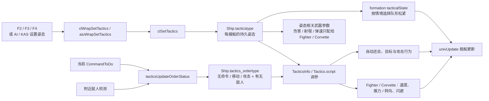
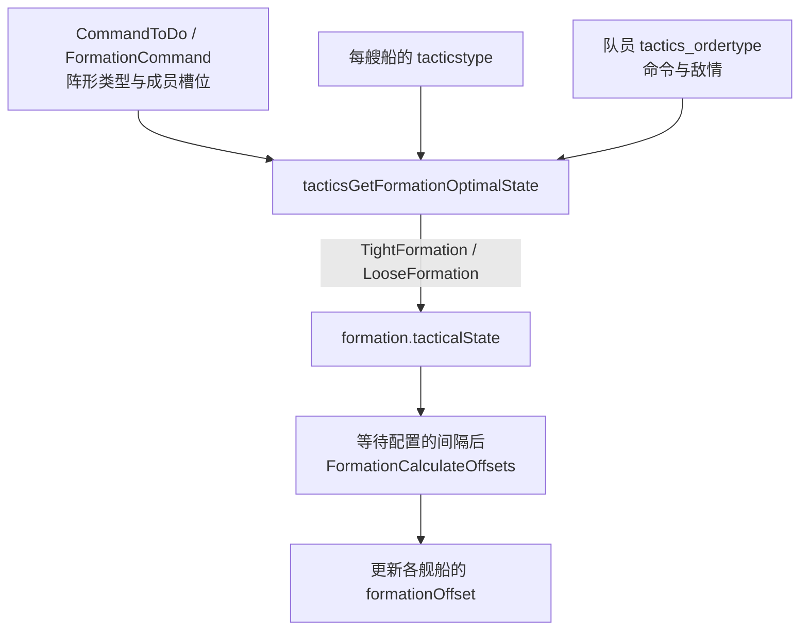

# 舰船战术（Tactics）：姿态如何影响自动战斗、机动和队形

## 先回答：它属于哪个系统？

项目有专门的 `tactics.c` / `tactics.h`，因此舰船战术是一个独立子系统；它又会被 CommandLayer、舰船更新、攻击、武器和编队逻辑调用，属于**横跨多个游戏功能的战术规则层**。它给每艘船保存战术姿态，并根据当前命令和附近敌情调整部分自动反应。

这里的 Tactics 不是电脑玩家 AI 决策器。它不决定整场战役要造什么舰队；它决定某艘船或一组舰船在当前命令与战斗情境下怎样机动、还击和读取战斗参数。

## 按键：战术姿态与阵形是两组设置

源码中的 `TacticsType` 只有三种：

| 按键 | 源码值 | 便于记忆的含义 |
| --- | --- | --- |
| F2 | `Evasive` | 回避倾向：更重视规避，被动还击较少。 |
| F3 | `Neutral` | 中性姿态：按普通规则还击与机动。 |
| F4 | `Aggressive` | 进取倾向：符合条件时可能把当前命令改成完整攻击命令。 |

“防御 / 平衡 / 进攻”可以作为粗略记忆，但源码枚举名是 `Evasive / Neutral / Aggressive`；实际行为还取决于舰船类别、当前命令、是否发现敌人以及是否正在停靠等情境。

阵形由另一组 `TypeOfFormation` / `formation.c` 逻辑管理。`mainrgn.c` 的按键分支把 F5–F11 映射到阵形设置处理；其中 Shift+F6 / Shift+F7 还会触发快速存档 / 读档处理。阵形决定舰船相对位置，Tactics 决定舰船的战术姿态。两者会互相影响，但分别保存和更新。

## 总体流程：玩家设置，运行时按情境消费

玩家设置的姿态保存在 `Ship.tacticstype`。运行时会另行计算 `Ship.tactics_ordertype`，表示“本船此刻有什么命令、附近有没有敌人”；Tactics 用这两类输入选参数或分支。一个是玩家/脚本选的模式，一个是运行时推导的情境，不要把它们当成同一字段。

## 按舰船类别比较三种姿态

源码的类别枚举在 [`ClassDefs.h`](../../src/Game/ClassDefs.h)；下面列的是**类别**，不是每种具体舰船。自动还击还会看 `shipIsCapital` 标记，所以 Heavy Cruiser、Carrier、Destroyer、Frigate 这几类只有在该标记为真时才走主力舰分支。姿态不是对所有舰船套用同一组“攻击 / 防御”倍率：Fighter 和 Corvette 有完整的姿态机动与武器数值表，其它类别主要体现为自动还击策略。

| 舰船类别 | 运行时条件 | Evasive（F2） | Neutral（F3） | Aggressive（F4） |
| --- | --- | --- | --- | --- |
| **Mothership** (`CLASS_Mothership`) | 特殊处理 | 常规自动还击分支不下被动攻击命令。 | 常规分支采用被动还击。 | 常规姿态分支采用被动还击；不会像其它 Aggressive 舰船那样改成完整攻击。 |
| **Heavy Cruiser** (`CLASS_HeavyCruiser`) | 只有 `shipIsCapital` 为真才走主力舰分支 | 不下被动还击命令。 | 被动还击。 | 单舰常规路径被动还击；分组路径中若舰船不忙且可攻击，当前命令可改成完整攻击。 |
| **Carrier** (`CLASS_Carrier`) | 只有 `shipIsCapital` 为真才走主力舰分支 | 不下被动还击命令。 | 被动还击。 | 单舰常规路径被动还击；分组路径中若舰船不忙且可攻击，当前命令可改成完整攻击。 |
| **Destroyer** (`CLASS_Destroyer`) | 只有 `shipIsCapital` 为真才走主力舰分支 | 不下被动还击命令。 | 被动还击。 | 单舰常规路径被动还击；分组路径中若舰船不忙且可攻击，当前命令可改成完整攻击。 |
| **Frigate** (`CLASS_Frigate`) | 只有 `shipIsCapital` 为真才走主力舰分支 | 不下被动还击命令。 | 被动还击。 | 单舰常规路径被动还击；分组路径中若舰船不忙且可攻击，当前命令可改成完整攻击。 |
| **Corvette** (`CLASS_Corvette`) | Fighter / Corvette 专属姿态更新 | 不主动被动还击；符合情境和机型配置时可闪避。姿态数值表会影响其机动和武器参数。 | 通常被动还击；可按情境闪避。姿态数值表仍作用于机动和武器参数。 | 当前命令允许改成完整攻击时会这样做；不触发姿态闪避。姿态数值表仍作用于机动和武器参数。部分特种 Corvette 另有命令 / 停靠时的闪避限制。 |
| **Fighter** (`CLASS_Fighter`) | Fighter / Corvette 专属姿态更新 | 不主动被动还击；符合情境和机型配置时可闪避。非 Aggressive 的战斗机可参与僚机跟随 / 配合；Evasive 还可触发额外的规避动作。 | 发现威胁时通常走被动还击，不把原任务改成完整追击；仍可按情境闪避并参与僚机配合。 | 当前命令允许改成完整攻击时会这样做；不会触发姿态闪避，并跳过非 Aggressive 的僚机跟随分支。 |
| **Resource** (`CLASS_Resource`，重点：ResourceCollector) | 资源收集船有额外受击分支 | ResourceCollector 空闲时受到攻击，会先自动返回资源点存放资源 / 维修；若进入通用还击分派，则遵循 Evasive 的不被动还击规则。 | ResourceCollector 空闲时受攻击也会先自动返航存放资源 / 维修；其它场景的通用还击按 Neutral 处理。 | ResourceCollector 不触发上述“受击后自动返航”分支；之后是否转完整攻击仍取决于它能否攻击，以及 CommandLayer 是否允许把当前命令改成攻击命令。 |
| **NonCombat** (`CLASS_NonCombat`) | 具体船型可能没有攻击能力 | 若该船型没有攻击能力，就没有还击目标可执行；也没有 Fighter / Corvette 专属数值与闪避更新。 | 船型可攻击时走通用被动还击；否则不产生攻击行为。 | 船型可攻击且 CommandLayer 允许把当前命令改成攻击命令时，走通用完整攻击；实际仍受武器能力和当前命令限制。 |

表中主力舰分支看的是 [`ShipStaticInfo.shipIsCapital`](../../src/Game/spaceobj.h)，而不是简单地用类别编号判断；若这些类别的标记为假，则回到普通非 Fighter / Corvette 规则。表中的 Resource 特殊行为具体针对 `ResourceCollector`。自动还击由 [`tactics.c`](../../src/Game/tactics.c) 分派，ResourceCollector 的受击返航由 [`univupdate.c`](../../src/Game/univupdate.c) 处理。

自动还击还要结合“当前命令是否忙碌”和“单舰 / 分组命令”来读：分组路径遇到忙碌命令时，不会改成完整攻击，只会在 `canChangeOrderToPassiveAttack()` 允许时尝试被动还击；单舰 Aggressive 路径遇到正在停靠的船也走被动还击。此前从战斗中撤离、又被追击记忆识别出的目标会先走单独分支：单舰路径可能直接下完整攻击，分组路径则只对非 Mothership 这样处理。玩家明确下达的 `COMMAND_ATTACK` 是已有命令，不会因为设成 Evasive 就被 Tactics 自动取消。这里的“把命令改成完整攻击”是 CommandLayer 的命令改写，详见[玩家命令执行：命令重派](player_command_execution_overview.md#命令重派)。另一个群体效果是 Aggressive 队长会启用攻击集火分配；[`CommandLayer.c`](../../src/Game/CommandLayer.c) 的该分支看的是攻击队长姿态，不限于 Fighter。

### 姿态相关数值：哪些类别真的会变？

| 影响项 | 实际适用范围 | 说明 |
| --- | --- | --- |
| 最大速度、推力、旋转、转向 | Fighter、Corvette | 按 `tactics_ordertype × 类别 × tacticstype` 查表；其它类的速度走静态值，不乘姿态倍率。 |
| 闪避 | Fighter、Corvette | 还要看具体船型的 `DodgeInfo` 是否启用、当前情境、燃料和特殊状态；不是所有战斗机 / 护卫舰都一定会闪避。 |
| 伤害、子弹射程、弹速 | Fighter、Corvette | Tactics 表只为这两类提供姿态倍率；其它类使用未按姿态拆分的基础武器数值。 |
| 燃料消耗 | 当前不生效 | 参数字段存在，但 `physics.c` 中读取它的代码处于 `#if 0`，不应把它描述成现行姿态效果。 |
| 连发武器的开火 / 等待节奏 | 进入 burst-fire 路径的武器 | `gun.c` 用姿态索引连发时长与等待时长参数；这是通用武器路径，不等于伤害倍率。 |

精确倍率来自运行时加载的 `Tactics.script`。当前源码仓库不包含这个脚本，因此这里只能确认“哪些代码会查表”，不能据此断言 Evasive / Neutral / Aggressive 的具体速度、伤害、射程或连发倍率大小。代码初始化时相关倍率先设为 `1.0`；闪避参数先设为 `0`，脚本可再覆盖。对应实现见 [`tactics.c`](../../src/Game/tactics.c)、[`statscript.c`](../../src/Game/statscript.c)、[`gun.c`](../../src/Game/gun.c) 和 [`physics.c`](../../src/Game/physics.c)。

## 姿态状态与战斗情境怎样合成

`tactics_ordertype` 把当前命令归为“无命令 / 移动 / 攻击”，再组合一个“附近有敌人”的标记，因此 `TacticsInfo` 可以为不同情境配置不同参数：

| 情境 | 常量示例 | 用途 |
| --- | --- | --- |
| 无命令、无敌人 | `NO_ORDER_NO_ENEMY` | 巡航或待机时的参数。 |
| 移动、有敌人 | `MOVE_ORDERS_ENEMY` | 正在转移且威胁接近时的参数。 |
| 攻击、有敌人 | `ATTACK_ORDERS_ENEMY` | 攻击交战时的参数。 |

`tacticsUpdateOrderStatus()` 按当前 `CommandToDo` 及邻近敌情更新这个上下文；附近敌人会按配置频率重新扫描。`tacticsManeuvUpdate()` 再按情境、战斗机 / 护卫舰类别和 `tacticstype`，重算推力、旋转和转向能力。

## 它会影响哪些游戏行为？

按源码把作用拆开看会更清楚：

- **自动反应**：是否被动还击、是否把当前任务改为完整攻击；具体分支见上表，并受舰船类别和命令状态约束。
- **战斗机 / 护卫舰更新**：`tacticsUpdate()` 只对 Fighter、Corvette 执行姿态机动更新，包括速度爆发、机动倍率、闪避和交战状态。
- **武器参数**：姿态伤害、射程和弹速倍率仅为 Fighter、Corvette 配置；连发时间参数则由通用 burst-fire 路径读取。
- **群体行为**：姿态会参与攻击集火和编队松紧判断；`holdFormationDuringBattle` 还可按姿态选择攻击时的编队处理路径。
- **战斗记忆**：撤退记录和短时追击记忆决定是否重新攻击先前撤离的目标，不等同于给某类舰船增加伤害 / 射程。

FuelBurnBonus 虽然仍保留在 `TacticsInfo` 参数结构中，但运行时代码已禁用，不能算当前姿态的实际效果。

## 阵形与 Tactics：互相读取，但状态不同

玩家选择的阵形类型（Delta、Wall、Sphere 等）定义队形形状；Tactics 还会为现有阵形推导一个 `tacticalState`，决定是否用较紧或较松的成员间距。源码中，Aggressive 队长会选择紧密状态；其他情况下，非战斗机 / 护卫舰成员或无附近威胁时倾向紧密，有船处于攻击或敌人附近时倾向松散。状态变化后，Formation 重新计算槽位偏移。该动态松紧规则属于两系统之间的接口，不会把玩家选定的阵形类型改成另一种阵形。

## 数据结构与所有权

| 字段 / 结构 | 定义位置 | 含义 |
| --- | --- | --- |
| `TacticsType` | [`objtypes.h`](../../src/Game/objtypes.h) | 枚举 `Evasive`、`Neutral`、`Aggressive`。 |
| `Ship.tacticstype` | [`spaceobj.h`](../../src/Game/spaceobj.h) | 本船当前选定的战术姿态；新船默认 `Neutral`。 |
| `Ship.tactics_ordertype` | 同上 | 按命令类型与附近敌情推导的临时情境索引。 |
| `TacticsInfo` | [`tactics.h`](../../src/Game/tactics.h) | 全局调参表、战术更新频率、闪避、保护和撤离规则。 |
| `RetreatAtom` / `AttackAtom` | 同上 | 全局撤离监控与暂时追击记忆的节点数据。 |
| `FormationCommand.formation.tacticalState` | [`CommandLayer.h`](../../src/Game/CommandLayer.h)、[`formation.h`](../../src/Game/formation.h) | 当前阵形使用的紧密 / 松散状态，与 `TypeOfFormation` 分开保存。 |
| `AITeam.kasTactics` | [`AITeam.h`](../../src/Game/AITeam.h) | KAS 团队记录的战术设置，供后续 AI move 复用。 |

## 从源码顺着读

1. [`src/Win32/mainrgn.c`](../../src/Win32/mainrgn.c)：F2/F3/F4 与 F5–F11 的输入分支。
2. [`src/Game/CommandWrap.c`](../../src/Game/CommandWrap.c) → [`src/Game/CommandLayer.c`](../../src/Game/CommandLayer.c)：`clWrapSetTactics()` 怎样进入 `clSetTactics()`，以及逐舰写入 `tacticstype`。
3. [`src/Game/univupdate.c`](../../src/Game/univupdate.c)：每艘船的 `tacticsUpdate()` 调用和自动还击分支。
4. [`src/Game/tactics.c`](../../src/Game/tactics.c)：`tacticsUpdateOrderStatus()`、`tacticsManeuvUpdate()`、`tacticsDodgeUpdate()`、`tacticsDelegateSingleAttack()` 与 `tacticsGlobalUpdate()`。
5. [`src/Game/gun.c`](../../src/Game/gun.c) / [`src/Game/attack.c`](../../src/Game/attack.c)：射击参数如何读取姿态，以及被动攻击的实际开火路径。
6. [`src/Game/formation.c`](../../src/Game/formation.c)：`FormationCommand` 如何应用 Tactics 计算出的队形松紧状态。
7. [`src/Game/KASFunc.c`](../../src/Game/KASFunc.c)：`kasfTacticsAggressive()`、`kasfTacticsNeutral()`、`kasfTacticsEvasive()` 如何为 KAS 团队设置相同的姿态枚举。
