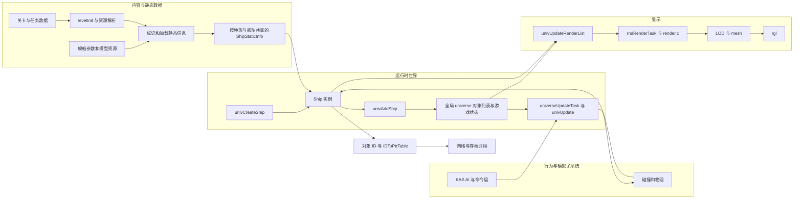
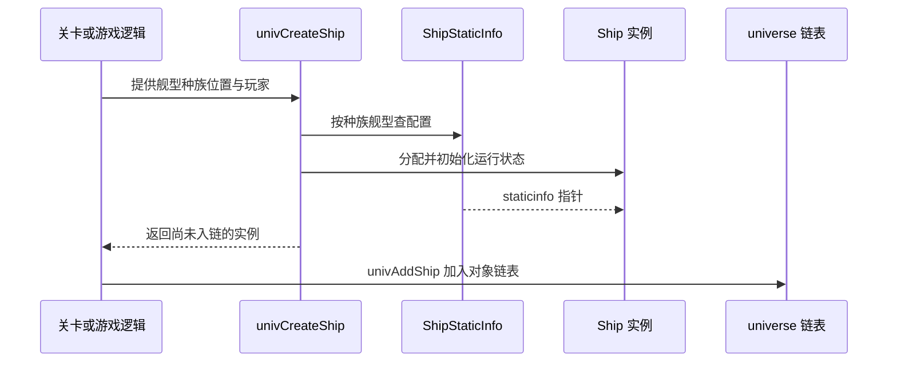

# Homeworld 1 项目级空间对象模型总览

本文说明 Homeworld 1 如何表示、创建、更新并呈现**游戏世界中的空间对象**，以及对象模型如何连接关卡数据、AI、物理、渲染、网络和存档。内容以当前源码为准；关于设计动机的判断会明确标为推断。

## 1. 设计目标与适用范围

`SpaceObj` 是贯穿多个游戏子系统的空间实体模型：舰船、子弹、导弹、资源、残骸、效果等运行时对象可以被加入 Universe 的对象集合，并被更新、碰撞检测、选入渲染列表或通过 ID 查找。

这是一套**项目级的空间对象模型**，但不等于项目里所有数据结构的总模型。`Player`、任务脚本状态、UI `Region`、渲染器资源等各有自己的模型；只有游戏世界里需要空间位置、对象身份或相关行为的实体才属于 `SpaceObj` 体系。

从设计上需要掌握四件事：

1. 通用空间对象字段如何让不同对象接入通用算法。
2. 每种种族/舰型共享的静态配置如何与每个实例的运行状态分开。
3. `universe` 如何持有运行中的对象集合，`univUpdate` 如何推进对象状态。
4. 对象如何把逻辑状态接到碰撞、AI、渲染、网络和存档等系统。

主要入口：[`spaceobj.h`](../../src/Game/spaceobj.h)、[`universe.h`](../../src/Game/universe.h)、[`universe.c`](../../src/Game/universe.c)、[`univupdate.c`](../../src/Game/univupdate.c)。

## 2. 项目中的分层与数据流

| 层 | 职责 | 关键源码 |
| :-- | :-- | :-- |
| 内容与类型定义 | 提供关卡、舰船参数、网格、LOD 和扩展数据 | `src/SinglePlayer/`、`src/Ships/`、`.level` / `.missphere` / `.shp` / `.lod` / `.geo` / `.mex` |
| 静态信息准备 | 按关卡需要标记、加载并初始化类型配置 | `universeFlagRaceNeeded`、`universeStaticInit`、`InitStatShipInfo`、`statscript.c` |
| 运行时对象 | 定义共同对象字段、类型专用字段和 Universe 对象列表 | `spaceobj.h`、`universe.h` |
| 行为与模拟 | 接收命令、执行 AI、碰撞和物理更新 | `univUpdate`、`CommandLayer.c`、`AIPlayer.c`、`collision.c`、`physics.c` |
| 呈现 | 从世界对象生成绘制列表，选择 LOD 并提交网格 | `univUpdateRenderList`、`render.c`、`LOD.c`、`mesh.c`、`src/rgl/` |
| 身份与恢复 | 用对象 ID 找回运行实例，供联机和存档相关代码引用 | `IDToPtrTable`、`SaveGame.c`、`CommandNetwork.c` |

按图阅读时，主路径是：

1. 关卡和资产准备出对应的静态类型信息。
2. 创建函数分配具体实例，并让实例指向其类型信息；加入函数把实例挂入 Universe 管理的链表。
3. 调度器恢复 `universeUpdateTask`，由 `univUpdate` 和其调用的各系统推进对象状态。
4. 绘制路径从对象集合中筛选出 `RenderList`，之后由渲染任务读取并交给 LOD、mesh 和 rgl。
5. 对象的运行指针与稳定 ID 分开管理，跨系统可以通过 ID 查找仍有效的实例。

此图表示系统关系，不意味着图中每条路径都在同一模拟步执行，也不表示 `univUpdate` 直接调用每个呈现函数。

## 3. 核心模型

### 3.1 Universe 系统与 `universe` 运行状态

`Universe` 是一个 C 结构体类型；全局变量 `universe` 是这份游戏运行状态。它保存主命令层、玩家、计时、对象链表、渲染链表、删除队列和对象计数等字段，定义见 [`universe.h`](../../src/Game/universe.h#L132)。

`universe.c` / `univupdate.c` 则包含 Universe 的初始化、静态信息管理、对象创建与更新等系统逻辑。因而在源码里，“Universe”既会指这块游戏系统，也会指全局 `universe` 中的当前世界状态；理解具体代码时要看它指的是函数/模块还是变量/数据。

`universe` 管理对象实例列表，但静态类型信息表并不都嵌在 `Universe` 结构内。例如舰船静态信息数组定义在 [`universe.c`](../../src/Game/universe.c#L199)，再通过 `RaceShipStaticInfos` 和 `GetShipStaticInfo` 查找。

### 3.2 类型共享数据与实例状态

| 数据层 | 舰船结构 | 典型字段 | 共享范围 |
| :-- | :-- | :-- | :-- |
| 类型/种族配置 | `ShipStaticInfo` | `staticheader.mass`、`staticheader.maxvelocity`、`maxhealth`、建造属性、武器/LOD 相关信息、特化回调 | 通常按种族和舰型共享 |
| 运行时实例 | `Ship` | `posinfo`、`rotinfo`、当前 `health`、`playerowner`、AI 状态、当前命令、燃料、资源量 | 每艘舰船各自一份 |

实例通过 `staticinfo` 指针读取类型配置。`univCreateShip` 根据 `shiptype` 和 `shiprace` 调用 `GetShipStaticInfo`，分配 `Ship`，并设置 `newship->staticinfo`；例如同种族、同舰型的两艘船可以共享 `ShipStaticInfo`，同时拥有不同的位置和当前生命值。[创建实现](../../src/Game/univupdate.c#L1349) · [静态信息查找](../../src/Game/universe.c#L4098)

`StaticInfo` 中的 “static” 是按类型共享的配置概念，不是 C 语言的 `static` 存储类别。源码明确指出，部分推力和转向参数创建时会从 `ShipStaticInfo` 复制到每艘船自己的 `nonstatvars`，因为运行中需要改动；所以不能把“static”理解成所有字段永远不可变。[字段说明](../../src/Game/spaceobj.h#L542) · [创建时复制](../../src/Game/univupdate.c#L1427)

### 3.3 `SpaceObj` 通用布局与专用对象

`SpaceObj` 提供通用空间实体视图：对象类型 `objtype`、行为/能力标志 `flags`、静态信息指针、渲染链表节点、相机距离字段，以及位置和速度 `posinfo`。[`SpaceObj` 定义](../../src/Game/spaceobj.h#L967)

旋转、碰撞、目标和生命等更具体的对象会在可供通用代码使用的字段前缀后继续扩展。舰船实例 `Ship` 除了这类共同字段，还带有命令、AI、战术、玩家归属和舰船专用数据。[`Ship` 定义](../../src/Game/spaceobj.h#L1282)

源码用 C 结构体的共同字段前缀配合强制转换，让通用代码能够把具体对象作为 `SpaceObj` 处理。它不是 C++ 的类继承，也不是在 `Ship` 中嵌入一个 `SpaceObj` 成员；对象结构重复声明兼容字段，布局顺序因此是重要约束。读到 cast 时应回到结构体定义核对前缀，不能只根据名字推断兼容关系。

`objtype` 说明对象属于哪类，`SOF_*` 标志表示对象具备或处于哪些通用状态，例如可旋转、可碰撞、可选择、隐藏或已死亡。舰船还带 `SPECIAL_*` 等舰船专用标志。类型分派与能力标志承担不同职责：前者区分类别，后者表达通用路径应怎样处理该实例。

### 3.4 通用数据与舰船特化行为

不同舰型共享 `Ship` 的通用运行结构，同时可以通过 `CustShipHeader` 安装特定行为函数。舰船头表在 [`universe.c`](../../src/Game/universe.c#L216) 按 `ShipType` 组织；`InitStatShipInfo` 把对应头信息复制到 `ShipStaticInfo.custshipheader`。实例随后通过其 `staticinfo` 访问这些回调。

回调覆盖静态初始化、实例初始化与释放、攻击/开火、housekeep、死亡通知和存档修复等扩展点，定义见 [`CustShipHeader`](../../src/Game/spaceobj.h#L520)。这是“共同对象数据 + 按舰型分派行为”的设计：通用模块处理共同状态，`src/Ships/` 中的舰型代码处理专属规则。

### 3.5 对象集合、链表节点与 ID

一个实例可以同时属于不同用途的链表。例如 `univAddShip` 把新船挂入 `SpaceObjList`、`ShipList` 和 `ImpactableList`；实例内不同的 `Node` 字段分别服务于这些链表，渲染列表也有自己的节点。链表成员关系记录对象“参加哪种遍历”，并不意味着复制出多份对象。

对象 ID 和内存指针也分开管理。`ShipID` 等标识以及 ID-to-pointer 表供代码按 ID 查找当前实例；指针表示本次运行中的地址，ID 表示跨模块使用的对象身份。销毁时必须同步清除列表关系和 ID 映射，避免其它系统保留失效引用。

## 4. 主要业务流程

### 4.1 静态信息准备

关卡需要哪些种族/舰型会影响静态资源的加载范围。`universeFlagRaceNeeded` 设置需求标志；`universeStaticInit` 遍历种族与舰型，只为需要且未加载的配置调用 `InitStatShipInfo`。初始化过程将脚本字段绑定到结构体，并准备 LOD、碰撞、武器等相关数据。[需求标记](../../src/Game/universe.c#L2589) · [按需加载](../../src/Game/universe.c#L2992)

### 4.2 创建并加入对象

`univCreateShip` 负责分配和初始化实例，但函数注释指出它本身不把船加入 Universe；`univAddShip` 再将实例挂入通用对象、舰船和可碰撞对象链表。[创建函数](../../src/Game/univupdate.c#L1341) · [加入函数](../../src/Game/univupdate.c#L1671)

### 4.3 更新对象并把它送入渲染路径

`univUpdate` 是一次世界模拟步的编排入口。它驱动 AI、命令、碰撞、位置/速度更新、死亡对象整理等系统；具体模块可能按不同周期或条件运行。`universeUpdateTask` 还会按条件更新 render list；渲染任务稍后读取列表并绘制对象。[`univUpdate`](../../src/Game/univupdate.c#L7415) · [`univUpdateRenderList`](../../src/Game/univupdate.c#L7151) · [`rndRenderTask`](../../src/Win32/render.c)

对象因此有两条相关但不同的路径：模拟路径修改运行状态；绘制路径读取可见对象和 LOD 信息来生成画面。`RenderList` 是呈现阶段的筛选结果，不是 Universe 对象的所有权列表。

### 4.4 死亡与释放

舰船死亡不等于立刻释放完所有对象数据。死亡处理会通知命令层、AI、传感器、摄像机、单人任务、声音等引用方，并处理目标引用；之后实例私有的 gun、dock、trail 等数据由释放路径回收。`univDeleteDeadShips` / `univDeleteDeadShip` 和 `univFreeShipContents` 是深入生命周期时的入口。[死亡处理](../../src/Game/univupdate.c#L3989) · [释放实现](../../src/Game/univupdate.c#L6650)

## 5. 与项目其它子系统的关系

| 子系统 | 如何使用对象模型 | 阅读入口 |
| :-- | :-- | :-- |
| 关卡与资源加载 | 根据关卡需要准备类型数据，再创建初始世界对象 | `levelload.c`、`universe.c`、`statscript.c`、`file.c` |
| 命令、任务脚本与 AI | 用对象指针或对象 ID 选择目标、保存当前命令并改变舰船行为 | `CommandLayer.c`、`KAS.c`、`AIPlayer.c`、`AITeam.c` |
| 物理与碰撞 | 从位置、速度、旋转、质量和碰撞字段读取对象状态并更新 | `physics.c`、`collision.c`、`univupdate.c` |
| 渲染 | 从对象列表筛选可见对象，再读取静态 LOD 和实例状态绘制 | `render.c`、`LOD.c`、`mesh.c`、`src/rgl/` |
| 网络与存档 | 通过稳定对象 ID 或序列化数据关联运行实例 | `CommandNetwork.c`、`SaveGame.c`、`univupdate.c` |
| 舰船特化 | 按舰型提供初始化、攻击、维护、死亡等回调 | `src/Ships/*.c`、`CustShipHeader` |

## 6. 设计收益与约束

### 6.1 设计收益

- 同一种族与舰型的船共享大型类型配置，实例只保存自己的运行状态。
- 通用字段前缀让碰撞、渲染、列表遍历等代码能够处理不同具体类型。
- 多条侵入式链表可以按用途遍历同一对象，无需为每个系统复制实体。
- `CustShipHeader` 把通用舰船结构与专属行为连接起来，适合大量舰型共享一组系统。
- 按需加载静态信息可让关卡只准备它会使用的类型资源。

### 6.2 阅读与维护时的约束

- C 结构体前缀依赖字段布局和 cast；新增或重排字段可能破坏通用代码的假设。
- 全局 `universe`、裸指针和多条 intrusive list 让所有权关系分散在创建/删除路径中；分析对象时要逐项核对所有引用和链表。
- “静态配置”中有少量会复制到实例或运行时修改的字段；修改参数前先确认数据所有者。
- `objtype`、`SOF_*`、`SPECIAL_*` 是不同层次的标识，不应把一个标志推断成完整对象类型。
- 对象从 `SpaceObjList` 进入 `RenderList` 只说明参与某次呈现筛选，不代表它是新的对象或被转移了所有权。

以上收益与代价是从当前实现归纳出的设计观察，不代表源码作者记录过完全相同的设计意图。

## 7. 围绕本文的学习路线

建议按下列顺序，每次只沿一条代码路径走深：

1. **对象数据模型**：`SpaceObj` 通用字段、`Ship` 实例字段、`ShipStaticInfo` 类型配置，以及共同前缀布局。重点回答“字段归谁所有”。
2. **对象生命周期**：从 `univCreateShip` → `univAddShip` 追到 `univUpdateAllPosVelShips`，再到 `univDeleteDeadShip` / `univFreeShipContents`。重点回答“谁分配、谁挂链、谁解除引用、谁释放”。
3. **静态数据加载**：从 `universeFlagRaceNeeded` → `universeStaticInit` → `InitStatShipInfo`，再读 `.shp` 的字段绑定和 LOD/MEX 初始化。
4. **对象行为扩展**：选 Mothership 或一种小型舰船，追踪 `CustShipHeader` 怎样把通用 `Ship` 接到舰型特定函数。
5. **对象到画面**：从 `univUpdateRenderList` → `rndRenderTask` → LOD/mesh/rgl，区分世界对象所有权和绘制候选列表。
6. **跨模块引用**：选择一个对象 ID，观察网络或存档怎样把它映射回活动实例。

当前学习从第 1 项开始；对象的分配、更新、死亡和释放留给第 2 项，不在本次结构总览中混讲。

## 8. 相关文档与源码索引

- 项目路线：[Homeworld 1 源码学习路线](../learning_guide.md)
- 模拟入口：[Universe 更新 task](../../src/Game/universe.c#L3754)、[一次模拟步](../../src/Game/univupdate.c#L7422)
- 对象定义：[spaceobj.h](../../src/Game/spaceobj.h)、[Universe 运行状态](../../src/Game/universe.h)
- 加载：[资源加载总览](resource_loading_overview.md)、[statscript 总览](statscript_overview.md)
- 行为：[KAS 脚本总览](kas_script_overview.md)、[AI 决策与团队执行](ai_features_overview.md)
- 呈现：[渲染管线总览](render_pipeline_overview.md)、[LOD 总览](lod_overview.md)
- 对象构造、更新与释放：[univupdate.c](../../src/Game/univupdate.c)

## 9. 事实与推断边界

**源码可以直接证明**：结构体字段与前缀布局、静态表、对象创建和入链函数、Universe 链表、模拟与呈现入口，以及舰船特化回调定义。

**本文作为推断呈现**：把这些实现概括为“类型共享数据 + 独立实例状态”“通用空间实体视图 + 类型特化行为”等设计模式。这些总结有源码结构支持，但不冒充作者留下的原始设计说明。
