# 特殊能力与战场感知：逐项看舰船能力和提示机制

本文逐项说明项目里可用的舰船特殊能力，以及玩家在 Sensor Manager（传感器管理界面）中获得战场信息的来源。这里把三件事分开：

- **特殊激活**：没有目标列表，调用 **CustShipSpecialActivate**。
- **特殊目标操作**：有目标列表，调用 **CustShipSpecialTarget**。其中维修、补给、打捞不是武器；导弹、爆发炮等攻击行为见[特殊武器](special_weapons_overview.md)。
- **战场感知**：按对象、区域或事件更新可见信息及 UI 提示；一个 ping 只是提示标记，不自动代表玩家能看清该处每艘敌舰。

## 1. 通用分发：一次点击如何进入舰船逻辑

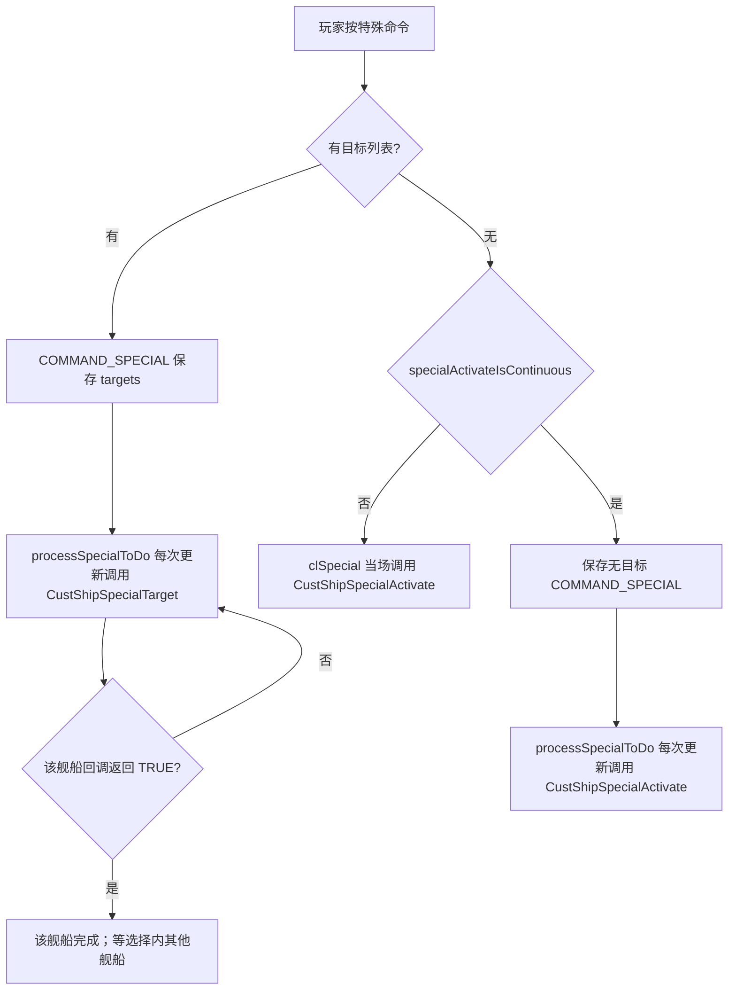

- **CustShipSpecialActivate** 与 **CustShipSpecialTarget** 是 **CustShipHeader** 上两种不同回调。
- 无目标能力是否反复调用，取决于该船 **ShipStaticInfo.specialActivateIsContinuous**。持续型回调返回 **FALSE** 表示继续；返回 **TRUE** 才结束。
- 特殊能力不是统一的可插拔组件。实际效果和状态字段分布在舰船自己的 .c 文件和 **ShipSpecifics** 中。

## 2. 特殊激活能力

### 2.1 Cloaked Fighter：单舰隐形

回调：**CloakedFighterSpecialActivate()**；维护逻辑：**CloakedFighterHouseKeep()**。

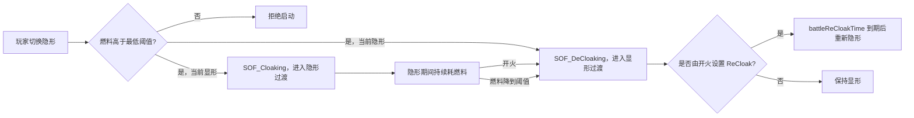

- 这个能力只作用于 Cloaked Fighter 自己；不是范围隐形。
- 隐形/显形有过渡时间；跨过 **VisibleState** 阈值时才改变 **SOF_Cloaked**。
- 隐形期间按时间消耗燃料。燃料到 **DeCloakFuelLevel** 会自动显形；燃料低于该阈值时也不能手动开启隐形。
- 开火会立即打断隐形，设置 **ReCloak** 计时；等待 **battleReCloakTime** 后重新开始隐形。
- 对隐形舰船的敌方显示和选取，还要看 **visibleToWho** 与近程探测器逻辑，见第 4.1 节。

### 2.2 Cloak Generator：范围隐形场

回调：**CloakGeneratorSpecialActivate()**；持续效果和范围成员表由 **CloakGeneratorHouseKeep()** 维护。

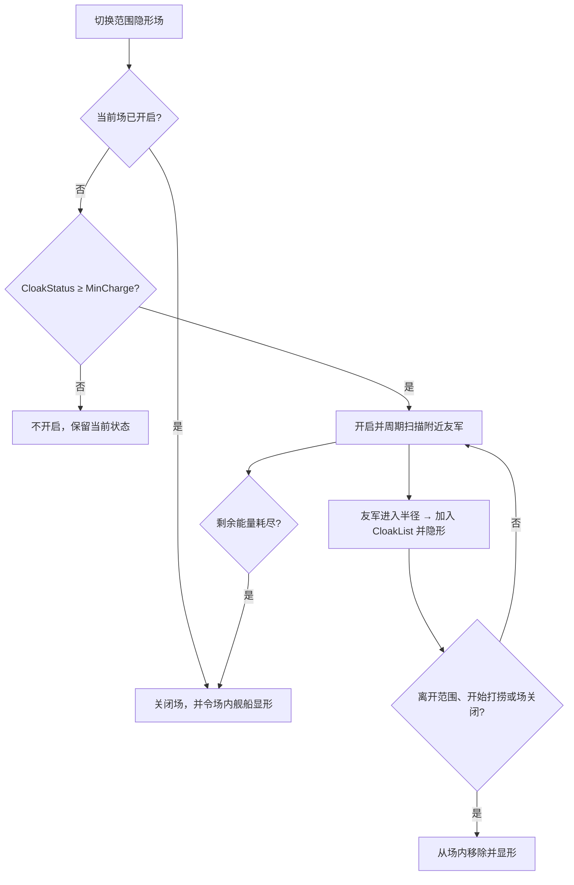

- 只为同一玩家的舰船提供范围效果；不纳入已死亡、已经隐形的舰船、Mothership、Carrier，以及正在牵引目标的 Salvage Corvette。
- 近邻搜索按节奏分批进行，不是每次渲染时遍历。**CloakList** 记录已被纳入场内的对象。
- 开启时 **CloakStatus** 持续下降；低于 0 时自动关场并使场内舰船显形。关闭时按 **ReChargeRate** 充能，最多恢复到 **MaxCloakingTime**。
- 被隐形舰船飞出半径、进入打捞牵引状态或场关闭时，会从隐形场效果中退出。
- 这套隐形场不包括 Mothership 与 Carrier；不要从“范围内友军”推断成对全部舰船生效。

### 2.3 GravWell Generator：重力场 / 跃迁拦截

回调：**GravWellGeneratorSpecialActivate()**；目标扫描和场内对象更新由 **GravWellGeneratorHouseKeep()** 执行。

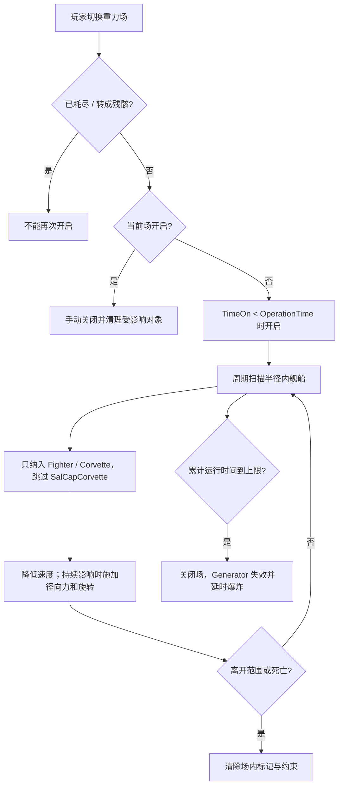

- GravWell 能手动开关，但不能在 **GravFired** 后再次开启；场累计运行时间到 **OperationTime** 后会失效并变成可摧毁的残骸状态，之后延时爆炸。
- 受影响对象主要是半径内的 Fighter 和 Corvette；代码明确跳过 SalCap Corvette。场内舰船会被减速，并受到径向力与旋转效果。
- 场内状态会写入 **SPECIAL_2_ShipInGravwell**；移出半径或对象死亡后清理该状态。
- 与跃迁的联动不是由 **COMMAND_SPECIAL** 完成：**GenericInterceptor** 检查附近开启的重力场后，会阻止相应战机的 hyperspace 更新。因此它也承担局部跃迁拦截作用。

### 2.4 DDD Frigate：部署与回收无人机

回调：**DDDFrigateSpecialActivate()**；阶段推进：**DDDFrigateHousekeep()**。

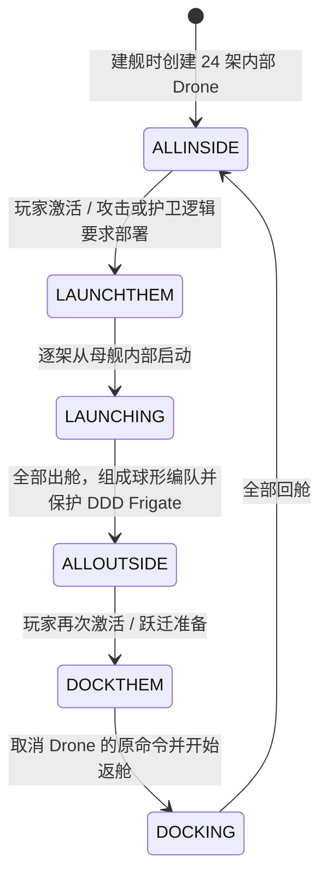

- DDD Frigate 创建时会创建 **MAX_NUM_DRONES** 架子舰；源码常量是 **24**。它们从一开始就是 Ship 对象，只是通过 **dockPutShipInside()** 存在母舰内部。
- 展开完成后，代码给 Drone 编球形编队并下达保护母舰的命令；Drone 使用自身普通攻击逻辑攻击敌舰。
- 特殊激活只在“全部在内”与“全部在外”状态切换；切换过程中的重复点击不会像任意中断按钮一样重置状态机。
- 攻击接近、被要求护卫以及准备跃迁等路径也会自动部署或回收 Drone，不只依靠手动点击。
- 毁坏的 Drone 按内/外状态对应的再生间隔逐架补充；若舰队已经全在外，新造 Drone 也会补进部署流程。

### 2.5 Light Interceptor：速度爆发

回调：共享的 **GenericInterceptorSpecialActivate()**；速度及冷却计时在 **tactics.c** 更新。

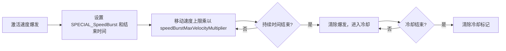

- **speedBurstDuration** 决定增速阶段；到期后进入 **speedBurstCoolDown** 冷却阶段。
- 它影响舰船移动速度上限，不会改写当前目标或直接传送位置。
- 多种舰船共用 **GenericInterceptorHeader**，但 **GenericInterceptorSpecialActivate()** 只有在 **shiptype == LightInterceptor** 时设置速度爆发标记。不要把这项能力套用到共用该回调的 Heavy Interceptor、P1 Fighter 或 Attack Bomber。

### 2.6 Defense Fighter：特殊旋转模式

回调：**DefenseFighterSpecialActivate()**；运行与恢复计时在 **DefenseFighterHouseKeep()**。

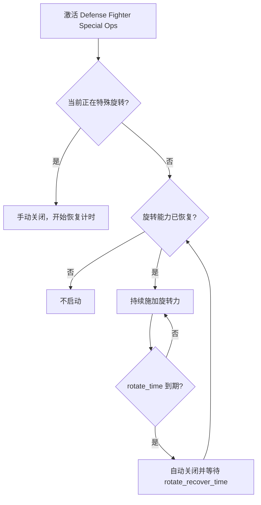

- 特殊激活切换的是 **dontrotateever** 的位标记，让舰船在一段时间内持续旋转；持续时长和恢复时长来自 **rotate_time**、**rotate_recover_time**。
- Defense Fighter 的反弹/拦截流程本身由另一套逻辑处理：碰撞更新向它报告可拦截的来袭子弹，**DefenseFighterHouseKeep()** 用激光持续削减子弹伤害直到摧毁或超出范围。
- **从实现推导**：持续旋转改变舰船正面的方向，因而改变 **defenseFighterCheckInFront()** 可接受的来袭方向；特殊模式影响的是拦截覆盖朝向，不是给激光加伤害。

### 2.7 Minelayer Corvette：雷墙布设

这是无目标激活能力，但它的攻击效果是武器布设，完整流程见[特殊武器：布设雷墙](special_weapons_overview.md#四布设雷墙minelayer-corvette)。

- 能力回调反复推进 **FIRST_OFF**、稳定舰船、按方格螺旋发射水雷，直到数量达到 **NumMinesInSide²**。
- 是否反复调用回调由 **specialActivateIsContinuous** 配置决定；回调返回 **FALSE** 时表示本轮布雷仍未完成。

### 2.8 源码中有函数，但不是可用特殊能力

- **SalCapCorvetteSpecialActivate()** 的函数注释写着“temporary test to generate a derelict”，会在舰船前方生成 Ghostship；但 **SalCapCorvetteHeader** 中的 **CustShipSpecialActivate** 槽位为 **NULL**。它是遗留测试代码，不能当成玩家可用能力。
- **GenericInterceptorSpecialActivate()** 对非 LightInterceptor 类型不执行速度爆发；“共享函数指针”不代表每种共用该函数的船都有特殊能力。

## 3. 特殊目标操作：非武器行为

这些操作同样经过 **COMMAND_SPECIAL**，但不是上面无目标的 activate 分支。

### 3.1 维修、补给与支援：共享 **refuelRepairShips()**

这些舰船的 **CustShipSpecialTarget** 最终都进入 **refuelRepairShips()**：

- Resource Collector、Resource Controller
- Repair Corvette、Advance Support Frigate、Carrier

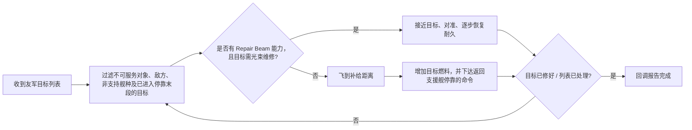

- **refuelRepairShips()** 会改写目标列表，移除非舰船、敌方目标、不适用舰种和处于停靠末段的目标。
- 拥有 **repairBeamCapable** 的维修舰可用光束修复符合条件的友军；修好一个目标后继续处理列表。
- 普通补给路径在距离合适时给目标增加固定燃料，再让目标停靠支援舰；不同舰型的接近距离和是否能维修大型舰船由静态配置决定。
- 各舰船实现回调很薄，差别主要在各自静态配置和 Repair Beam 能力标记；共享的是补给/维修流程，不是每条船都有独立目标状态机。
- **源码边界需留意**：Repair Beam 分支发现目标列表都已满血时，只会关闭光束并返回 **FALSE**；此函数没有移除这些目标。因此这一分支不会靠自身报告命令完成。

### 3.2 Salvage Corvette / Junkyard Dawg：打捞与俘获

回调：**SalCapCorvetteSpecialTarget()**；状态字段为 **SalCapCorvetteSpec.salvageState**。它的目标命令包含牵引、拆解、关闭目标、返航等阶段。

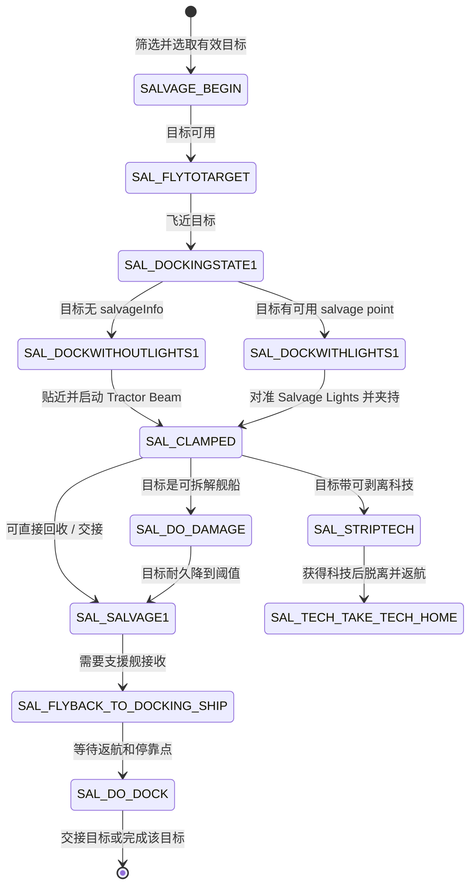

- **SALVAGE_BEGIN** 从用户目标中挑可打捞对象；空列表/无有效目标会清理状态并回报完成。
- 对已被另一艘打捞船占用的目标，会等待或把该目标从命令列表移除；避免两艘船抢占同一个夹持对象。
- 若目标有 **salvageInfo**，流程会分配空闲 salvage point、对准目标灯并夹持；没有 lights 时走近距离夹持路径。
- 对可拆解舰船，先持续造成伤害，直到低于 **HealthThreshold**，再进入回收。达到并联人数需求后会禁用目标，送到接收舰/母舰并交接。
- 可剥离科技的目标会走 **SAL_STRIPTECH** 计时分支；完成后解除牵引并让 Salvage Corvette 带着科技回家。
- Junkyard Dawg 复用同一回调，但有专属结果：目标被永久禁用，Dawg 可带着目标继续任务；不是普通 Corvette 的返航交接路径。

## 4. 战场感知：检测、视图与事件 ping 是不同层

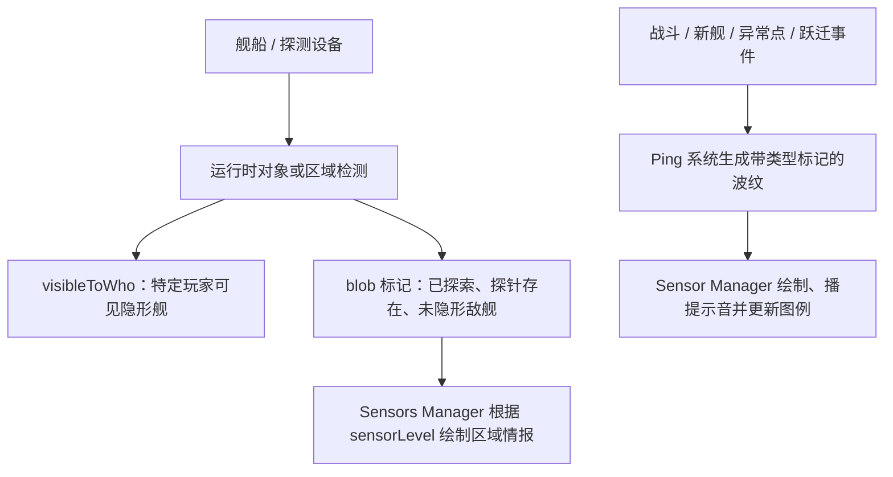

| 机制 | 它回答的问题 | 它不会自动代表什么 |
| --- | --- | --- |
| Proximity Sensor / **visibleToWho** | 近处是否有敌舰；近程探测是否允许看见一艘隐形船 | 全地图侦测或所有舰船的全局位置 |
| Sensor Array / **sensorLevel** | Sensors Manager 应显示多少 blob 情报 | 逐舰写入隐形可见标记 |
| Blob 探索标记 | 该 blob 中当前是否有友军舰船/Probe | 特定敌舰当前是否可见 |
| Ping | 是否有某类事件位置提示 | 目标发现、可选取或获得了完整舰队情报 |

### 4.1 Proximity Sensor：近程敌舰与隐形探测

检测入口：**DetectShips()**；搜索半径来自 **ProximitySensorStatics.SearchRadius**。

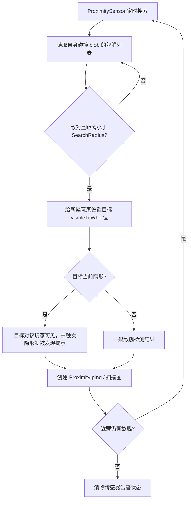

- **DetectShips()** 不遍历整个 Universe：它只扫描探测船所在的 **collMyBlob->blobShips**，并按 **SearchRadius** 做距离筛选。
- 发现敌舰时，**proximityPlayerSeesShip()** 把所属玩家位写入敌舰的 **visibleToWho**。**spaceobj.h** 的注释限定它主要用于隐形对象；选取和绘制路径会查询 **proximityCanPlayerSeeShip()**。
- **univSetupShipForControl()** 按搜索节奏轮换 **visibleToWhoPreviousFrame** 与当前位集；近程探测发现的隐形目标不是永久解锁。
- 传感器进入 **SENSOR_SENSED** 后会为玩家创建 Proximity ping，并播放提示；当再次搜索不到敌舰或传感器被摧毁，提示关联状态会结束。

### 4.2 Sensor Array 与 Sensors Manager：区域级情报显示

- **SensorArrayInit()** 把玩家 **sensorLevel** 设为 2；最后一艘 Sensor Array 被摧毁时将其归零。初始值也可由游戏设置改变。
- Sensors Manager 按 **sensorLevel** 和每个 blob 的标志绘制：**BTF_Explored** 表示当前 blob 中有友军/盟友舰船；**BTF_ProbeDroid** 表示有 Probe；**BTF_UncloakedEnemies** 表示该 blob 内有未隐形敌舰。
- 级别 2 会额外把含未隐形敌舰的 blob 画成已知区域；级别 0、1 不会因这面敌舰而清除雾化显示。有友军或 Probe 的 blob 也会作为已知区域绘制。
- 级别 0 在未探索 blob 上提示“未探索”；非 0 级别的光标提示可以显示其下方对象类别。不要据此理解成获得精确舰队清单：用于绘制舰船数目/类别明细的 **smTacticalOverlayDraw()** 代码目前被注释掉。
- **smToggleSensorsLevel()** 切换 Sensors Manager 的显示级别；Sensor Array 把玩家 **sensorLevel** 设为 2，最后一艘被摧毁后归零。它们影响区域视图，不替代 Proximity Sensor 对隐形舰的逐舰可见标记。

### 4.3 Ping 类别：每种波纹由什么事件创建

Ping 是 **ping** 结构组成的短时 UI 波纹，包含中心/跟随对象、颜色、大小、持续时间、类型掩码和可选评估回调。**pingTask** 周期评估过期或事件状态；**pingListDraw()** 负责绘制。图例中 Proximity、New Ships、Anomaly、Battle、Hyperspace 是五种不同类型。

| Ping 类型 | 创建时机和来源 | 生命周期 / 解释 |
| --- | --- | --- |
| Proximity | **ProximitySensorHouseKeep()** 检测到附近敌舰 | 以探测器为中心反复闪烁；敌舰消失或传感器失效后移除。它与 **visibleToWho** 的逐舰标记同时发生，但不是同一数据。 |
| Battle | **pingBattlePingsCreate()** 在 blob 更新中检查 **BTM_PieceOfTheAction**；只要已有战斗 ping 就不再创建新一轮 | 基于交战子 blob 建立红色战斗提示，并跟踪参战舰船；评估回调可据战斗损失/胜负触发战况提示。 |
| New Ships | 建造管理器在某舰种当前建造队列完成时调用 **pingNewShipPingCreate()** | 固定在工厂附近位置的短时提示；代码不是每造出一艘就必定创建，而是在该队列的 **nJobs** 清零时创建。 |
| Anomaly | KAS API 按标签添加对象、目标集合或坐标 ping | 供任务脚本标注异常点/任务目标；脚本可按标签移除。它是脚本发布的标记，不是传感器发现算法。 |
| Hyperspace | CommandLayer 在跃迁离场/到场阶段为舰船创建 | 跟随单艘舰船的位置并持续至其进入跃迁或退出跃迁状态；类型图例表达正在发生的跃迁。 |

#### Battle ping 具体如何形成

1. Universe 在碰撞 blob 更新节奏调用 **pingBattlePingsCreate()**。
2. **BTM_PieceOfTheAction** 由近期受攻击或正在攻击的舰船活动标记；满足条件的 blob 交给 **pingAttackPingsCreate()**。
3. **bobSubBlobListCreate()** 把大 blob 切成彼此接近的交战区域；每个区域生成一个 ping 和一份 **battleping** 参与者列表。
4. ping 更新评估该战斗区域，并在船只毁坏时更新双方损失统计；Battle ping 已存在时，本轮不会继续生成新的 Battle ping。

这类 ping 让玩家注意到交战位置并可触发战况音频；它本身不表示这些舰船已通过 **ProximitySensor** 显形。

## 5. 关键状态放在哪里

| 状态 / 结构 | 含义 |
| --- | --- |
| **ShipStaticInfo.specialActivateIsContinuous** | 空目标特殊能力是否要由 CommandLayer 重复调用。 |
| **CustShipHeader.CustShipSpecialActivate** / **CustShipSpecialTarget** | 每个舰种注册的无目标激活回调 / 有目标回调。 |
| **Ship.ShipSpecifics** | 单艘舰的能力状态，例如 CloakStatus、DDDstate、GravFieldOn、burstState。 |
| **Ship.visibleToWho** / **visibleToWhoPreviousFrame** | 针对隐形舰的玩家可见位集及前一轮值。 |
| **Player.sensorLevel** | Sensors Manager 的区域情报显示等级。 |
| blob 的 **BTF_Explored**、**BTF_ProbeDroid**、**BTF_UncloakedEnemies** | 区域是否探索、有无 Probe、是否包含未隐形敌舰。 |
| **ping** / **battleping** | 事件波纹的 UI 配置、对象引用和战斗评估数据。 |

## 阅读顺序与源码入口

1. [**CommandLayer.c**](../../src/Game/CommandLayer.c)：**clSpecial()**、**processSpecialToDo()**。
2. [**spaceobj.h**](../../src/Game/spaceobj.h)：**CustShipHeader**、**specialActivateIsContinuous**、**visibleToWho**。
3. 能力： [**GenericInterceptor.c**](../../src/Ships/GenericInterceptor.c)、[**CloakGenerator.c**](../../src/Ships/CloakGenerator.c)、[**GravWellGenerator.c**](../../src/Ships/GravWellGenerator.c)、[**DDDFrigate.c**](../../src/Ships/DDDFrigate.c)、[**DefenseFighter.c**](../../src/Ships/DefenseFighter.c)。
4. 维修与打捞： [**RepairCorvette.c**](../../src/Ships/RepairCorvette.c)、[**SalCapCorvette.c**](../../src/Ships/SalCapCorvette.c)。
5. 感知： [**ProximitySensor.c**](../../src/Ships/ProximitySensor.c)、[**SensorArray.c**](../../src/Ships/SensorArray.c)、[**sensors.c**](../../src/Game/sensors.c)、[**blobs.c**](../../src/Game/blobs.c)。
6. 提示： [**ping.c**](../../src/Game/ping.c)、[**consMgr.c**](../../src/Game/consMgr.c)、[**univupdate.c**](../../src/Game/univupdate.c)。

