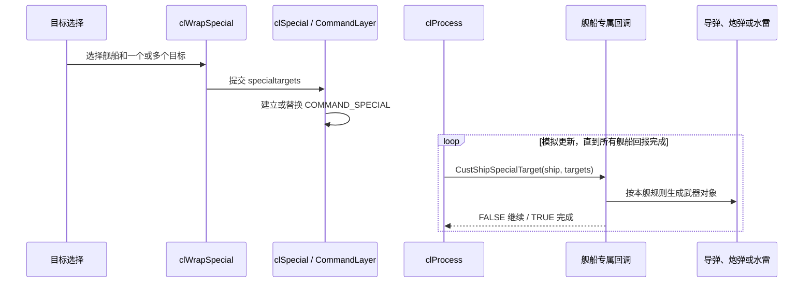
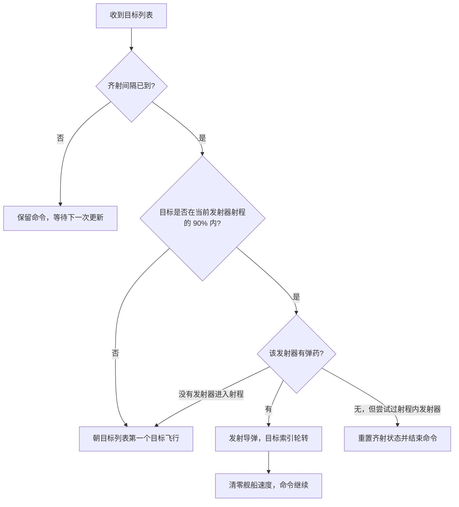
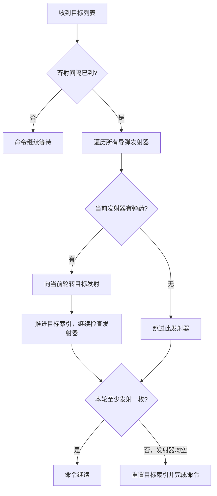
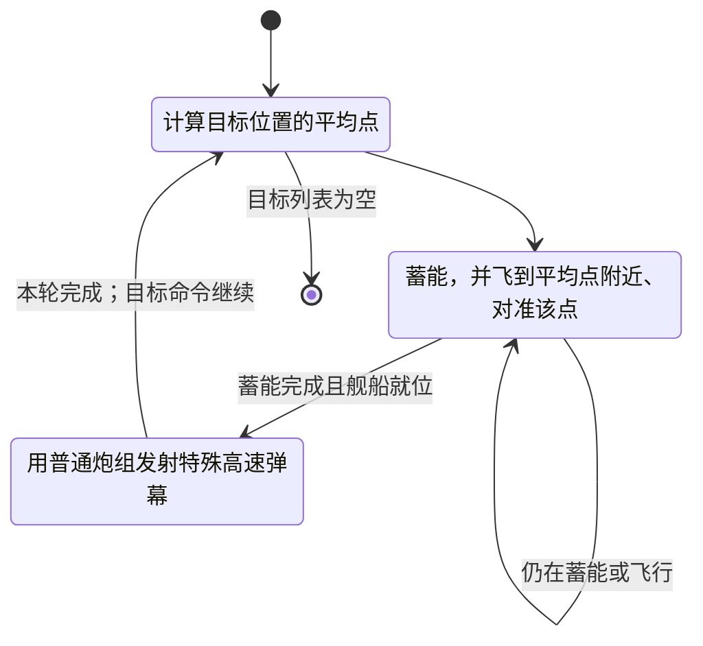
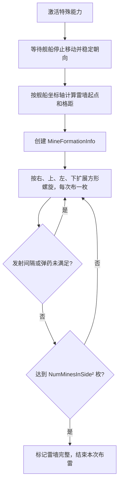
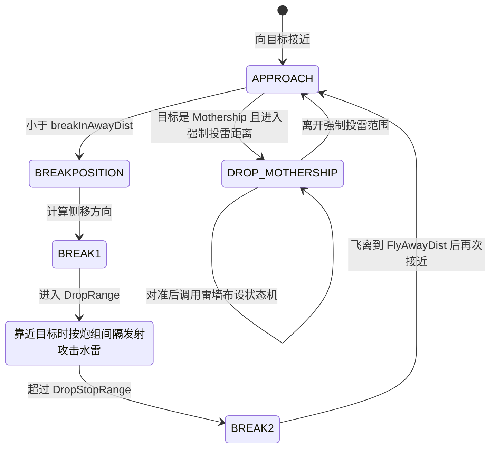

# 特殊武器：四种舰船专属攻击流程

本文只讨论会造成攻击效果的特殊武器。`COMMAND_SPECIAL` 是通用分发入口，武器本身没有统一算法；每种舰船的 `CustShipSpecialTarget` 决定攻击步骤、状态和结束条件。

## 总览：玩家目标如何变成武器效果

- 有目标列表时走 `CustShipSpecialTarget`；无目标时才是特殊能力激活，见[特殊能力与战场感知](special_abilities_battlefield_awareness_overview.md)。
- `processSpecialToDo()` 汇总所选舰船的返回值；只有全部舰船返回 `TRUE`，命令才结束。
- 特殊回调可自行控制瞄准、射程、弹药、间隔和接近目标的行为。

## 一、导弹齐射：Missile Destroyer

回调：`MissileDestroyerSpecialTarget()`，运行状态主要在 `MissileDestroyerSpec`。

- 回调按 `MissileVolleyTime` 限制齐射频率；每个发射器都检查当前轮转目标，成功发射后 `curTargetIndex` 前进。
- 只要发出至少一枚导弹，就让舰船停稳并保留目标命令。目标列表耗尽时也会结束命令。
- Housekeeping 在停止执行特殊目标一段 `MissileLagVolleyTime` 后，才按 `MissileRegenerateTime` 给较空的发射器补弹。
- **源码边界需留意**：如果目标超出射程，回调会命令舰船向目标飞行，但该分支到函数末尾没有显式返回 `bool`。按意图应是“继续命令”；C 中从非 `void` 函数末尾落出属于未定义行为。文档只记录源码现状，不把它描述为可靠的完成信号。

## 二、导弹齐射：P1 Missile Corvette

回调：`P1MissileCorvetteSpecialTarget()`，它与 Missile Destroyer 共用导弹发射思路，但不是同一套流程。

- 通过 `MissileVolleyTime` 节制发射；每个有弹药的发射器在一次回调中都可能发射一枚，目标索引逐个轮转。
- 该回调本身没有像 Missile Destroyer 那样检查射程或主动飞向目标；导弹发射由 `missileShoot()` 执行。
- Housekeeping 与 Missile Destroyer 类似：停止特殊目标命令达到 `MissileLagVolleyTime` 后，逐步给较空的发射器补弹。
- **区别**：Missile Destroyer 会检查 90% 发射距离并尝试接近；P1 Missile Corvette 的这段回调只负责按节奏向目标列表发射。

## 三、蓄能直线爆发：Heavy Corvette

回调：`HeavyCorvetteSpecialTarget()`；状态保存在 `HeavyCorvetteSpec.burstState`。

- 一开始对目标列表中的碰撞位置求平均，得到 `burstFireVector`；这是炮弹方向的瞄准点。
- 舰船要同时完成蓄能和到达发射位置/方向，才进入 `BURST_Fire`。
- 发射时临时设置 `SPECIAL_BurstFiring`，调用 `gunShootGunsAtTarget()`。`gun.c` 因此创建 `BULLET_SpecialBurst`：弹丸有特殊伤害和速度、用计算出的飞行时间，但不把单个选择目标作为追踪目标。
- 一轮发射后进入冷却；Housekeeping 计时结束后可再次爆发。只要目标列表仍在，特殊命令就可能重复爆发；列表清空才算完成。
- 因为目标列表被压缩成一个平均瞄准点，不能把它理解为“每枚炮弹分别追踪一个被点选目标”。

## 四、布设雷墙：Minelayer Corvette

回调：无目标的 `MinelayerCorvetteSpecialActivate()`，调用 `MinelayerCorvetteStaticMineDrop()`。它是定点布雷能力，和 Minelayer 在普通攻击命令中的攻击航线布雷要分开看。

- 先将舰船刹停并稳定旋转，取自身坐标系的上下、左右、前向作为雷阵方向；`MineSpacing` 控制间距，`MineDropDistance` 决定离舰船的起始距离。
- 按方形螺旋顺序逐枚发射水雷，水雷对象接收 `MINE_DROP_FORMATION` 和目标阵位，之后由水雷 AI 飞到该位置并组成雷墙。
- `gunReFireTime` 控制布雷节奏；弹药由 Housekeeping 缓慢补充。形成数量达到 `NumMinesInSide × NumMinesInSide` 后结束。
- `MineFormationInfo` 记录一整面雷墙的所属玩家、雷列表和脉冲特效状态；这不是命令列表本身。
- 该回调返回 FALSE 表示这面雷墙还没布完；CommandLayer 是否逐次重调由这类舰船的 `specialActivateIsContinuous` 配置控制。

## 补充：Minelayer 普通攻击中的攻击航线布雷

这条路径不是特殊激活，而是 **COMMAND_ATTACK** 调用 **MineLayerAttackRun()** 后进入的攻击状态机；与上文无目标激活布一面固定雷墙分开理解。

- 普通攻击先接近目标，再做侧移/进入攻击距离；KILL 阶段按发射间隔投放攻击水雷，随后飞离并再次接近。
- 攻击 Mothership 时有独立近距离分支，会对准目标并调用前述 **MinelayerCorvetteStaticMineDrop()**，这会形成雷墙式布雷。
- 因而它有两种不同的布雷用法：玩家按特殊能力手动布设雷墙；普通攻击命令则按目标类型与攻击航线布雷。

## 四种实现对照

| 武器 | 命令入口 | 攻击形态 | 主要持续条件 / 结束条件 |
| --- | --- | --- | --- |
| Missile Destroyer | 有目标 `COMMAND_SPECIAL` | 检查射程后轮流发射导弹 | 等待齐射；尝试射程内发射但无弹药会结束；目标空也结束 |
| P1 Missile Corvette | 有目标 `COMMAND_SPECIAL` | 所有有弹药发射器轮流向目标列表发射 | 等待齐射；发射器全空或目标空时结束 |
| Heavy Corvette | 有目标 `COMMAND_SPECIAL` | 蓄能、移动对准后发射非追踪爆发弹 | 冷却与下一轮爆发；目标空时结束 |
| Minelayer Corvette | 无目标特殊激活 | 按格点布下一面雷墙 | 等待发射间隔/弹药；雷数达到配置上限后完成 |

## 顺着源码阅读

1. [`CommandWrap.c`](../../src/Game/CommandWrap.c)：目标特殊命令的 UI 到 CommandLayer 包装。
2. [`CommandLayer.c`](../../src/Game/CommandLayer.c)：`clSpecial()` 与 `processSpecialToDo()` 的命令生命周期。
3. [`MissileDestroyer.c`](../../src/Ships/MissileDestroyer.c)、[`P1MissileCorvette.c`](../../src/Ships/P1MissileCorvette.c)：两种导弹回调与弹药补充。
4. [`HeavyCorvette.c`](../../src/Ships/HeavyCorvette.c)、[`gun.c`](../../src/Game/gun.c)：爆发状态机与特殊炮弹生成。
5. [`MinelayerCorvette.c`](../../src/Ships/MinelayerCorvette.c)、[`AIShip.c`](../../src/Game/AIShip.c)：雷墙布设及水雷阵位移动。
6. [collision.c](../../src/Game/collision.c) / [univupdate.c](../../src/Game/univupdate.c)：投射物命中检查与伤害更新。

