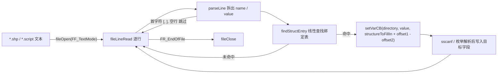
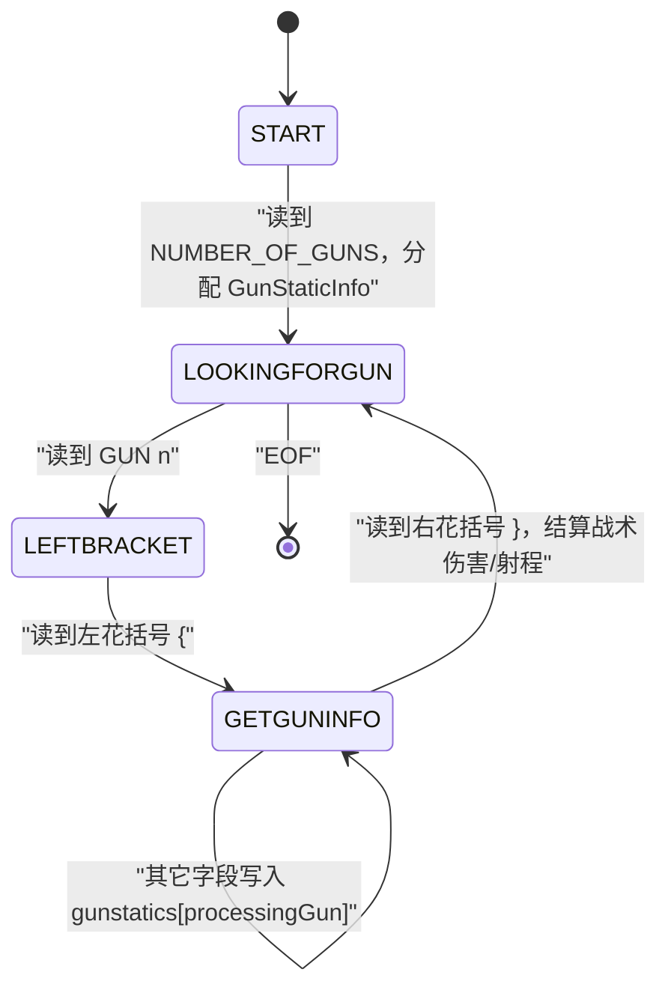

# 数据绑定 statscript 模块 overview

> 模块：`statscript`（Static Scripting Utilities）
> 源码：`src/Game/statscript.c`、`src/Game/statscript.h`
> 路径均相对仓库根目录；「事实」可由源码核验，「推断」是由代码结构推出的解释，「设计观察」总结实现收益与代价。

---

## 1. 模块定位

**一句话职责（事实）**：`statscript` 把文本数据文件（`.shp` 及各类 `.script`）里的「字段名 = 值」行，通过一张「字段名 → 类型化回写回调 → 目标地址/偏移」的绑定表，写入 C 结构体字段，实现「配置即数据」——设计师改文本即可调参，无需改 C。

**在整体架构中的位置（引用总览，事实）**：本模块属于「资源加载 → 静态信息填充」链上的末端一步。`docs/analysis.md` 第 4.4 节将其归类为「数据绑定」，并在第 5.2 节数据流中把它定位为：`.level/.missphere` 布局经 `file.c` 透明读入后，由 `scriptSetStruct`/`scriptSetGunStatics` 把字段写入 `ShipStaticInfo`/`lodinfo`/`GunStaticInfo`，随后静态信息才进入 AI 与渲染管线。它在整体分层中位于「游戏逻辑层」，向下依赖 `file.c`（透明加载）与 `objtypes.c`（枚举解析），向上服务 `universe.c`/`levelload.c`/`LOD.c` 等静态信息生产者。

**职责边界（事实）**：

管什么：

- 定义绑定表的两种条目 `scriptEntry` / `scriptStructEntry` 与回写回调类型 `setVarCback`。
- 提供三种通用驱动：`scriptSetStruct`（写结构体字段）、`scriptSet`（写全局变量）、`scriptSetFileSystem`（仅走文件系统）。
- 提供一批类型化回写回调（数值 / 布尔 / 位 / 字符串 / 角度 / 枚举 / 向量 / RGB）。
- 提供若干针对「变长集合字段」的专用解析器（炮塔、导航灯、停靠点、打捞点、多人预设等），用显式状态机解析块状文本并分配变长内存。
- 提供 `scriptSetTweakableGlobals` 作为全局可调参数的统一装载入口。

不管什么：

- 不拥有目标结构体的生命周期——`ShipStaticInfo` 等由 `universe.c` 的 `ShipStaticInfoR1` / `RaceShipStaticInfos` 持有，`statscript` 只做填充（事实，见 `src/Game/universe.c:199`）。
- 不定义结构体布局，也不做内存分配策略决策（分配由 `spaceobj.h` 的 `sizeofGunStaticInfo` 等宏与 `memAlloc` 完成）。
- 不负责文件系统差异屏蔽（交给 `file.c`），不负责枚举字符串解析（交给 `objtypes.c` 的 `StrTo*` 函数）。
- 不做运行时校验/热更新：绑定表是编译期常量，文本在启动加载期读一次。

---

## 2. 设计与关键数据结构

### 2.1 关键数据结构 / 接口（事实，字段名源自 `src/Game/statscript.h`）

| 名称 | 类型 / 签名 | 字段 / 参数 | 作用与所有权 |
| :-- | :-- | :-- | :-- |
| `setVarCback` | `void (*)(char *directory, char *field, void *dataToFillIn)` | `directory`（目录）、`field`（原始值字符串）、`dataToFillIn`（目标地址） | 回写回调的统一类型；所有 `*CB` 函数都符合此签名（`src/Game/statscript.h:19`） |
| `scriptStructEntry` | `struct` | `name`（字段名）、`setVarCB`（回写回调）、`offset1`、`offset2`（两个 `udword` 地址） | 结构体字段绑定条目；`offset1` 存字段在模板实例中的绝对地址，`offset2` 存模板实例首地址，运行时相减得偏移（`src/Game/statscript.h:21-27`） |
| `scriptEntry` | `struct` | `name`、`setVarCB`、`dataPtr`（目标变量地址） | 全局变量绑定条目；`dataPtr` 直接是变量地址，无需偏移运算（`src/Game/statscript.h:29-34`） |
| `makeEntry` / `endEntry` | 宏 | `makeEntry(var,callback)` = `{ str$(var), callback, &var }`；`endEntry` = `{ NULL, NULL, 0 }` | 构造 `scriptEntry` 表项与哨兵项；`str$` 定义于 `src/Game/types.h:167`（`#define str$(x) #x`） |
| `scriptSetStruct` | `void (char *directory, char *filename, scriptStructEntry info[], ubyte *structureToFillIn)` | 目录、文件名、结构体绑定表、待填充结构体 | 通用结构体绑定驱动（`src/Game/statscript.c:770`） |
| `scriptSet` | `void (char *directory, char *filename, scriptEntry info[])` | 目录、文件名、全局变量绑定表 | 通用全局变量绑定驱动，走 `file.c`（`src/Game/statscript.c:831`） |
| `scriptSetFileSystem` | `void (char *directory, char *filename, scriptEntry info[])` | 同上 | 同 `scriptSet`，但用 `fopen`/`fgets` 直接读文件系统，永不读 `.big`（`src/Game/statscript.c:884`） |
| `globalScriptFileName` | `char[50]` 全局变量 | 当前正在加载的文件名 | 记录回调上下文中的文件名；供 `scriptSetSalvageStatCB` 等「二次打开同一文件」的回调使用（`src/Game/statscript.h:37`） |

**两种条目形态的差别（事实）**：`scriptEntry` 面向散落的全局变量，`dataPtr` 直接持地址；`scriptStructEntry` 面向结构体字段，通过「地址差」而非编译期 `offsetof` 计算偏移。`statscript.h` 内 `offset1` 旁注释明确写着 `// should really be 1 offset, but I can't get rid of this strange compiler error`——即作者本想只存一个偏移量，因编译器问题改用「两地址相减」的运行时求偏移方案（事实，`src/Game/statscript.h:25`）。

### 2.2 键值 → 结构体偏移的机制（事实）

核心算式出现在 `scriptSetStruct` 里（`src/Game/statscript.c:806`）：

```c
foundentry->setVarCB(directory, value,
                      structureToFillIn + (foundentry->offset1 - foundentry->offset2));
```

绑定表在别处用「模板实例」写出，例如 `src/Game/universe.c:497-499`：

```c
{ "mass", scriptSetReal32CB,
  (udword) &(ShipStaticInfoR1[0].staticheader.mass),
  (udword) &(ShipStaticInfoR1[0]) },
```

即 `offset1` = 字段在 `ShipStaticInfoR1[0]` 中的地址，`offset2` = `ShipStaticInfoR1[0]` 首地址，二者相减得到 `mass` 字段在 `ShipStaticInfo` 内的字节偏移；再叠加到实际待填充实例 `structureToFillIn` 上，就得到该实例内 `mass` 的真实地址。炮塔表 `StaticGunInfoScriptTable` 用同样手法，只是模板换成了 `static GunStatic gunStaticTemplate`（`src/Game/statscript.c:80-118`）。

---

## 3. 关键业务逻辑

### 3.1 通用绑定驱动 `scriptSetStruct`（数据流，事实）



**关键步骤解释（事实，`src/Game/statscript.c`）**：

1. 拼接完整路径：`directory != NULL` 时 `strcpy+strcat` 组成 `fullfilename`，否则直接用 `filename`（`scriptSetStruct` 开头）。
2. `fileOpen(fullfilename, FF_TextMode)` 打开文本；循环 `fileLineRead(fh, line, MAX_LINE_CHARS)`（`MAX_LINE_CHARS=650`）直至 `FR_EndOfFile`。
3. `parseLine` 做轻量清洗：跳过 `[`/`]`/空行，去掉 `;` 与 `//` 注释，去尾随空格，把行拆成 `name` 与 `value` 两个以 `\0` 结尾的指针（`src/Game/statscript.c:678-750`）。
4. `findStructEntry` 从表头起 `strcmp` 线性查找同名条目（`src/Game/statscript.c:157-170`）；未命中则静默跳过（不报错，靠调试期 `dbgMessagef` 提示）。
5. 命中后 `strcpy(globalScriptFileName, filename)` 记录上下文，再以 `structureToFillIn + (offset1 - offset2)` 为地址调用 `setVarCB`，回调负责把 `value` 解析后写入该字段。

`scriptSet` 与 `scriptSetFileSystem` 结构相同，区别仅在：`scriptSet` 用 `file.c`（可读 `.big`），`scriptSetFileSystem` 用 `fopen`/`fgets`（只读磁盘），且后者查的是 `scriptEntry.dataPtr` 而非偏移。

### 3.2 专用解析器：炮塔块状文本（状态机，事实）

`scriptSetGunStatics` 是模块内最复杂的专用解析器，用显式状态机解析 `NUMBER_OF_GUNS` + 多个 `GUN n { ... }` 块，分配并填充 `GunStaticInfo`（`src/Game/statscript.c:939-1151`）：



**关键步骤解释（事实）**：

1. `SETGUNSTATE_START` 状态识别 `NUMBER_OF_GUNS`，`scriptSetSdwordCB` 读出数量，`sizeofGunStaticInfo(numGuns)` 计算大小，`memAlloc(..., NonVolatile)` 分配并 `memset` 清零，挂到 `shipstatinfo->gunStaticInfo`，进入 `SETGUNSTATE_LOOKINGFORGUN`。
2. `SETGUNSTATE_LOOKINGFORGUN` 识别 `GUN n`，把 `processingGun` 设为当前炮塔序号，进入 `SETGUNSTATE_LEFTBRACKET`。
3. `SETGUNSTATE_LEFTBRACKET` 等待 `{`，进入 `SETGUNSTATE_GETGUNINFO`。
4. `SETGUNSTATE_GETGUNINFO`：遇到 `}` 表示本炮塔结束，进入结算分支；否则用 `findStructEntry(StaticGunInfoScriptTable, name)` 查字段并写入 `gunstatics[processingGun]`。
5. 结算分支（`}`）：对 `CLASS_Fighter`/`CLASS_Corvette` 按 `tacticsInfo.DamageBonus[Tactics_*][Evasive/Neutral/Aggressive]` 预计算三档 `gunDamageLo/Hi`，其它舰种直接复制 `baseGunDamageLo/Hi`。
6. 全部分析完后（EOF 处）统一后处理：按战术类型 `NUM_TACTICS_TYPES` 遍历，计算 `shipstatinfo->bulletRange[k]`/`minBulletRange[k]`（取各炮 `bulletrange*bonus` 的最大/最小），对 `angletracking`/`declinationtracking`/`bulletlifetime` 为 0 的字段补默认值，最后平方得到 `bulletRangeSquared[k]`。
7. 若根本没分配 `gunstaticinfo`（无炮塔文件）但 `shiptype == ResourceCollector`，则把 `bulletRange` 设为 `ASTEROID_HARVEST_RANGE`（`src/Game/statscript.c:1137-1147`）。

其它专用解析器遵循同构套路（事实，均在 `src/Game/statscript.c`）：`scriptSetNAVLightStatics`（`NUMBER_OF_NAV_LIGHTS` + 每条 `NavLight`）、`scriptSetDockStatics`（`NUMBER_OF_DOCK_POINTS` + 每条 `DockPoint`）、`scriptSetDockOverideStatics`（`NUMBER_OF_DOCK_OVERIDES` + 每条 `DockOveride`）、`scriptSetSalvageStatics`（额外状态 `SET_NUM/SET_BIG/SET_BIG2/SET_BIG3` 顺序读 `NUM_NEEDED_FOR_SALVAGE/NEED_BIGR1/NEED_BIGR2/WILL_FIT_CARRIER`）、`mgGameTypeScriptInit`（解析 `gametypes.script`，状态 `GT_NUMGAMES/GT_FINDGAME/GT_OPENGAME`）；`scriptSetSphereStaticInfo` 被 `#ifdef USE_SPHERE_TABLES` 关闭。

### 3.3 类型化回写回调（事实）

回写回调是「值字符串 → 内存」的最后一步，全部符合 `setVarCback` 签名（`src/Game/statscript.c:205-576`）。按处理方式可分为：

| 类别 | 回调（`src/Game/statscript.h` 声明，`statscript.c` 定义） | 解析方式 |
| :-- | :-- | :-- |
| 数值标量 | `scriptSetReal32CB` / `Real32SqrCB` / `SbyteCB` / `UbyteCB` / `SwordCB` / `UwordCB` / `SdwordCB` / `UdwordCB` | `sscanf(field, "%f"/"%d")`，`Real32SqrCB` 写后平方 |
| 颜色 | `scriptSetRGBCB` / `RGBACB` | `sscanf("%d,%d,%d[,%d]")` → `colRGB`/`colRGBA`（`src/Game/color.h`） |
| 布尔 | `scriptStringToBool` / `SetBool8` / `SetBool` | 首字符 `1..9` 或 `TRUE`/`YES`（大小写不敏感）为真 |
| 位掩码 | `scriptSetBitUdword` / `BitUword` | 识别 `BIT<n>`，`*(T*) |= (1 << n)` |
| 字符串 | `scriptSetStringCB` / `StringPtrCB` | `strcpy` / `memStringDupeNV`（后者堆分配，`src/Game/memory.h`） |
| 角度/三角 | `scriptSetAngCB` / `CosAngCB` / `CosAngSqrCB` / `SinAngCB` / `TanAngCB` | `sscanf("%f")` 后 `DEG_TO_RAD` + `cos/sin/tan` |
| 枚举解析 | `scriptSetGunTypeCB` / `GunSoundTypeCB` / `BulletTypeCB` / `ShipTypeCB` / `ShipRaceCB` / `ShipClassCB` / `FormationCB` / `TacticsCB` / `DockPointCB` / `SalvagePointCB` / `NAVLightCB` | 调用 `objtypes.c` 的 `StrTo*` 函数 |
| 向量 | `scriptSetVectorCB` / `LWToHWMonkeyVectorCB` | `sscanf("%f,%f,%f")` 写 `vector`；后者做 LightWave 坐标系换序并取反 z |
| 索引数组 | `scriptSetShipProbCB` / `ShipGroupSizeCB` / `HyperspaceCostCB` / `SpecialDoorOffsetCB` / `Real32CB_ARRAY` / `CosAngCB_ARRAY` | 先 `StrToShipType`/`StrToTacticsType`/`StrToShipClass` 得到下标，`dataToFillIn += index` 再写 |
| 结构体二次加载 | `scriptSetSalvageStatCB` | 用 `globalScriptFileName` 二次调用 `scriptSetSalvageStatics` 后接 `mexGetSalvageStaticInfo` |

---

## 4. 与其它模块的交互

### 4.1 输入 / 依赖（事实）

| 依赖 | 用到的符号 | 核验 |
| :-- | :-- | :-- |
| 透明文件 IO | `fileOpen` / `fileLineRead` / `fileClose` / `fileExists`，`FF_TextMode`、`FR_EndOfFile` | `src/Game/file.h`、`src/Game/file.c` |
| 基础类型与宏 | `udword`/`real32`/`bool`/`sdword` 等，`str$(x)` 宏 | `src/Game/types.h:167` |
| 枚举字符串解析 | `StrToShipType` / `StrToShipRace` / `StrToShipClass` / `StrToGunType` / `StrToBulletType` / `StrToTacticsType` / `StrToTypeOfFormation` / `StrToDockPointType` / `StrToSalvagePointType` / `StrToNAVLightType` / `StrToGunSoundType` | `src/Game/objtypes.h:321-375`、`src/Game/objtypes.c` |
| 目标结构体与尺寸宏 | `GunStatic`/`GunStaticInfo`/`ShipStaticInfo`/`DockStaticInfo`/`NAVLightStaticInfo`/`SalvageStaticInfo`；`sizeofGunStaticInfo`/`sizeofDockStaticInfo`/`sizeofNavLightStaticInfo`/`sizeofSalvageStaticInfo` | `src/Game/spaceobj.h`（如 `1922-1924`、`264`） |
| 内存分配 | `memAlloc` / `memStringDupeNV`，`NonVolatile` | `src/Game/memory.h` |
| 颜色 | `colRGB` / `colRGBA`、`color` | `src/Game/color.h` |
| 纹理注册 | `trTextureRegister`、`TR_InvalidHandle` | `src/Game/texreg.h` |
| 其它 | `mexGetSalvageStaticInfo`、`TypeOfFormation`/`StrToTypeOfFormation`、`TacticsType`/`NUM_TACTICS_TYPES`/`NUM_CLASSES`、`GameType`/`preSetGames`、`MothershipStatics` | `mex.h`、`formation.h`、`tactics.h`、`multiplayerGame.h`、`mothership.h` |

### 4.2 输出 / 被谁调用（事实）

`statscript` 不向外暴露新数据，输出是对传入结构体的「就地填充」。绑定表与调用点分布在各静态信息生产者处：

| 调用方 | 绑定表 / 调用 | 核验 |
| :-- | :-- | :-- |
| `universe.c` | `ShipStaticScriptTable`（字段→`ShipStaticInfoR1[0]` 偏移）、`AsteroidStaticScriptTable`、`DustCloudStaticScriptTable`、`GasCloudStaticScriptTable`、`NebulaStaticScriptTable`、`DerelictStaticScriptTable`、`MissileStaticScriptTable`、`MineStaticScriptTable`、`HierarchyBindingTable`、`MadMaxMadInfoLoad`；在 `InitStatShipInfo` 等中调 `scriptSetStruct`/`scriptSetGunStatics`/`scriptSetDockStatics`/`scriptSetNAVLightStatics`/`scriptSetDockOverideStatics` | `src/Game/universe.c:495`、`1581`、`2075`、`2179-2238` |
| `levelload.c` | `MissionSphereScriptTable`、`MissionPreloadMissphereTable`、`MissionScriptTable`、`AsteroidDistScriptTable`、`DustCloudDistScriptTable`、`GasCloudDistScriptTable` 等 | `src/Game/levelload.c:221-245`、`1656-1724`、`2216-2395` |
| `LOD.c` | `lodScriptTable`（写 `lodMaxInfo`） | `src/Game/LOD.c:115` |
| `formation.c` | `ParadeInfoScriptTable`（写 `paradeTypeInfos[...]`） | `src/Game/formation.c:3287-3292` |
| 各 AI/子系统 | `AIPlayerTweaks`/`AIResourceManTweaks`/`AIShipTweaks`/`CameraTweaks` 等 `scriptEntry` 表，经 `scriptSetTweakableGlobals` 统一装载 | `src/Game/AIPlayer.c:206`、`AIResourceMan.c:59`、`statscript.c:1839-1876` |

---

## 5. 设计特点与实现代价

### 5.1 设计收益

- **声明式字段表**：`makeEntry` / `makeEntryCB` 把字段名与类型化回调放在一张表里，解析器可以复用同一套查找和派发逻辑。
- **集中处理类型转换**：字符串枚举、向量坐标和颜色等转换落在专用回调中，避免每个资产解析器重复实现。
- **静态绑定、无通用反射层**：C 结构体偏移和回调表在编译期确定，运行时按字段驱动写入。
- **支持变长子结构**：炮塔、停靠点等块状字段有专用解析和分配流程，能填充不同长度的静态信息表。

### 5.2 读代码时要留意

- 绑定表字段名、回调类型和目标结构体布局必须一致；这里的“数据驱动”仍依赖 C 编译期 schema。
- 通过地址差计算偏移和裸指针回写很省抽象层，但出错时类型检查能力有限。
- 未识别字段的处理、`globalScriptFileName` 等状态，以及回调里的资源副作用，都需要追到实现逐项确认。
- 解析和绑定共享文件读取层；可从一个 `.shp` 字段一路追踪到 `scriptSetStruct`、对应回调和目标字段。

### 5.3 推荐阅读顺序

先读 `statscript.h` 中的 entry 结构与 `makeEntry` 宏，再看 `scriptSetStruct` 怎样按字段查表，接着挑一个类型回调追踪它如何写入结构体。最后看炮塔或导航灯这类变长块，比较通用字段绑定与专用解析器的职责边界。

---

## 6. 事实 / 推断边界

**事实（可在仓库核验）**：

- 全部函数名、结构体名、字段名、宏名、表名均来自 `src/Game/statscript.c`、`src/Game/statscript.h` 及其被引用文件，例如 `scriptEntry`/`scriptStructEntry`/`setVarCback`、`makeEntry`/`endEntry`、`scriptSetStruct`/`scriptSet`/`scriptSetFileSystem`、`scriptSetGunStatics`、`findStructEntry`、`parseLine`、`globalScriptFileName`、`StaticGunInfoScriptTable`/`gunStaticTemplate`、`ShipStaticInfoR1`/`ShipStaticScriptTable`。
- `offset1 - offset2` 的偏移计算方式、`statscript.h` 中「should really be 1 offset, but I can't get rid of this strange compiler error」注释、`makeEntry` 展开、`str$` 宏（`src/Game/types.h:167`）均为源码明示。
- `scriptSetGunStatics` 的四个状态（`SETGUNSTATE_*`）、炮塔结算的 `DamageBonus` 分支、`ASTEROID_HARVEST_RANGE` 兜底，均在 `src/Game/statscript.c` 内可核验。
- 绑定表与调用点的分布（`universe.c`/`levelload.c`/`LOD.c`/`formation.c`/`AIPlayer.c`/`AIResourceMan.c`）均已用 `grep` 核验到具体行号。

**推断（合理但无显式文档）**：

- 「未命中字段静默跳过、`?` 替换为 `0`」属调试期容错手段而非正式错误处理策略——源码只有注释掉的 `dbgMessagef` 提示，无正式失败路径（`RemoveCommasFromString`，`src/Game/statscript.c:614-631`）。
- 回调表按「字段名 + 类型化写入器」组织，意在让绑定表成为编译期常量、零运行时反射开销——由宏与数组初始化方式合理推出，无文档直述。

**设计观察边界**：

- 第 5 节是基于当前实现的设计观察，不代表源码作者的原始设计意图。
- 本分析只阅读源码与 `docs/analysis.md`，不搬运、不解析、不修改 `exe/`、`tools/bin/`、`EB Levels/`、`sound/` 下的二进制大文件。
