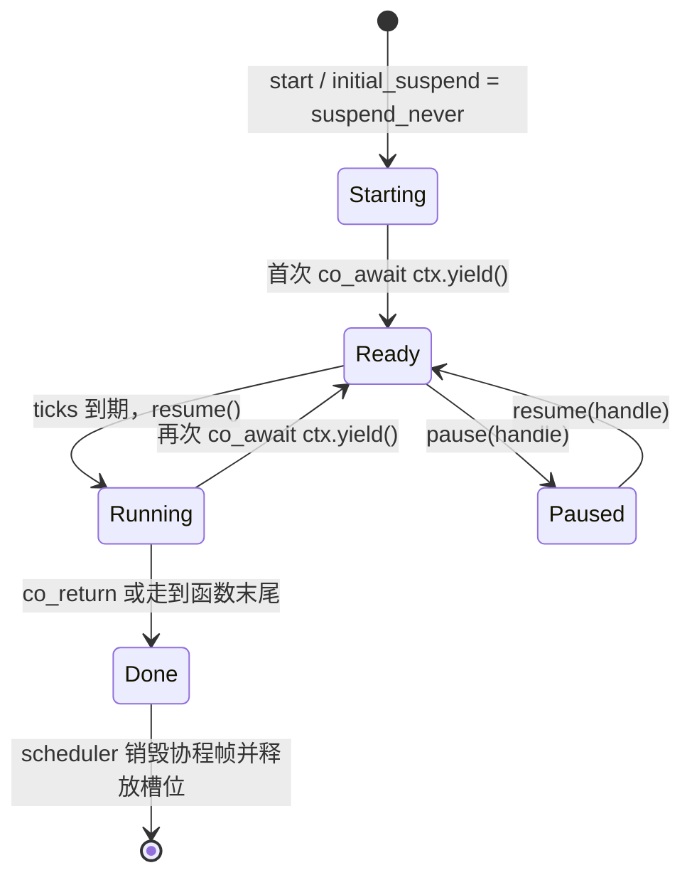

# 用 C++20 协程表达 Homeworld task

本文给出一个保留现有调度语义的 C++20 原型，代码在 [`task_coroutine_prototype.cpp`](task_coroutine_prototype.cpp)。它是可审阅的独立设计样例，没有接入旧版 C 构建。

先看核心映射：**协程 handle 和编译器生成的协程帧替代手工保存的 EIP/ESP/寄存器及栈副本；一个控制块仍保存调度器需要的数据。** 调度频率、暂停标志、最多补跑 8 次等仍由调度器负责。

## 1. 旧 taskdata 的职责怎样拆

`src/Game/task.h` 中的 `taskdata` 同时放了调度信息和 x86 执行现场。协程版本应把两类状态分开：

| 旧字段 / 概念 | C++20 原型中的对应 | 说明 |
| --- | --- | --- |
| `flags`：分配、暂停、逐帧 | `TaskControlBlock` 的布尔状态 | 调度器仍需要这些状态；暂停不销毁协程帧。 |
| `function` | `TaskEntry` 协程工厂 | 函数返回 `TaskRoutine`，函数体包含 `co_await`。 |
| `ticks` | `tickRemainder` | 记录还没凑满一次运行间隔的 ticks。 |
| `ticksPerCall` | `ticksPerCall` | 周期秒数乘基础频率后得到的 ticks。 |
| `ebx`、`ecx`、`edi`、`esi`、`esp`、`ebp`、`eip` | `std::coroutine_handle` 指向的协程状态 | 编译器管理恢复点和跨暂停点存活的变量。用户代码不再写寄存器快照。 |
| `nBytesStack` 和附加栈副本 | 没有直接对应字段 | C++20 协程是有状态帧的无栈协程，不复制任务的普通调用栈。 |
| `taskhandle` 槽位索引 | `TaskControlBlock` 槽位编号 | 原型仍用 32 个槽位；正式实现可加 generation，避免旧句柄误指向复用槽位。 |

业务局部变量属于协程帧，而不是 `TaskControlBlock`。例如 `exampleTask()` 的 `i` 在 `co_await ctx.yield()` 之间仍然有效。编译器把需要跨暂停点保留的值安排到协程状态中；这里没有 Fiber 式的独立本机栈。

## 2. yield、pause 和 resume

旧 task 只能在 `taskYield()` 处交回主线程。新写法把这个边界变成显式 await：

```cpp
TaskRoutine universeTask(TaskContext& ctx) {
    co_await ctx.yield(); // 对齐旧 taskStart() 同步执行到首次 yield

    for (;;) {
        updateOneUniverseStep();
        co_await ctx.yield();
    }
}
```

调度侧仍按旧的 task API 思路驱动，只是保存协程 handle 的控制块由 `Scheduler` 管理：

```cpp
Scheduler scheduler;
int handle = scheduler.start(universeTask, /*periodTicks=*/3);

// 每次主循环把经过的基础 tick 数交给调度器。
scheduler.dispatch(/*elapsedTicks=*/3); // universeTask 恢复一次，运行到下一个 yield
```

原型把 `TaskRoutine::promise_type::initial_suspend()` 设为 `std::suspend_never`，因此 `start()` 调用入口后会立即运行到第一个 `co_await ctx.yield()`，再把 handle 收进槽位。这保留了 `taskStart()` 首次同步进入任务的特征；业务代码要在首次 yield 前保持短小。

暂停和恢复只改控制块的 `paused` 状态：

- `pause(handle)` 让后续调度跳过此槽位，协程帧和 handle 保留。
- `resume(handle)` 清除暂停位，任务从上一次 yield 后继续。
- task body 也可以通过 `ctx.pause(handle)` / `ctx.resume(handle)` 控制其他任务。当前任务正在执行时，暂停标志不会抢占它；如果它本轮已有多个补跑调用，原版调度器会跑完本轮剩余调用，下一次 dispatch 才跳过它。原型保留这个顺序。
- `freezeAll()` 先记录各任务原有暂停状态，再全部暂停；`resumeAll()` 恢复原状态，和旧 `TF_PauseSave` 逻辑对应。
- 暂停期间调度器在计算 ticks 前跳过任务，因此不积累暂停期间的运行次数。恢复后继续保留暂停前的余数；若游戏希望暂停时钟，仍需在调用侧清理或调整 elapsed ticks。

## 3. 对齐 `taskNumberCalls`

旧的 `taskExecuteAllPending()` 对定频任务按以下方式计算补跑次数：

```text
total = 本次 ticks + 上轮余数
calls = total / ticksPerCall
新余数 = total % ticksPerCall
calls = min(calls, TSK_MaxTicks)  // 当前值为 8
```

逐帧任务每次调度设 `calls = 1`。原型沿用这套计算。注意余数在限幅前计算，因此当积压超过 8 次时，超出上限的整次调用会被丢弃，只留下小于 `ticksPerCall` 的余数；这避免下一轮继续补跑整段过期工作。

对 `calls` 中的每一项调用一次 `routine.resume()`：它从上次 `co_await ctx.yield()` 后执行到下一个同类 yield，或运行到协程结束。这对应旧实现中每一轮 `taskNumberCalls` 的恢复、任务执行和 yield。

因此，`co_await ctx.yield()` 的位置定义了一个“任务调用边界”。要维持旧逻辑，每一个旧 `taskYield()` 都应迁成一个 await 点；不要把多个旧 yield 合并成一个，否则一次 `resume()` 会执行更多业务。

原型要求任务只在 `ctx.yield()` 处暂停。若以后加入 timer、I/O 等 awaitable，应扩展状态机，区分 `Ready`、`Running`、`Waiting`、`Paused`、`Done`；外部事件完成后把等待中的 handle 放回可运行队列。

## 4. task 生命周期映射



| 旧 API | 协程版本中的动作 |
| --- | --- |
| `taskStart(fn, period, flags)` | 分配 `TaskControlBlock`，计算 `ticksPerCall`，调用 `TaskEntry`，保存返回的 `TaskRoutine`。 |
| `taskYield(0)` | `co_await ctx.yield()`；协程挂起并交回调度器。 |
| `taskExit()` | `co_return;`；调度器观察到 `done()` 后销毁帧并释放槽位。 |
| `taskPause(handle)` | 设置控制块的暂停位，不销毁协程。 |
| `taskResume(handle)` | 清除暂停位。 |
| `taskFreezeAll()` / `taskResumeAll()` | 保存并恢复原暂停状态。 |
| `taskStop(handle)` | 对已挂起任务调用 `coroutine_handle::destroy()`，再释放控制块。不能在协程正在执行时销毁它。 |

## 5. 迁移边界和代价

这不是把现有 C `taskfunction` 指针直接换成 `co_await` 就能完成的 ABI 替换。旧函数必须改成返回 `TaskRoutine` 的 C++ 协程；C 模块可以先通过 `extern "C"` 适配 API 创建、暂停和恢复 C++ 任务，再逐步迁移任务体。普通 C 函数不会因为被协程调用就自动保留其调用栈。

所有可能暂停的调用链都需要协程化。例如 `taskA()` `co_await`s `taskB()`，而 `taskB()` 又要暂停，那么 `taskB()` 也得返回 awaitable/coroutine 结果并由上层 await。C++20 协程在暂停点保存协程状态帧，不会像 Fiber 一样冻结任意深度的普通同步调用栈。

协程帧通常需要分配和销毁；生产实现应测量分配成本，并考虑 promise 自定义分配器或帧池。还要规定异常、取消、资源释放和句柄所有权。C++ 协程仍是协作式：任务若长时间不执行 `co_await`，调度器无法抢占它。

旧实现事实可从 [`task.h`](../../src/Game/task.h) 的 `taskdata` / 标志位，以及 [`task.c`](../../src/Game/task.c) 的 `taskStart()`、`taskExecuteAllPending()`、pause/freeze API 核对。C++20 的 promise、await 和句柄规则见 [WG21 C++20 草案 N4860](https://isocpp.org/files/papers/N4860.pdf)。
