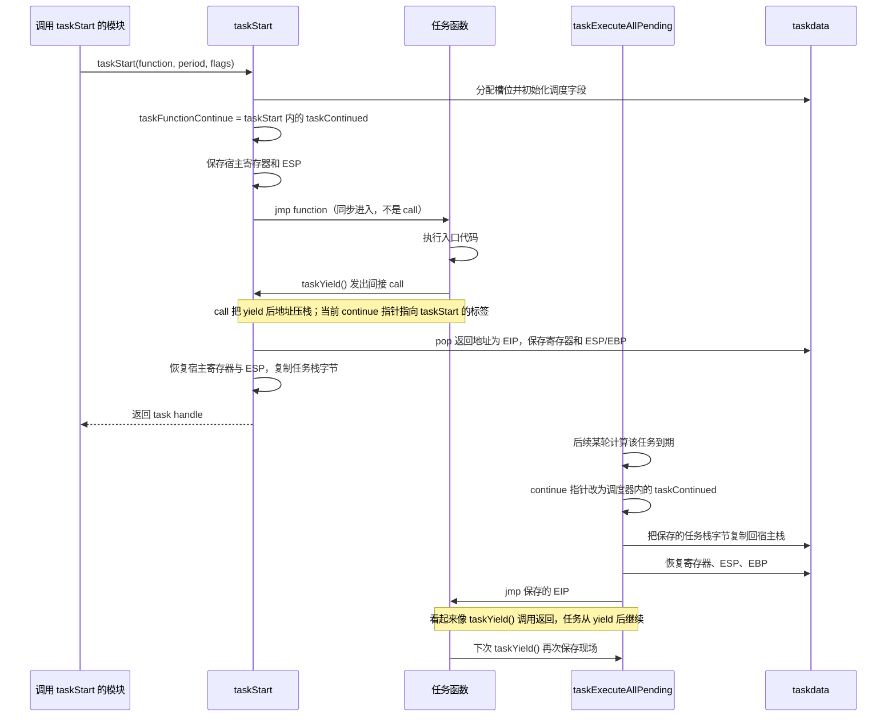

# `taskStart()` 与 `taskYield()`：一次上下文切换的完整旅程

本文只解释 `src/Game/task.c` / `src/Game/task.h` 中任务首次启动、首次 yield、后续恢复的控制流。实现依赖 32 位 x86 汇编；这里的地址和栈内容是示意，不代表固定数值。

## 先回答：`taskYield(N)` 的 N 去哪里了？

`task.h` 中的定义是：

```c
#define taskYield(n) ((void (*)(void))taskFunctionContinue)()
```

形参 `n` 没有出现在替换文本里。因此 `taskYield(0)`、`taskYield(123)` 都会展开成同一段代码：调用 `taskFunctionContinue` 指向的函数地址。宏展开时参数表达式也不会被求值；例如 `taskYield(nextValue())` 不会调用 `nextValue()`。

仓库里的任务调用都传 `0`。当前实现中 N 没有运行时语义；它很可能是旧接口遗留或兼容形式，但仅凭当前代码无法确认当初保留它的原因。不要把它理解为“保存 N 个寄存器/栈字”或“等待 N 个 tick”。

## 必要的 x86 背景

调度器利用了普通 32 位 x86 函数调用规则：

| 指令/寄存器 | 本文需要的含义 |
| --- | --- |
| `call target` | 把 call 后一条指令的地址压入栈，再跳到 `target` |
| `ret` | 从栈顶取出地址并跳过去 |
| `jmp target` | 直接跳转，不压入返回地址 |
| `ESP` | 当前栈顶指针；`push` 会减小 ESP，`pop` 会增大 ESP |
| `EBP` | 常用于定位当前函数的栈帧 |
| `EIP` | CPU 下一步要执行的位置；这里把它保存在 `taskdata.eip` |

栈向低地址增长。简化表示如下：

```text
较高地址
  taskStart 的调用者返回地址及 taskStart 栈帧
  taskStart 进入任务入口后，任务函数压入的栈帧内容
  taskYield 的 call 压入的“yield 后续执行地址”  <- ESP（进入 trampoline 时）
较低地址
```

任务并没有单独一块完整栈。它运行时使用当前线程的栈；yield 后调度器把任务需要保留的栈字节复制到 `taskdata` 末尾，以免其他任务复用这片宿主栈时覆盖它。

## 栈状态逐步跟踪

栈向低地址增长。下面用一个状态图把栈内容和关键寄存器放在同一视图中：`S0` 是首次跳入任务前的 ESP，`S1` 是 yield 的 `call` 前 ESP，`A` 是该 `call` 压入的续接地址。每个状态旁的 note 是该时刻的快照。

```mermaid
stateDiagram-v2
    direction TB
    [*] --> HostReady

    state "taskStart 即将 jmp function" as HostReady
    note right of HostReady
        CPU: ESP = S0; ESI EDI EBP EBX 已暂存
        Stack: S0 以上是 taskStart 和调用者的栈帧
        taskdata: EIP / ESP 尚未保存任务现场
    end note

    state "任务运行到首次 taskYield" as TaskAtYield
    note right of TaskAtYield
        CPU: ESP = S1; 当前寄存器属于任务
        Stack: [S1, S0) 是任务使用的栈帧和局部数据
        taskdata: 初始上下文仍未捕获
    end note

    state "call 已压入续接地址 A" as ReturnAddressPushed
    note right of ReturnAddressPushed
        CPU: ESP = S1 - 4
        Stack: [S1 - 4] = A; 高地址处仍是任务栈内容
        EIP: 已跳到 taskFunctionContinue 指向的 trampoline
    end note

    state "trampoline 已 pop eax" as ReturnAddressPopped
    note right of ReturnAddressPopped
        CPU: ESP = S1; EAX = A
        Stack: 临时返回地址已从栈移除
        taskdata: trampoline 正在写入任务上下文
    end note

    state "任务现场已保存" as TaskSaved
    note right of TaskSaved
        taskdata: EIP = A; ESP = S1; 保存 EBX ECX EDI ESI EBP
        Stack copy: [S1, S0) 已复制到 taskdata 扩展区
        CPU: 宿主 ESP 和宿主寄存器恢复
    end note

    state "taskStart 返回，任务暂停" as Suspended
    note right of Suspended
        CPU: 正常运行创建 task 的代码
        taskdata: 保有 EIP A、ESP S1、寄存器和栈副本
    end note

    state "调度器恢复任务" as Restored
    note right of Restored
        先把栈副本写回 [S1, S0)
        CPU: 恢复 EBX ECX EDI ESI ESP=S1 EBP
        EIP: 取出 A，准备 jmp
    end note

    state "从 yield 后继续" as Continued
    note right of Continued
        CPU: EIP = A; ESP = S1
        Stack: 与 yield 的 call 前一致，没有残留 A
        语义: 像 taskYield() 已返回，继续执行下一条指令
    end note

    HostReady --> TaskAtYield: jmp function，不压返回地址
    TaskAtYield --> ReturnAddressPushed: call continue，push A
    ReturnAddressPushed --> ReturnAddressPopped: trampoline pop eax
    ReturnAddressPopped --> TaskSaved: 写寄存器/EIP/ESP，复制栈
    TaskSaved --> Suspended: 恢复宿主现场，taskStart 返回
    Suspended --> Restored: 到期后先恢复栈和寄存器
    Restored --> Continued: jmp A
    Continued --> ReturnAddressPushed: 下次 yield，push 新地址 A2
```



首次初始化中，`taskStart()` 用 `taskESPSaveInitial - taskData[handle]->esp` 得到 `S0 - S1`，然后将 `[S1, S0)` 复制到 taskdata 扩展区。运行期恢复时按同一个起点和字节数复制回去。`A` 不包含在这段任务栈副本里：它已由 `pop` 取出，再单独保存为 `eip`。
图里的栈副本范围 `[S1, S0)` 来自 `taskStart()` 中的 `taskESPSaveInitial - taskData[handle]->esp`；`A` 不在副本中，因为它由 `pop` 取出后单独保存在 `eip`。恢复时必须先复制回栈内容，再装回任务 ESP，最后跳到 EIP。

注意，任务入口是 `jmp function` 而不是 `call function`，因此没有普通的入口返回地址。任务不能通过普通 `return` 回到创建者；它应 yield，或用 `taskExit()` 跳到调度器设置好的退出 trampoline。

## 全貌：首次启动与之后的恢复



首次 yield 的接收点在 `taskStart()` 内；后续 yield 的接收点在 `taskExecuteAllPending()` 内。两处都叫 `taskContinued`，但它们是各自函数作用域里的 **C 标签**，地址不同。`OFFSET taskContinued` 取的是这个 C 标签在机器码中的地址；它不是一个独立的汇编函数。

## 第一阶段：`taskStart()` 建立一个可恢复的任务

### 1. 建立 taskdata

`taskStart()` 分配 `taskdata`，从 `taskData[]` 找一个空槽，并设置：

- `flags`：包含 `TF_Allocated` 和传入标志。
- `function`：任务入口。
- `ticks`：初始为 0。
- `ticksPerCall`：`period * taskFrequency` 转为基础 tick 数。

此时任务已经占有槽位，但它的寄存器上下文和可恢复的续接点还没有初始化完成。

### 2. 把 continue 指针临时指向启动 trampoline

源码先保存旧的 `taskFunctionContinue`，再把它设成 `taskStart()` 里的 `taskContinued` 标签地址：

```asm
mov eax, OFFSET taskContinued
mov [taskFunctionContinue], eax
```

为什么要临时改？因为接下来任务入口会立即运行，而入口通常第一件事就是 `taskYield(0)`。这次 yield 必须回到 `taskStart()`，让它捕获任务的初始现场。若仍指向正常运行期的调度器标签，初始化阶段就会跳进错误的控制路径。

### 3. 保存“创建者”的现场，再 `jmp` 到任务入口

启动代码保存 `ESI`、`EDI`、`ESP`、`EBP`、`EBX`，随后：

```asm
mov eax, function
jmp eax
```

这里是 `jmp`，不是 `call`。它直接把执行流交给任务函数，不额外压一个函数入口返回地址。此时 CPU 使用的仍是 `taskStart()` 所在的宿主栈；任务函数的序言会在此栈上建立自己的栈帧。

保存宿主现场是为了首次 yield 后能回到 `taskStart()` 的 C 代码继续完成初始化。如果 ESP 没保存/恢复，后续 C 代码会在任务函数留下的栈帧位置继续运行，局部变量、返回地址和调用栈都会错位。

### 4. 入口必须 yield 或通过受支持的退出路径离开

典型任务入口开头是：

```c
void myTask(void)
{
    taskYield(0);
    for (;;)
    {
        doWork();
        taskYield(0);
    }
}
```

`jmp function` 没有为任务函数额外建立普通 C 调用的返回地址。因此任务函数不能把普通 `return` 当作正常结束方式：它可能用栈上并非为该函数准备的值作为返回地址。长期任务应 yield；任务结束使用 `taskExit()`，它跳到调度器明确设置的退出路径。

首次 yield 之前的代码是在 `taskStart()` 调用期间同步执行的，不是等下一帧才运行。通常把入口第一条有效操作写为 yield，避免注册任务时就执行一大段业务逻辑。

## 第二阶段：yield 为什么能回到正确标签

`taskYield(0)` 展开后相当于：

```c
((void (*)(void))taskFunctionContinue)();
```

编译器为这个间接函数调用生成 `call`。首次启动时 `taskFunctionContinue` 指向 `taskStart()` 内的 trampoline；运行期则指向 `taskExecuteAllPending()` 内的 trampoline。

概念上的机器动作：

```asm
call dword ptr [taskFunctionContinue]
; CPU 先把下一条指令地址压到当前任务栈，再跳到 continue 指针
```

假设 yield 后一条指令地址是 `A`：

```text
call 前： ESP -> 任务当前栈顶
call 后： ESP - 4 -> A       ; 32 位地址占 4 字节
          CPU 跳到 trampoline
```

trampoline 的第一段用 `pop eax` 取回 `A`：

```asm
pop eax                      ; eax = A，ESP 恢复到 call 前的值
mov [taskdata + eip], eax    ; 记住下次要继续的位置
```

这里没有用 `ret`，因为此时不是要立刻回任务继续执行，而是要暂停任务并回到调度器。`ret` 会马上跳到 `A`，任务不会让出控制权。

`pop` 也不能漏：若把含有 `A` 的栈顶原样保存，恢复任务后却直接跳到 `A`，栈顶会残留这次 yield 的返回地址。任务每 yield 一次就多留一个地址，ESP 与函数调用栈逐渐失配，最终会破坏局部变量或普通函数的返回流程。

## 第三阶段：trampoline 保存什么

首次启动的 `taskContinued` 和运行期的同名标签都会保存关键状态。初始化版本从当前任务槽取 `taskdata`，运行期版本从 `taskCurrentTask` 找槽。核心操作可概括为：

```asm
pop eax                         ; 弹出 yield 后续地址
mov [taskdata + TOF_Context+24], eax ; eip
mov [taskdata + TOF_Context+ 0], ebx
mov [taskdata + TOF_Context+ 4], ecx
mov [taskdata + TOF_Context+ 8], edi
mov [taskdata + TOF_Context+12], esi
mov [taskdata + TOF_Context+16], esp
mov [taskdata + TOF_Context+20], ebp
```

`TOF_Context` 是 16；`taskdata` 前 16 字节放调度字段，后面按固定偏移保存这组 x86 状态。这里保存 `EIP` 是为了知道从哪条指令继续；保存 `ESP`/`EBP` 是为了恢复栈和当前栈帧；保存通用寄存器是为了让跨 yield 的计算状态仍然有效。

并非所有 CPU 状态都被保存。`EAX`、`ECX`、`EDX` 在 32 位 x86 常见 C 调用约定中属于 caller-saved（调用者不能假设跨函数调用保持原值）；yield 宏表现为一次函数调用，所以编译器会在需要时先把这些值保存在别处。实现仍额外保存了 `ECX`。这里没有保存浮点/SIMD 状态或 EFLAGS；这套实现依赖当时的 32 位 x86 编译器约定和游戏代码的使用方式，不能直接视作通用 ABI 级上下文切换器。

## 第四阶段：首次 yield 如何回到 `taskStart()`

首次 `taskContinued` 保存任务寄存器后，第二段汇编将之前保存的宿主 `ESI`、`EDI`、`ESP`、`EBP`、`EBX` 还原。特别是 `ESP`：它让 C 代码回到 `taskStart()` 执行 `jmp function` 之前的栈位置。

接着 `taskStart()` 计算：

```c
taskESPDiff = taskESPSaveInitial - taskData[handle]->esp;
```

因为栈向低地址增长，任务使用栈后 `ESP` 通常更小，所以差值表示任务占用的栈区间大小。它把从任务保存的 `ESP` 开始的字节复制到 `taskdata` 紧随结构体的扩展区域，并记下 `nBytesStack`。

**不保存这段栈会怎样？** `taskStart()` 返回后宿主栈会继续被其他 C 函数和任务使用；局部变量、函数帧链和待返回地址可能被覆盖。之后即使把旧 `ESP` 和 `EIP` 装回 CPU，指针指向的数据也已变成别的内容，任务无法正确续跑。

最后恢复原来的 `taskFunctionContinue` 指针，`taskStart()` 正常返回 handle。到此才算完成“创建并捕获初始暂停点”。

## 后续恢复：为什么像 yield 调用正常返回

每次 `taskExecuteAllPending()` 开始运行任务前，会把全局 continue 指针设置到调度器内部的 `taskContinued` 标签。轮到某任务时，大致执行：

1. 将之前保存在 `taskdata` 扩展区的任务栈字节复制回当初的栈地址。
2. 从 `taskdata` 恢复 `EBX`、`ECX`、`EDI`、`ESI`、`ESP`、`EBP`。
3. 取出保存的 `EIP` 并 `jmp EIP`。

保存的 EIP 正是上次 `call taskFunctionContinue` 后面的地址，所以 CPU 会从 yield 的下一条指令继续。它不是重新调用任务入口，也不是执行一个 `ret`；“像调用返回”是控制流效果，实际由保存的 EIP、ESP 和寄存器恢复共同实现。


## 哪些“不这样做”会出问题

| 必须保留的动作 | 省略或改错的后果 |
| --- | --- |
| 首次启动时把 continue 指针设为 `taskStart` 内标签 | 第一次 yield 会跳到错误阶段或无效地址，初始上下文建不起来 |
| 跳入入口前保存并在首次 yield 后恢复宿主 ESP/寄存器 | `taskStart()` 的 C 栈帧被任务执行污染，无法安全继续初始化并返回 |
| yield 的 `call` 返回地址保存为任务 EIP | 不知道任务下次从哪里继续，可能重启、跳错或崩溃 |
| `pop` 移除 yield call 压入的地址 | 保存的 ESP 多一个栈项，重复恢复时栈逐次失衡 |
| 保存并恢复 ESP/EBP 和任务栈字节 | 局部变量、栈帧、普通函数返回地址不再对应原任务现场 |
| 恢复时 `jmp` 保存的 EIP | 若从入口重新执行，会重复已完成代码；若用错误的 `ret`，会从不匹配的栈顶取地址 |

## 源码阅读锚点

- `src/Game/task.h`：`taskYield(n)` 宏和 `taskdata` 字段。
- `src/Game/task.c` 的 `taskStart()`：临时 continue 地址、保存创建者现场、`jmp function`、首次 `taskContinued`、栈字节复制。
- `src/Game/task.c` 的 `taskExecuteAllPending()`：运行期 continue 地址、恢复任务栈、恢复寄存器和 `jmp eip`。
- `src/Game/region.c` 的 `regProcessTask()`：真实任务的首次 yield 与循环 yield 示例。
