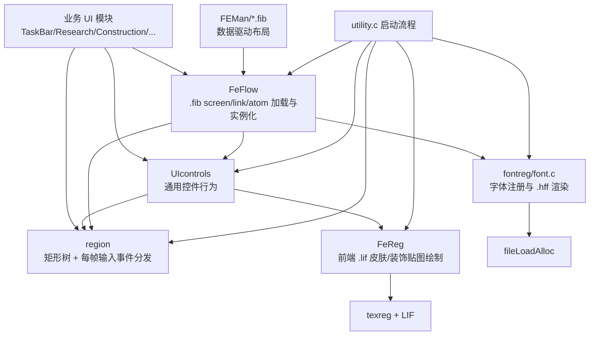
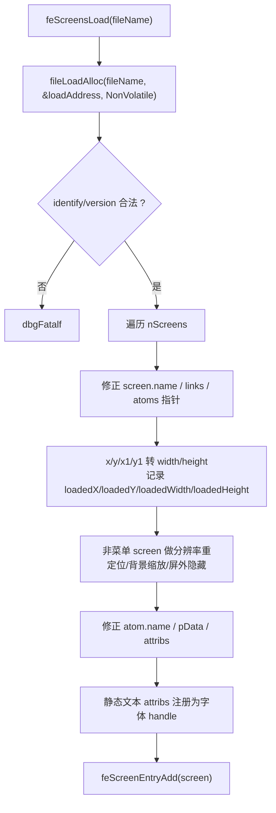

# UI 系统（region + FeFlow + UIcontrols + FeReg）模块 overview

> 模块：Homeworld 1 UI / Front End 系统 
> 源码：`src/Game/region.c`、`src/Game/region.h`、`src/Game/FeFlow.c`、`src/Game/FeFlow.h`、`src/Game/UIcontrols.c`、`src/Game/UIcontrols.h`、`src/Game/FeReg.c`、`src/Game/FeReg.h`、`src/Game/fontreg.c`、`src/Win32/font.c`，以及接入点 `src/Win32/utility.c`、`src/Win32/mainrgn.c` 
> 路径均相对仓库根目录。结论标注「事实 / 推断 / 设计观察」，分别表示源码证据、结构性解释和收益或代价分析。

---

## 1. 模块定位

**一句话职责（事实）**：Homeworld 1 的 UI 系统以 `region` 矩形树作为统一输入/绘制调度层，用 `FeFlow` 从 FEMan 生成的 `.fib` 布局文件实例化屏幕，再用 `UIcontrols` 把通用控件行为叠到 region 上，最后由 `FeReg`/`fontreg`/`font.c` 提供前端贴图和字体渲染。

**在整体架构中的位置（事实）**：`docs/analysis.md` 将 `src/Game/` 归为核心游戏逻辑并包含 UI；实际接线位于 Win32 层启动流程中：`utility.c` 先 `frStartup()`，再 `regStartup()`，创建主游戏 region，启动 `uicStartup()`、`feStartup()`、`ferStartup()`，加载前端 `.fib`，最后 `feScreenStart(ghMainRegion, "Main_game_screen")` 进入主菜单/主界面（`src/Win32/utility.c:3807-3809`、`4123-4127`、`4207-4209`、`4246-4260`、`4370`、`4383`）。

**职责边界（事实）**：

管什么：

- 维护一棵 region 树：矩形范围、父子兄弟链接、输入过滤位、状态位、绘制回调、处理回调、tabstop、cutout、FE atom 反向指针。
- 每帧轮询鼠标/键盘，把低层输入转换为 `RPE_*` 事件并分发给 region 的 `processFunction`。
- 把 `.fib` 的 screen/link/atom 数据转成运行时 region/control，维护 screen stack、popup、modal、menu、link-to-screen 和 name-to-callback 绑定。
- 提供基础控件：按钮、toggle、checkbox、radio、scrollbar、slider、text entry、list window、drag button、bitmap button。
- 绘制通用前端控件皮肤：按钮三段贴图、文本框、列表框、滚动条、装饰图、bitmap button、窗口边框/切角。
- 管理前端字体注册、语言目录选择、`.hff` 字体加载和 GL 字体页创建。

不管什么：

- 不负责具体业务面板的数据模型。研究、建造、发射、交易、传感器、多人游戏、颜色选择、聊天等模块各自注册 `fecallback`/`fedrawcallback` 并填充列表/绘制 user region。
- 不负责 3D 世界渲染。主游戏窗口由 `ghMainRegion` 的 `mrRegionDraw`/`mrRegionProcess` 承接，UI 面板只是挂在它之上的子 region。
- 不提供现代意义上的布局求解器。`.fib` atom 记录的是绝对坐标/尺寸，加载时只做分辨率重定位、背景缩放和屏幕外隐藏等修正。
- 不做资源包透明加载本身；贴图和字体最终仍通过 `trLIFFileLoad`、`fileLoadAlloc` 等资源/文件模块取字节。

---

## 2. 分层设计

### 2.1 总体分层（事实 + 推断）

**核心设计点（事实）**：

1. `region` 是最低层 UI 原语。`region.h` 明确说明其用途是处理所有 region-based UI 元素，包括 buttons 和 menus（`src/Game/region.h:1-4`）。
2. `FeFlow` 的用途是加载/处理 FEMan screens，`.fib` 文件头用 `"Bananna"` 标识和 `0x00000212` 版本号（`src/Game/FeFlow.h:1-4`、`40-41`）。
3. `.fib` 的 atom 类型覆盖静态文本、按钮、复选框、toggle、滚动条、文本输入、菜单项、radio、装饰区、列表窗口、bitmap button、slider、drag button 等（`src/Game/FeFlow.h:85-110`）。
4. `UIcontrols` 的结构体都以内嵌 `region reg` 开头，通过 `uicStructureExtra(type) = sizeof(type) - sizeof(region)` 在 `regChildAlloc` 后追加控件私有字段（`src/Game/UIcontrols.h:135-146`、`162-184`、`204-263`、`286`；`src/Game/UIcontrols.c:4331-4333`）。
5. `FeReg` 只关心前端贴图与控件皮肤，贴图路径统一落在 `FeMan\\Textures\\` 下（`src/Game/FeReg.h:21-23`）。

**推断**：这是典型 1990s 游戏 UI 架构：工具编辑布局，运行时读二进制布局并创建绝对坐标控件；控件不拥有复杂对象树语义，主要靠 C 回调和全局状态完成业务绑定。

### 2.2 关键数据结构（事实）

| 名称 | 位置 | 关键字段 | 作用 |
| :-- | :-- | :-- | :-- |
| `region` | `region.h` | `rect`、`drawFunction`、`processFunction`、`parent/child/previous/next`、`flags`、`status`、`key[]`、`userID`、`tabstop`、`cutouts`、`drawstyle[]`、`atom` | UI 的基础节点：矩形、输入过滤、运行状态、绘制/处理回调、树链接（`src/Game/region.h:164-185`） |
| `regrenderevent` | `region.h` | `function`、`reg` | 延迟绘制队列项；region 处理阶段只入队，渲染阶段统一倒序执行（`src/Game/region.h:191-197`） |
| `fibfileheader` | `FeFlow.h` | `identify[8]`、`version`、`nScreens` | `.fib` 文件头（`src/Game/FeFlow.h:146-153`） |
| `fescreen` | `FeFlow.h` | `name`、`flags`、`nLinks`、`nAtoms`、`links`、`atoms` | 一个可启动的屏幕定义（`src/Game/FeFlow.h:155-165`） |
| `felink` | `FeFlow.h` | `name`、`flags`、`linkToName` | button/link 名称到目标 screen 名称的跳转（`src/Game/FeFlow.h:167-174`） |
| `featom` | `FeFlow.h` | `name`、`flags`、`status`、`type`、`tabstop`、`borderColor/contentColor`、`x/y/width/height`、`pData`、`attribs`、`hotKey[]`、`drawstyle[]`、`region` | `.fib` 内最小 UI 元素；运行时会反向保存 region/control 指针（`src/Game/FeFlow.h:184-215`） |
| `fecallback` / `fedrawcallback` | `FeFlow.h` | `function`、`name` | 业务层以字符串名注册处理/绘制回调（`src/Game/FeFlow.h:217-237`） |
| `festackentry` | `FeFlow.h` | `screen`、`baseRegion`、`parentRegion` | 当前 screen stack 条目，支持 popup/back/delete（`src/Game/FeFlow.h:239-245`） |
| `uicbutton` | `UIcontrols.h` | `region reg`、`processFunction`、`contentColor`、`borderColor`、`screen`、`clickX/Y` | button/toggle/checkbox/radio/bitmap/drag 的共享运行体（`src/Game/UIcontrols.h:135-147`） |
| `uictextentry` | `UIcontrols.h` | `textBuffer`、`bufferLength`、`iCharacter`、`iVisible`、`currentFont`、`textRect`、`message`、`textflags` | 文本输入框状态（`src/Game/UIcontrols.h:204-224`） |
| `uiclistwindow` | `UIcontrols.h` | `listofitems`、`itemdraw`、`topitem`、`scrollbar`、`ListTotal`、`UpperIndex`、`MaxIndex`、`CurLineSelected`、`message` | 列表窗口及其滚动/选择状态（`src/Game/UIcontrols.h:235-263`） |
| `cutouttype` | `FeReg.h` | `type`、`name`、`rect`、`region` | 用于 textured box 的切角/挖空区域（`src/Game/FeReg.h:308-315`） |
| `fontregistry` | `fontreg.h` | `name`、`handle`、`fontdat`、`nUsageCount` | 字体注册表条目，最多 `FR_NumberFonts` 个（`src/Game/fontreg.h:28-47`） |

---

## 3. 启动与生命周期

### 3.1 系统启动顺序（事实）

1. `utility.c` 初始化全局、数学、键盘和字体注册表：`keyInit()`、`frStartup()`（`src/Win32/utility.c:3801-3809`）。
2. 文件路径建立后，启动 `region`：`regStartup()` 分配 `regRenderEvent` 队列并以 `taskStart(regProcessTask, REG_TaskFrequencyOPF, TF_OncePerFrame)` 注册每帧任务（`src/Game/region.c:986-995`）。
3. 渲染、鼠标、主 region 启动：`mouseStartup()` 后 `mrStartup()` 创建 `ghMainRegion`，它覆盖整个窗口并绑定 `mrRegionDraw`/`mrRegionProcess`（`src/Win32/utility.c:4201-4209`；`src/Win32/mainrgn.c:491-500`）。
4. 业务系统与 UI 控件启动：`uicStartup()`，再 `feStartup()` 初始化前端 callback/draw callback 表和 screen stack（`src/Win32/utility.c:4246-4260`；`src/Game/FeFlow.c:1571-1611`）。
5. `ferStartup()` 初始化前端贴图注册表并检测 `glRGBA16`（`src/Win32/utility.c:4366-4371`；`src/Game/FeReg.c:642-652`）。
6. `utyFrontEndDataLoad()` 注册默认字体、加载 `FEMan\\Front_end.fib`、`Sensors_manager.fib`、`Research_manager.fib`、`In_game_ESC_menu.fib`、`CSM-All.fib`、`TaskBar.fib`、`single_player_objective.fib` 等前端文件，并注册全局回调（`src/Win32/utility.c:428-436`、`3448-3460`）。
7. 启动主界面：`feScreenStart(ghMainRegion, "Main_game_screen")`（`src/Win32/utility.c:4380-4384`）。

### 3.2 `.fib` 加载生命周期（事实）

`feScreensLoad(fileName)` 负责把 FEMan 二进制布局读入并修正指针：

关键事实：

- 文件头必须匹配 `FIB_Identify`/`FIB_Version`，否则致命错误（`src/Game/FeFlow.c:1775-1793`）。
- `.fib` 内部保存的是相对加载地址的指针；加载后逐个加上 `loadAddress` 修正 `screen->name`、`screen->links`、`screen->atoms`、`link->name`、`link->linkToName`、`atom->name`、`atom->pData`、`atom->attribs`（`src/Game/FeFlow.c:1795-1818`、`1873-1906`）。
- atom 的 `width/height` 初始是右下角坐标，加载时改成尺寸，并保存 `loaded*` 原始值（`src/Game/FeFlow.c:1835-1853`）。
- 有 `pData` 且不是 radio/bitmap 的 atom 会被转成 `FA_StaticText`，字体通过 `frFontRegister` 注册（`src/Game/FeFlow.c:1877-1900`）。

### 3.3 screen 实例化生命周期（事实）

`feScreenStart(parent, screenName)` 根据名字找到 `fescreen`，管理旧 screen/popup/stack，然后调用 `feRegionsAdd` 创建 region 子树（`src/Game/FeFlow.c:2194-2238`）。

`feRegionsAdd` 的关键策略：

- screen 的第一个 atom 是 base atom，用来创建 base dummy region；如果 atom 有 `FAF_Modal`，base region 加 `RPE_ModalBreak` 阻断父层事件；如果有 `FAF_Draggable`，base region 绑定拖拽处理（`src/Game/FeFlow.c:1281-1305`）。
- 普通 atom 从后往前遍历创建，使 region 绘制/事件层级符合 FEMan 的叠放语义（`src/Game/FeFlow.c:1310-1324`，结合 region 绘制队列倒序执行见第 4.2 节）。
- `FA_UserRegion` 查找 draw callback 并绑定 `feUserRegionDraw`；`FA_StaticText` 绑定 `feStaticTextDraw`；`FA_DecorativeRegion`/`FA_OpaqueDecorativeRegion` 绑定 `ferDrawDecorative`/`ferDrawOpaqueDecorative`（`src/Game/FeFlow.c:1327-1397`）。
- `FA_Button`、`FA_ToggleButton`、`FA_CheckBox`、`FA_RadioButton`、`FA_BitmapButton`、`FA_HorizSlider`、`FA_VertSlider`、`FA_DragButton` 走 `uicChildButtonAlloc`，统一把业务回调设为 `feButtonProcess`（`src/Game/FeFlow.c:1398-1417`）。
- `FA_ScrollBar`、`FA_TextEntry`、`FA_ListWindow` 分别走专门的 `uicChildScrollBarAlloc`、`uicChildTextEntryAlloc`、`uicChildListWindowAlloc`；list window 还会自动创建关联 scrollbar（`src/Game/FeFlow.c:1421-1460`）。
- menu 走单独的 `feMenuRegionsAdd`：base region 覆盖全屏，点击外部即可关闭；菜单位置会被夹到屏幕范围内（`src/Game/FeFlow.c:2608-2646`）。

---

## 4. 输入、事件与绘制调度

### 4.1 region 事件模型（事实）

`region` 用 `flags` 表示“本 region 订阅哪些事件”，用 `status` 表示“本 region 当前处于什么状态”。事件和状态都是位域：

- 状态位：`RSF_DrawThisFrame`、`RSF_MouseInside`、`RSF_LeftPressed`、`RSF_CurrentSelected`、`RSF_KeyCapture`、`RSF_RegionDisabled`、`RSF_ToBeDeleted` 等（`src/Game/region.h:78-95`）。
- 输入事件：`RPE_Enter`/`Exit`、`RPE_PressLeft`/`ReleaseLeft`/`HoldLeft`、wheel、double click、`RPE_KeyDown`/`KeyUp`/`KeyRepeat`/`KeyHold` 等（`src/Game/region.h:97-130`）。
- 组合过滤器：`RPE_LeftClickButton`、`RPE_RightClickButton`，以及 `RPM_MouseEvents`、`RPM_KeyEvent`（`src/Game/region.h:118-139`）。

`regRegionProcess` 每帧递归处理 region 树，特点是：

1. 子节点先处理，父节点后处理，注释明确写着 “bottom to top”（`src/Game/region.c:541-552`、`567-575`）。
2. 若 region 带 `RPE_ModalBreak`，会清掉父层事件 mask，阻断事件继续向上（`src/Game/region.c:580-583`）。
3. 鼠标在矩形内时，根据当前/上一帧状态合成 enter、press、hold、release、exit、wheel、double click，并调用 `regFunctionCall`（`src/Game/region.c:586-798`）。
4. 键盘有两种路径：获得 `RSF_KeyCapture` 的 region 直接消费 `keyBufferedKeyGet`；普通快捷键 region 则用 `regKeysStuck`/`regKeysPressed` 判断组合键并发 `RPE_KeyDown`/`Hold`/`Repeat`/`KeyUp`（`src/Game/region.c:800-857`）。
5. 如果事件处理要求重绘或 `feShouldSaveMouseCursor()` 要求整帧刷新，region 会被标记为 `RSF_DrawThisFrame`，最后加入绘制队列（`src/Game/region.c:859-898`）。

### 4.2 绘制队列（事实）

region 处理阶段不会立即绘制，而是调用 `regDrawFunctionAdd` 把 `(drawFunction, region)` 放进 `regRenderEvent`。真正渲染时 `regFunctionsDraw` 从队列尾部倒序调用所有 draw function（`src/Game/region.c:1064-1088`、`1098-1107`）。

这个设计带来两个效果（事实 + 推断）：

- 事实：绘制顺序由 region 遍历顺序 + render event 倒序共同决定；`regSiblingMoveToFront` 和 `RSF_PriorityRegion` 可影响兄弟 region 前后关系。
- 推断：倒序绘制配合 FeFlow 从 atom 列表尾部开始建 region，是为了让 FEMan 编辑器中的层级/排序在运行时更自然地表现为前后覆盖。

### 4.3 控件事件二次封装（事实）

`UIcontrols` 把低层 `RPE_*` 事件转换为控件级 `CM_*` 消息：

| 控件 | 低层事件 | 控件消息 / 行为 |
| :-- | :-- | :-- |
| Button | `RPE_PressLeft` / `RPE_ReleaseLeft` / `RPE_KeyDown` | 设置当前焦点、播放 `UI_Click`，释放或键盘触发时调用 `processFunction(..., CM_ButtonClick, 0)`（`src/Game/UIcontrols.c:1615-1641`） |
| Toggle / Checkbox | release/key | toggle `FAS_Checked` 后发 `CM_ButtonClick`（`src/Game/UIcontrols.c:1858-1881`） |
| Radio | release/key | 发 `CM_ButtonClick` 后调用 `feRadioButtonSet(atom->name, atom->pData)` 互斥选中同组（`src/Game/UIcontrols.c:1911-1930`） |
| Scrollbar | wheel / release / drag | up/down 按钮发 `SC_Negative`/`SC_Positive`，拖 thumb 发 `CM_ThumbMoved` 并把 x/y 塞进 `data` 高低位（`src/Game/UIcontrols.c:1949-2054`） |
| ListWindow | key / click / double click | 改 `CurLineSelected`、`UpperIndex`、`message`，再用 `feFunctionExecute(atom->name, atom, FALSE)` 通知业务（`src/Game/UIcontrols.c:2799-2950`） |
| TextEntry | key / focus | 处理 escape/enter/tab/特殊键/各语言键表，更新 `textBuffer`，按 `CM_GainFocus`、`CM_AcceptText`、`CM_RejectText`、`CM_KeyPressed` 等通知业务（`src/Game/UIcontrols.c:3703-4055`） |

控件创建统一查 `uicControlFunctions[]`：每种 FE atom 类型映射到 process/draw 函数和默认 region filter（`src/Game/UIcontrols.c:101-131`）。

### 4.4 焦点与键盘导航（事实）

- 每个 `featom` 有 `tabstop`，运行时写入 region；`feTabStop` 记录当前 tab 序号（`src/Game/FeFlow.h:191-193`、`261-265`；`src/Game/FeFlow.c:1411-1417`）。
- `uicSetCurrent` 设置 `RSF_CurrentSelected`，对 text entry/list window 会设置 `RSF_KeyCapture` 并清空键盘缓冲，阻止普通快捷键 region 抢输入（`src/Game/UIcontrols.c:5324-5381`）。
- Tab/方向键/space/return/esc/home/end 都有独立处理函数，`uicTabProcess` 会根据 Shift 正反移动 `feTabStop` 并寻找对应 region（`src/Game/UIcontrols.h:316-326`；`src/Game/UIcontrols.c:5419-5444`）。

---

## 5. 资源、皮肤与文字

### 5.1 前端贴图注册与绘制（事实）

`FeReg` 使用 `ferTextureRegistry[FER_NumTextures]` 缓存前端贴图。`ferTextureRegister(holder, newtype, origtype)` 在首次请求时通过 `trLIFFileLoad(tex_names[holder], NonVolatile)` 加载 `.lif`，垂直镜像后放入链表；如果请求的方向/类型不同，则复制一份并旋转/翻转得到派生贴图（`src/Game/FeReg.c:822-895`、`720-805`）。

绘制路径：

- `ferDraw` 对软件路径或特殊模式用 `glDrawPixels`，否则按 power-of-two texture 创建/复用 GL 纹理并绘制 2D 贴图（`src/Game/FeReg.c:1108-1128`）。
- `ferDrawButton` 根据 `ferbuttonstate` 选择 left/mid/right 三段贴图，再用 `ferDrawLine` 平铺中段，以支持任意宽度按钮（`src/Game/FeReg.c:2175-2319`）。
- `ferDrawBoxRegion`/`ferDrawBox` 用角贴图、边贴图和 `cutouts` 绘制窗口边框、凹角、发光边，支持 alpha test（`src/Game/FeReg.c:1823-1880`、`1891-1905`）。
- `ferDrawDecorative` 和 `ferDrawBitmapButton` 通过 atom 名称或 `attribs` 拼接 `.lif` 文件名，绘制装饰图和 bitmap button 状态图（`src/Game/FeReg.c:2924-2955`、`2987-3021`）。

### 5.2 字体与多语言文字（事实）

`fontreg` 是字体句柄缓存层：

- `frFontRegister(fileName)` 如果字体已注册则增加 usage count，否则根据 `strCurLanguage` 拼 `fonts\\English\\`、`German\\`、`French\\`、`Spanish\\`、`Italian\\` 子目录，再调用 `fontLoad`（`src/Game/fontreg.c:117-176`）。
- `frReloadFonts()` 会按当前语言重载所有已注册字体，保留当前字体 handle（`src/Game/fontreg.c:186-233`）。
- `fontLoad` 通过 `fileLoadAlloc` 读取 `.hff`，修正字符/图像指针，生成 8-bit 字符位图，再调用 `glfontCreate` 创建 GL 字体页（`src/Win32/font.c:790-882`）。
- `fontPrintN` 支持 shadow，优先走 GL 字体页路径，失败/软件路径再走手工绘制路径（`src/Win32/font.c:1071-1128`）。

静态文本的多语言字符串不是通过 key 查表，而是一个 atom 的 `pData` 里按语言顺序存多段 null-terminated 字符串；`feStaticTextDraw` 根据 `strCurLanguage` 跳到对应字符串，再按左/右/中对齐和 drop shadow 画出（`src/Game/FeFlow.c:761-811`）。

---

## 6. 业务 UI 如何接入

### 6.1 字符串名绑定 C 回调（事实）

业务模块通常遵循同一模式：

1. 定义 `fecallback[]` 和 `fedrawcallback[]` 表，表项名字必须和 `.fib` atom 名匹配。
2. 首次打开时调用 `feCallbackAddMultiple` / `feDrawCallbackAddMultiple`。
3. 调用 `feScreensLoad("FEMan\\X.fib")` 载入布局。
4. 调用 `feScreenStart(parent, "ScreenName")` 或 `feRegionsAdd` 创建运行时 UI。

例子：

- Research Manager：注册 `rmCallback`/`rmDrawCallback`，加载 `FEMan\\Research_Manager.fib`，启动 `RM_ResearchScreen`（`src/Game/researchgui.c:2233-2238`、`2284`）。
- Construction Manager：注册 `cmCallback`/`cmDrawCallback`，加载 `FEMan\\Construction_Manager.fib`，启动 `CM_ConstructionScreen`（`src/Game/consMgr.c:3838-3854`）。
- Taskbar：先 `feScreenFind("Task_Bar")`，创建 bumper region，再注册 taskbar 按钮和绘制回调，最后 `feRegionsAdd(tbBumperRegion, screen, FALSE)`（`src/Game/taskbar.c:511-545`）。
- Multiplayer、LAN、scenario picker、game picker、color picker、trade manager、launch manager、chat、objectives、sensors 等也都用同样的 callback 表模式（`grep "feCallbackAddMultiple" src/Game/*.c` 可核验）。

### 6.2 主游戏区与 UI 面板的关系（事实 + 推断）

`ghMainRegion` 是整个游戏窗口的根交互区，由 `mrStartup()` 创建，并注册世界交互的 draw/process 回调（`src/Win32/mainrgn.c:491-500`）。几乎所有 in-game 面板都把自己作为 `ghMainRegion` 的子树启动：taskbar、research manager、construction manager、launch manager、trade manager、sensor manager、ESC menu 等。

推断：这使 UI 和世界选择/命令共享同一套输入事件系统。modal/popup 通过 `RPE_ModalBreak`、screen stack、`spLockout`/`ioDisable` 等业务锁阻断底层世界交互，而不是由单独的窗口管理器完成。

---

## 7. 设计特征与风险

### 7.1 设计特征（事实 + 推断）

| 特征 | 说明 |
| :-- | :-- |
| 数据驱动布局 | `.fib` 存 screen/link/atom；C 代码只注册名字到函数，降低菜单/面板布局改动对代码的影响。 |
| region 统一输入模型 | 所有 UI 元素和主游戏区都挂在 region 树上，输入过滤、焦点、dirty redraw、绘制队列统一处理。 |
| 控件是 region 的扩展结构 | `uicbutton`/`uiclistwindow` 等首字段都是 `region`，用 C 的结构体内嵌模拟继承。 |
| 绘制皮肤集中化 | 普通控件状态图都在 `FeReg` 中集中选择和绘制，业务模块通常只处理内容数据或 user region 绘制。 |
| 字符串名解耦 | `.fib` atom 名既可作为 link 名，也可作为业务 callback/draw callback 名；这让 UI 工具产物与 C 模块弱耦合。 |
| 全局状态较重 | `feStack`、`feCallback`、`regRenderEvent`、`regClickedLeft`、`fontCurrentFont`、`ferTextureRegistry` 等均为全局或模块静态状态。 |

### 7.2 风险 / 局限（事实 + 推断）

1. **类型安全弱（事实）**：`region->userID` 经常强转为 `featom *`，`atom->pData` 可指文本、控件句柄、radio index、bitmap/font 名等不同类型；依赖 atom type 和约定保证正确。
2. **全局 callback 表固定容量（事实）**：`FE_NumberCallbacks=400`、`FE_NumberDrawCallbacks=150`、`FE_NumberScreens=150`、`FE_StackDepth=32`（`src/Game/FeFlow.h:124-127`），超量依赖断言/致命错误。
3. **布局响应式能力有限（事实）**：加载时有分辨率重定位和背景缩放，但 atom 本体仍是绝对坐标/尺寸，没有约束布局、自动换行或内容测量。
4. **事件传播语义隐式（推断）**：region 递归、mask、modal break、draw queue 倒序、priority sibling 共同决定最终行为，读单个控件很难完整理解层级效果。
5. **控件和业务耦合在字符串名（推断）**：`.fib` 名称改动会静默导致 “function not found” 或 draw callback 缺失，主要靠调试输出发现。
6. **平台/渲染后端耦合（事实）**：字体和 FeReg 直接使用 GL、rGL/软件渲染分支、`MAIN_WindowWidth/Height` 与 Win32 启动流程，因此 UI 抽象并未形成平台无关边界。

---

## 8. 设计特点与实现代价

### 8.1 设计收益

- **一个 region 模型承载输入和绘制**：主视口、HUD、菜单与弹窗共享区域树和事件机制。
- **布局与控件行为分开**：`.fib` 描述 screen 与 atom，`FeFlow` 负责实例化，`UIcontrols` 提供可复用交互。
- **低层事件转成控件语义**：按钮、列表、文本输入等在控件内部处理按键和鼠标，再向业务发消息。
- **业务界面保留自定义绘制点**：研究、建造和传感器等模块可以注册回调，复用基础 region 又保留各自呈现。
- **皮肤与字体有专门管理层**：`FeReg` 和 `fontreg` 集中注册贴图和字体，通用控件不必重复实现资源加载。

### 8.2 读代码时要留意

- `region->userID` 和 `atom->pData` 会承载不同类型数据，解释它们必须结合 region/atom 类型和调用约定。
- 屏幕名、atom 名和 callback 名组成工具文件与 C 代码之间的弱契约；修改任一侧时要搜注册和查找两端。
- `.fib` 主要使用绝对坐标，加载阶段的缩放与重定位不能等同于通用响应式布局。
- 事件处理顺序、modal break、焦点规则和倒序绘制共同决定叠放效果，单看一个控件回调不够。
- `FeReg`、字体和绘制接口依赖旧渲染路径；通用控件抽象并不意味着整个 UI 可脱离平台层。

### 8.3 推荐阅读顺序

从 `utility.c` 的启动顺序进入 `regStartup`、`uicStartup`、`feStartup` 和 `ferStartup`；然后看 `feScreensLoad`、`feRegionsAdd` 如何把 `.fib` atom 变成 region/control；最后追一个 button 的事件和绘制回调，连接到具体业务模块。

---

## 9. 事实 / 推断边界

**事实（可在仓库核验）**：

- `region` 的结构体字段、`RPE_*` 事件、`RSF_*` 状态、`regStartup` 每帧任务、`regRegionProcess` 子先父后处理、`regFunctionsDraw` 倒序绘制，均来自 `src/Game/region.{c,h}`。
- `.fib` 头、`fescreen`/`felink`/`featom`、atom 类型、screen stack、callback/draw callback 表、`feScreensLoad` 指针修正、`feRegionsAdd` atom-to-region/control 创建逻辑、`feScreenStart` stack/popup 逻辑，均来自 `src/Game/FeFlow.{c,h}`。
- `UIcontrols` 内嵌 `region`、`uicControlFunctions[]`、button/toggle/radio/scrollbar/list/text entry 的事件处理和控件消息，均来自 `src/Game/UIcontrols.{c,h}`。
- `FeReg` 的 `FeMan\\Textures\\` 路径、贴图注册、按钮三段绘制、box/cutout 绘制、decorative/bitmap button 绘制，均来自 `src/Game/FeReg.{c,h}`。
- 字体按语言目录注册、`.hff` 通过 `fileLoadAlloc` 加载、GL 字体页创建与 `fontPrintN` shadow/GL 优先路径，均来自 `src/Game/fontreg.c` 与 `src/Win32/font.c`。
- 启动顺序和主 region 接入来自 `src/Win32/utility.c` 与 `src/Win32/mainrgn.c`；TaskBar/Research/Construction 示例来自对应 `src/Game/*.c`。

**推断（合理但无显式文档）**：

- FeFlow 从 atom 列表尾部开始实例化、region 绘制队列倒序执行，是为了还原 FEMan 编辑器的叠放顺序；源码可见该组合，但没有注释明确说明设计意图。
- UI 与世界交互共享 region 树，是有意用同一套输入系统管理 in-game UI 和主视口；源码接线明确，但没有架构文档直接命名这一模式。
- `.fib` 的字符串名绑定属于工具链与 C 运行时之间的弱契约；这是由 callback 查找方式推出的维护风险。

**设计观察边界**：

- 第 8 节总结的是当前源码可见的实现收益与限制，不代表作者的原始设计意图。
- 本文只分析 UI 系统源码与接入点，没有逆向 FEMan 工具或 `.fib` 二进制文件内容，也没有运行游戏验证实际画面。
